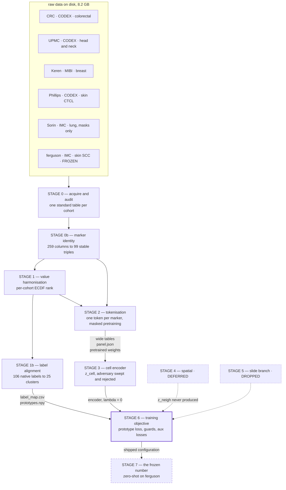
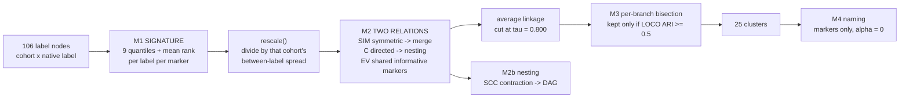
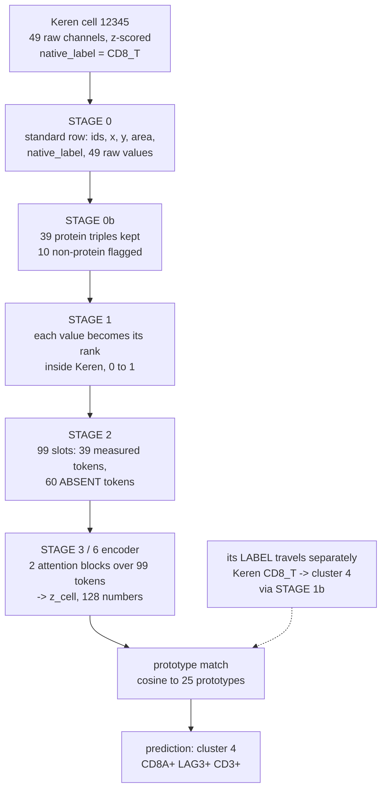
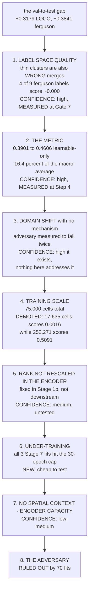
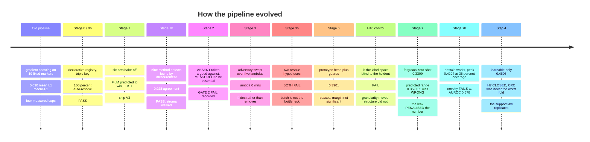
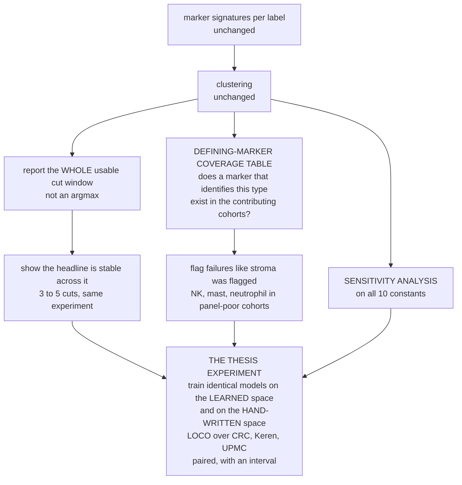

# Project audit — reverse engineering the whole pipeline

**Written 2026-08-11. Updated the same day with GATE 7, GATE 7b and the Step 4 per-class re-score.
Nothing was run to produce this. No file in `pipeline2/` or `work/` was changed.**

> **UPDATE SUMMARY.** The frozen-holdout number exists: **ferguson zero-shot macro-F1 = 0.3309**
> (shipped space A), **0.4240** in the clean matched-cut space B2. Three things changed in this
> audit as a result, and all three are improvements:
> 1. **The headline is no longer the headline.** The **support law** — cross-cohort transfer works
>    for cell types several cohorts independently agree on and fails completely for types carried by
>    one or two — is now measured **three times independently** and is the project's real result.
> 2. **The leak direction was backwards.** D-46 said the holdout's presence *favoured* the result.
>    At a matched cut it **penalised** it by 0.0931. My first draft repeated the wrong direction;
>    it is corrected throughout.
> 3. **My finding B.4 is confirmed in the strongest possible way.** All four ferguson labels that
>    score ~0.000 land in exactly the four mis-merged clusters I flagged. That turns a suspicion
>    into a measurement, and it reframes the support law (new finding **B.6**).

This is a read-only audit of the project as it stands. It reconstructs the pipeline from the code
and the reports, checks every component against evidence, and says plainly which parts are
supported and which are assumptions.

It is written to be read on its own. You should not need `files/` open beside it.

Three kinds of statement appear, and they are always marked:

| mark | means |
|---|---|
| **MEASURED** | a number exists in a report or a checkpoint |
| **ARGUED** | reasoned from data properties, never run |
| **ASSUMED** | neither measured nor argued — a choice that was made and never checked |

New findings from this audit — things that are **not** in `files/` — are collected in section B and
marked `NEW` wherever they appear later.

---

## Contents

- **A** — The project in one page, including **A.6 the support law — the actual result**
- **B** — What this audit found that was not already recorded (eight items)
- **C** — Datasets: what each cohort actually contributes
- **D** — Model architecture, exactly as built
- **Part 1** — The complete pipeline map
- **Part 2** — Data flow: one cell traced end to end
- **Part 3** — Purpose of every component, labelled
- **Part 4** — Decision audit
- **Part 5** — Validation at every step
- **Part 6** — Intermediate outputs: expected vs observed
- **Part 7** — Error propagation: where the F1 is lost
- **Part 8** — Experiment timeline
- **Part 9** — Literature justification
- **Part 10** — Scientific evidence map
- **Part 11** — Final system assessment

---

# A. The project in one page

## A.1 The research question

There are **two** questions in this project, and they are not equally novel. Separating them is the
single most important thing this audit can do for the write-up.

**Question 1 — the one the pipeline was built to answer.**

> Can one model give every cell in a spatial-proteomics image a cell-type name, and still work on a
> cohort it has never seen — a different hospital, a different machine, a different antibody panel?

**Question 2 — the one that is actually unclaimed by anyone else.**

> Can the **shared list of cell types** — the target vocabulary the model predicts into — be
> **derived from marker evidence**, instead of being written by hand by a biologist?

Question 1 is answered in the literature. VirTues (Nature 2026), DeepCell Types (2024) and RIBCA
(Cell Systems 2025) all build panel-agnostic cross-dataset annotators, at 25–50× this project's
scale. Stages 2 and 3 of this pipeline are a small reimplementation of what those papers do.

Question 2 is not answered by any of them. **All four competitors are handed the label vocabulary.**
DeepCell Types uses an explicit human-in-the-loop name mapping — precisely the artefact this project
deleted. CellHint (Cell 2023) does automatic label harmonisation, but on transcriptomes
(~20,000 genes), not on a 17–57 protein panel.

**This is recorded as D-49 / H12 and it is correct. The thesis must lead with Question 2.**

## A.2 The central claim, and its one piece of hard evidence

> Label harmonisation across cohorts can be **learned from marker profiles** instead of hand-written
> into a fixed ontology.

The strongest single result in the entire project, and it is one line:

> **Phillips `tumor cells` and CRC `tumor cells` — identical strings — are correctly placed in
> different clusters (5 and 0).** Phillips is cutaneous T-cell lymphoma, so its tumour cells are
> malignant T cells; it lands in the CD4 T-cell cluster with `CRC|CD4+ T cells CD45RO+`,
> `ferguson|TC_CD4` and `Sorin|Th`. CRC's tumour cells land in the keratin cluster.

No string method, no text embedding, and no name-mapping table can do that. A human curator gets it
right only if they happen to know what CTCL is. **This is the thesis in one example and it should be
the first figure in the document.** MEASURED, `reports/s1b_labels.md`.

## A.3 Status, honestly

| stage | what it does | gate | state |
|---|---|---|---|
| 0 | acquire + audit 6 cohorts into one table | PASS | done |
| 0b | resolve 259 marker columns → 99 stable triples | PASS (5/5) | done |
| 1 | put 4 different value scales on one footing | PASS, ships V3 | done |
| 1b | 106 native labels → 25 clusters, no ontology | PASS (7/7, 1 waived) | done, **with two qualifiers** |
| 2 | one token per marker, masked pretraining | **FAIL** (1 of 4 checks) | done, failure recorded not repaired |
| 3 | cell encoder + domain adversary | PASS, ships λ=0 | done, **adversary does not help** |
| 3b | two rescue attempts for the adversary | both FAIL | done |
| 4 | spatial neighbourhood | — | deferred |
| 5 | global slide branch | — | dropped |
| 6 | prototype loss + guards + aux losses | PASS | done, **margin not significant** |
| 7 | the frozen zero-shot number | **reported** | **DONE — 0.3309 shipped space, 0.4240 clean matched cut** |
| 7b | abstain curve + novel-class detection | reported | **DONE — abstain works, novelty FAILS at AUROC 0.578** |
| Step 4 | per-class re-score, learnable vs unlearnable | no gate | **DONE — H7 closed, CRC was never the worst fold** |
| Step 3 | 5 seeds × 5 folds, confidence intervals (H9) | — | **built (`s8_seeds.py`), NOT RUN** |

**The claim's last untested row is now tested.** Every row of the falsification checklist in
`files/10` §14 has a measurement against it. What remains is not evidence-gathering but
**interval-gathering** — `s8_seeds.py` exists and has never been run, so every number below is
still a point estimate at one seed.

⚠️ **All three Stage 7 fits hit the 30-epoch ceiling** (`[30, 30, 30]`), so none had stopped
improving. **0.3309 is a lower bound, not a converged result.**

## A.4 Results as they stand

| quantity | value | scope |
|---|---|---|
| marker resolution coverage | 100% auto (259 columns) | Gate 0b |
| shared markers, triple key vs verbatim strings | 59 vs 43 (+16) | Gate 0b |
| Gate 1 winner, LOCO masked-marker R² | 0.169 (V3, per-cohort ECDF) | 9 core markers |
| Gate 2, median per-marker reconstruction R² | 0.5122 | held-out slides |
| Gate 2, full panel vs core-9 control vs Gate 1 | 0.1963 / 0.1707 / 0.169 | LOCO, 9 core markers |
| agreement with the hand mapping | 0.928 (target), 0.855 (L2), 0.629 (L1) | Gate 1b |
| Gate 3, cross-cohort macro-F1 | 0.3642 | λ=0, **88-triple vocab, not comparable** |
| Gate 6, cross-cohort macro-F1 | **0.3901** | 22 reliable clusters, LOCO |
| Gate 6, over all 25 clusters | 0.3666 | same runs |
| Gate 6, **over learnable clusters only** | **0.4606** | same runs, re-scored at Step 4 |
| in-distribution validation ceiling | 0.68–0.79 | same runs |
| **val → test gap, LOCO** | **+0.3179 mean** | |
| **ferguson zero-shot, space A (shipped, 25 clusters)** | **0.3309** | majority 0.0237, random 0.0562 |
| ferguson zero-shot, space B1 (clean, 37 clusters) | 0.3080 | |
| **ferguson zero-shot, space B2 (clean, shipped cut, 22)** | **0.4240** | the leak-free matched-cut number |
| **what the leak was worth (A − B2)** | **−0.0931** | the leak **penalised** the shipped number |
| ferguson, clusters carried by ≥3 training cohorts (5 labels) | **0.5291** | |
| ferguson, clusters carried by ≤2 training cohorts (4 labels) | **0.0014** | never predicted at all |
| **val → test gap, ferguson** | **+0.3841** | val 0.7150 → 0.3309 |
| abstain: macro-F1 peak | **0.4204 at 35% coverage** | +0.0894 over answering everywhere |
| abstain: accuracy at 10% coverage | 0.7120 | but macro-F1 *falls* past 35% |
| **novel-class detection AUROC** | **0.578** | ≈ chance. **The deliverable's abstain-on-novelty goal is not met** |

**The 0.630 from the old pipeline is not a valid comparison and must be dropped.** It is a 3-class
L1 number over ~10 hand-written classes; 0.3901 is over 22 data-derived clusters. Different label
space, different class count, different difficulty. `files/10` already says this.

## A.5 The three sentences a reader must be given before any number

1. **No gate in this project has ever been scored with a confidence interval.** Every verdict from
   Gate 1 onward is a mean over 5 folds at one seed. Where paired tests were run afterwards, most do
   not survive (H9, D-44). `s8_seeds.py` is built to fix this and **has not been run**.
2. **The label space is not blind to the frozen holdout — and the leak made the number WORSE, not
   better.** ferguson's presence changed the granularity. D-46 predicted this would flatter the
   result because "coarser is easier". **Measured at a matched cut, it is backwards**: ferguson made
   the space *finer* (25 clusters where the 5 training cohorts alone give 22), and the shipped number
   is **0.0931 lower** than the clean one. **The disclosed headline is conservative** (D-51).
3. **Macro-F1 averages over classes no model could learn on that fold.** Under LOCO, 9 of 55
   class-folds have zero training examples and score exactly 0.000. Reported 0.3901 →
   **learnable-only 0.4606**. Quote both, always, and say which is which (D-53).

> ⚠️ **A caution this audit's first draft got wrong too.** Point 2 was written the other way round
> before Gate 7 measured it. If a stated bias direction has not been measured, do not state it as
> known — say the direction is unknown. D-46 is correctly kept as written with the correction
> attached rather than silently edited, per the `files/01` maintenance rule.

## A.6 The support law — this is the result, not the macro-F1

The single headline number hides two completely different regimes. Split ferguson's nine labels by
how much **training data their target cluster carries**, and the separation is total:

| ferguson label | cells | F1 | training cohorts in its cluster | training cells |
|---|---|---|---|---|
| TC_CD8 | 4,313 | **0.8131** | 5 | 325,817 |
| TC_CD4 | 5,536 | **0.5192** | 3 | 244,911 |
| BC | 2,327 | **0.5091** | 5 | 252,271 |
| MC | 4,196 | **0.4372** | 5 | 632,612 |
| SC | 5,984 | **0.3671** | 5 | 2,014,929 |
| EC | 5,881 | 0.0039 | **1** | 13,062 |
| GC | 3,864 | 0.0016 | **2** | 17,635 |
| EP | 5,488 | 0.0000 | **1** | 3,018 |
| DC | 2,411 | 0.0000 | **2** | 2,313 |

| | classes | mean F1 |
|---|---|---|
| cluster carried by **≥3** training cohorts | 5 | **0.5291** |
| cluster carried by **≤2** training cohorts | 4 | **0.0014** |

Correlation with the **number of contributing cohorts: r = 0.843**. With log₁₀ training cells:
r = 0.798.

**It is not a gradient. The thin classes are not weak — they are never predicted at all.**

### Why this is the strongest thing in the project

It is a **replication, measured three times on progressively harder ground**, and it was written down
before the hardest test:

| where | what was measured | result |
|---|---|---|
| inside the training roster, LOCO class-folds (n=55) | F1 by number of contributing cohorts | 0 cohorts → **0.0000** (100% exactly zero) · 1 → **0.0921** (50% zero) · 2 → **0.2231** (22% zero) · **3+ → 0.6361** (**0 of 29 at zero**) |
| held-out cohorts of a familiar kind (Gate 6) | support-to-F1 correlation | r = 0.709 |
| **an unseen machine, tissue and panel (Gate 7)** | same law, on 9 labels | r = 0.843, and it holds in **all three label spaces** |

A law that survives transfer to a new technology *and* a new tissue *and* a new panel, in three
independently built label spaces, is worth more than any average. **This should be the thesis's
central empirical claim.** The macro-F1 is those two regimes mixed together in a proportion that
depends entirely on which cohorts happen to be on the roster.

**The deployable sentence:** *cross-cohort annotation transfers to a completely unseen cohort for
cell types that several cohorts independently agree on, and fails outright for types defined by one
or two — and the number of contributing cohorts is knowable before you ever see the new data.*

That last clause is what makes it useful rather than merely descriptive: **the pipeline can predict
which of its own outputs will be worthless, in advance, from `label_map.csv` alone.**

---

# B. What this audit found that was not already recorded

Eight items. Each is checkable from the files named. Items B.1–B.5 are from the first pass;
**B.6–B.8 are new since Gate 7**, and B.4 is now confirmed rather than suspected.

## B.1 Gate 6 check 4 changes two things at once — `NEW`, and it matters

**What is wrong.** Check 4 asks whether Stage 6's prototype head beats Stage 3's plain linear head.
The two arms compared are:

| arm | head | VICReg | mean LOCO macro-F1 |
|---|---|---|---|
| `linear_*` | linear | **ON** | 0.3692 |
| `proto2_*` | prototype | **OFF** | 0.3901 |

The reported margin is **+0.0209** against a declared +0.02. But the arms differ in **two** ways, not
one. Source: the `vicreg` column of the run table in `reports/s6_train.md`.

**The matched comparison.** `proto3_*` is the prototype head with VICReg **on** — the arm that
differs from `linear_*` in exactly one thing.

| comparison | what changes | margin |
|---|---|---|
| proto3 − linear | head only (VICReg on in both) | **+0.0096** |
| proto2 − proto3 | VICReg only (prototype head in both) | **+0.0113** |
| proto2 − linear | **both at once** — the reported check 4 | +0.0209 |

It decomposes exactly: 0.0096 + 0.0113 = 0.0209.

**Why it matters.** The prototype head on its own is worth **+0.0096**, which is **below the declared
+0.02 threshold**. The other half of the margin is dropping VICReg — and Gate 6 check 3 already
recorded that as `p = 0.191`, i.e. "the ablation cannot separate them". So the reported margin is two
sub-threshold, non-significant effects added together.

Per fold, the head-only margin (proto3 − linear):

| CRC | UPMC | Keren | Phillips | Sorin | mean |
|---|---|---|---|---|---|
| −0.0132 | −0.0042 | +0.0001 | −0.0476 | **+0.1128** | +0.0096 |

The prototype head loses or ties **4 of 5 folds**. All of the gain is Sorin. This is the same shape
D-44 already flagged, but stronger: it is now structural, not only statistical.

**This is the exact defect D-27's core-9 control was invented to prevent** — "comparing X straight to
Y changes two things at once and cannot tell which one did it". The project has a written rule
against this and its own check 4 broke it.

**Repair — already built, not yet run.** `pipeline2/s8_seeds.py:95` passes `use_vicreg=False` for
**both** arms (`ARMS = ('proto', 'linear')`), so its 5 seeds × 5 folds × 2 heads produce exactly the
matched comparison this finding asks for. **No checkpoints exist yet** — nothing matching `s8*` or
`seed*` is in `work/ckpt/`. Running `s8_seeds.py --loco` closes B.1 and H9 in one job.

⚠️ Note that `s6_train.py:630` still lists the Gate 6 control as `('linear', 'linear', True, True)`
— VICReg on. So re-running Gate 6 as-is would reproduce the confounded comparison. The fix lives in
`s8_seeds.py`, not in Gate 6.

**What must not be written.** "The prototype loss improves cross-cohort transfer by 0.02." D-44
already banned the sentence; this audit shows the number itself is not the head's.

## B.2 Space A's prototypes are contaminated by the frozen holdout — `NEW`

D-46 priced one leak channel: ferguson changed the **granularity** of the label space. There is a
second channel it did not price.

`s1b_labels.py:1213` writes `work/prototypes.npy` from `cen`, which comes from `name_clusters`:

```python
cen[c] = np.nanmean(P[memb == c], 0)      # s1b_labels.py:778
```

`P` is the position matrix over **all six cohorts**. So each cluster's prototype vector is the mean
signature of its member labels **including its ferguson members**. Nine of the 25 clusters contain a
ferguson label (0, 1, 4, 5, 6, 18, 20, 21, 22).

Stage 6 and Stage 7 initialise their learnable prototypes from exactly this file
(`s6_train.py:169 init_prototypes`). So in **space A**, the model starts from prototypes that have
seen holdout data.

**This is handled correctly for B1 and B2.** `s7_spaces.py:117-120` recomputes centroids from `S5`,
the 5-cohort signature set, so the clean spaces are clean on this channel too. The code is right; the
documentation of space A's leak is incomplete.

**Consequence.** One sentence to add beside Stage 7's space-A number: *ferguson influenced space A
through two channels — the cut that set granularity, and the prototype initialisation. B1 and B2 are
free of both.*

**Now that Gate 7 has run, this is easier to say, not harder.** Space A scores **0.3309** against
B2's **0.4240** — so the space carrying *both* contamination channels produced the **lower** number.
Whatever the prototype contamination did, it did not buy the shipped result anything measurable.
The honest statement is: *space A had two channels of holdout influence and still scored 0.0931
below the clean matched-cut space, so the disclosed number is conservative on both counts.*

## B.3 The masked-marker auxiliary loss is never ablated — `NEW`

Gate 6's loss ablation is 2 losses vs 3 losses (D-40 explains why it is not 2 vs 4). But there is no
**1-loss** arm — cell-type alone. So the contribution of carrying Stage 2's masked-marker objective
into Stage 6 is **unmeasured**.

This matters more than it looks. The masked-marker loss is the only thing in Stage 6 that keeps the
representation general rather than collapsing onto whatever the 25 clusters happen to separate. It is
argued for in `nn/losses.py`, and the argument is good, but it is an argument.

**Cost to settle:** 5 fits, about 25 minutes on a T4, alongside the B.1 repair.

## B.4 The label space contains mis-merges that are not the waived ones — `NEW`, and **GATE 7 CONFIRMED IT**

> **Confirmation, added after Gate 7.** This was written as a suspicion from reading the cluster
> table. Gate 7 then scored ferguson, and **all four labels that score ~0.000 land in exactly the
> four clusters flagged below.** Not three of four, not four of six — a clean 4-for-4.
>
> | ferguson label | its cluster in space A | what that cluster contains from training | F1 |
> |---|---|---|---|
> | `GC` (granulocyte) | 22 | Phillips **dendritic cells**, Sorin **mast cells** | 0.0016 |
> | `DC` (dendritic cell) | 21 | Keren **NK**, Sorin DCs | 0.0000 |
> | `EP` (epithelial) | 20 | Keren **neutrophils** | 0.0000 |
> | `EC` (endothelium) | 18 | Keren Mesenchymal_like / Tumor / **Unidentified** — the junk cluster | 0.0039 |
>
> The model is asked to recognise granulocytes from training examples that are dendritic cells and
> mast cells. **It scores 0.0016, and that is the correct behaviour for a working model given a
> broken target.** The same reading holds in space B2, where `DC`'s cluster is named
> `IDO1+ NCAM1+ ITGAX+` — `NCAM1` is CD56, an NK marker, in the cluster ferguson's dendritic cells
> are supposed to join.
>
> One of these four was **predicted before the run for an unrelated reason**: Gate 1 measured
> ferguson's CD31 at exactly 0.500 AUROC because its endothelium is marked by CD13/ANPEP, and
> recorded that zero-shot endothelium on ferguson would fail *for a data reason*. It failed.
> That prediction landing is a point in the project's favour and should be cited.


The stroma waiver (D-23) flags 3 clusters as unreliable. Reading the full cluster list in
`reports/s1b_labels.md` shows further merges that look biologically wrong and are **not** flagged:

| cluster | name | members | problem |
|---|---|---|---|
| 3 | `FUT4+ ITGAM+ PTPRC+` | CRC granulocytes; UPMC Granulocyte; **Sorin NK cell** | FUT4=CD15 and ITGAM=CD11b are granulocyte markers. NK cells are not granulocytes. |
| 21 | `ITGAX+ HLA-DR+ IDO1+` | **Keren NK**; ferguson DC; Sorin DCs | dendritic-cell markers. NK cells are not DCs. |
| 22 | `CD68+ ITGAX+ ICOS−` | ferguson GC; Phillips DCs CD11c+; **Sorin Mast cell** | granulocyte + DC + mast cell in one class |
| 20 | `PDPN+ KRT…+ EGFR+` | **Keren Neutrophils**; ferguson EP | an epithelial signature holding neutrophils |
| 2 | `no discriminative shared marker` | 17 labels: CRC stroma, smooth muscle, dirt, undefined, nerves, adipocytes, lymphatics, Keren Mono_Neu, Phillips stroma… | already flagged, but note it is a *junk drawer*, not a cell type |

**The pattern is consistent and it is diagnosable.** Every one of these is a **rare type in a
marker-poor cohort**. Sorin has 17 markers and carries no NK-specific marker (NCAM1/CD56), no
mast-cell marker (KIT/TPSAB1). Keren carries no NK marker either. So `Sorin|NK cell` is a label whose
*defining* marker is not measured anywhere in the comparison — and the clustering places it by what
is left over, which is "myeloid-ish and PTPRC+".

**The mechanism this exposes.** `EV` (the evidence floor, `K_EVID = 8`) counts how many **shared
informative markers** a label pair has. It does **not** check that the marker which *defines* either
label is among them. A pair can clear the evidence floor on eight generic markers while the one
marker that would separate them is absent. That is exactly the stroma failure mode (D-23), and it is
already known to be a field-level problem — RIBCA reports the same stroma-into-epithelium collapse.
What is new here is that **it is not confined to stroma**: it hits NK, mast cells and neutrophils in
the panel-poor cohorts too.

**Why this is a finding, not a defect to hide.** It is the honest limit of the method and it is
measurable. The right response is a **defining-marker coverage table** — for each cluster, does at
least one marker that identifies that cell type exist in the cohorts contributing to it? Clusters
that fail get flagged the same way stroma did. That is a reporting change, not a rebuild, and it
turns an embarrassment into a stated scope condition.

## B.5 Per-cohort ranking is corrected inside Stage 1b and not inside the encoder — `NEW`, and it is a hypothesis worth testing

Stage 1b's very first build failed because per-cohort ECDF makes a label's position depend on its
cohort's **composition**: Keren is 50.3% keratin-positive tumour and CRC is 18.4%, so the same
biology ranks differently. The fix was `rescale()` — divide each (cohort, marker) by its own
between-label spread (defect 1 in `files/06`).

**The same problem exists at cell level in Stages 2, 3, 6 and 7, and there is no equivalent fix
there.** `load_cohort` reads `u_coh::{triple}` straight out of the parquet and hands it to the value
MLP. A CD8 value at rank 0.8 in Keren and a CD8 value at rank 0.8 in CRC are *not* the same
biological statement, and nothing tells the encoder that.

The encoder is expected to learn the correction from data. It sees five cohorts. It cannot learn a
five-point correction that generalises to a sixth.

**Status: ARGUED, not measured.** It is a hypothesis, and a cheap one to test — apply the same
between-label rescale to `u_coh` before tokenising, refit one LOCO fold, compare. If it helps, it is
a bigger lever than anything Stage 3 tried.

## B.6 "Low support" and "wrong merge" are perfectly confounded — `NEW`, and it changes what to do next

The support law (A.6) says: **more contributing cohorts → higher F1**. Finding B.4 says: **the thin
clusters are also the biologically wrong ones.** On this data those two statements pick out *exactly
the same four clusters*. They are not independent explanations — they are one phenomenon seen twice.

| ferguson label | contributing cohorts | is the merge biologically sound? | F1 |
|---|---|---|---|
| TC_CD8 | 5 | ✅ all CD8 T cells | 0.8131 |
| TC_CD4 | 3 | ✅ all CD4 T cells (+ Phillips CTCL tumour, correctly) | 0.5192 |
| BC | 5 | ✅ all B cells | 0.5091 |
| MC | 5 | ✅ all macrophages | 0.4372 |
| SC | 5 | ✅ all keratin+ tumour/epithelial | 0.3671 |
| EC | 1 | ❌ endothelium vs a junk cluster | 0.0039 |
| GC | 2 | ❌ granulocyte vs DC + mast | 0.0016 |
| EP | 1 | ❌ epithelial vs neutrophils | 0.0000 |
| DC | 2 | ❌ DC vs NK + DC | 0.0000 |

**5 for 5 clean, 4 for 4 broken. Perfectly separated.**

### Why the distinction matters enormously

The two readings point at **opposite next steps**:

| reading | mechanism | the fix | cost |
|---|---|---|---|
| **quantity** — "not enough training data" | thin classes have few cells | add cohorts, scale up training | months, or a new dataset |
| **quality** — "the cluster is not a cell type" | labels were merged by *absence* of discriminative evidence | flag them, and abstain | days, no new data |

**The evidence favours quality, and it is checkable right now.** Cluster 22 (`GC`) has **17,635
training cells** and scores 0.0016. Cluster 6 (`BC`) has 252,271 and scores 0.5091 — a 14× data
difference for a 300× F1 difference. Meanwhile the correlation is **higher against cohort count
(0.843) than against cell count (0.798)**, and cell count is the thing "more data" would fix.

**Cohort count is not a data-quantity measure. It is an agreement measure.** A cluster that three
cohorts independently contribute to is a cluster three separate annotation teams, three machines and
three panels all landed on. That is *evidence the cell type is real*. A cluster built from two labels
in two cohorts is often just two leftovers that were closest to each other.

### The reframing this licenses — and it is a better thesis claim

> **The number of contributing cohorts is a proxy for whether a derived cluster is a real cell type.
> Stage 1b's output is therefore self-diagnosing: it can tell you, before any model is trained and
> before the new cohort arrives, which of its own classes will be worthless.**

That is a stronger and more useful claim than "transfer correlates with training data", and it is
already fully supported by data in hand.

**How to separate the two properly** (cheap, no new fits): take the 29 LOCO class-folds with 3+
cohorts and check whether any of them are *also* biologically mixed. If high-support clusters are
always clean merges, the confound cannot be broken on this roster and must be **declared as a
confound** — which is itself the honest result. Currently `s8_perclass.md` reports the correlation
without noting that merge quality is a competing explanation.

## B.7 Stage 7b partly answers the argument the prototype head shipped on — `NEW`

D-44 shipped the prototype head **not** on its margin (which is +0.0096 matched, B.1) but on a
**design argument**: *"Stage 7's abstain rule needs prototype distances."* Stage 7b now measures
that argument against the standard baseline, max-softmax:

| | proto (distance to nearest prototype) | msp (temperature-scaled max softmax) |
|---|---|---|
| accuracy at 10% coverage | 0.7120 | **0.7997** |
| **macro-F1 peak** | **0.4204 at 35%** | 0.4058 at 50% |
| macro-F1 at 10% coverage | 0.3941 | 0.3934 (tie) |
| **novel-class AUROC** | 0.5776 | 0.5778 (tie) |

**The verdict is split, and it should be reported that way.** The prototype score gives the better
**macro-F1** curve and a clearly identifiable operating point — that is a real win and it does
vindicate part of the design argument. But max-softmax is **better on accuracy** and **exactly tied
on novelty**, which was the other half of what prototype distances were supposed to buy. A plain
linear head with temperature scaling would have delivered most of Stage 7b.

**What to write:** *the prototype head earns its place on the abstain curve's macro-F1, not on
novelty detection and not on the cross-cohort margin.* That is a narrower claim than D-44's, and it
is the one the data supports.

## B.8 The decision log has duplicate D-numbers — `NEW`, housekeeping

`files/08` now contains **two rows numbered D-48** and **two numbered D-50**:

| number | first use | second use |
|---|---|---|
| D-48 | the transferable-class metric defect | Stage 7 reports three label spaces |
| D-50 | the two required pre-write-up experiments | the Gate 7 result |

Four documents already cite "D-48" and "D-50" meaning different things. Renumber the later pair to
D-54 and D-55, or suffix them (D-48b, D-50b), and fix the cross-references. **Five minutes now, an
hour of confusion in the write-up otherwise.**

---

# C. Datasets: what each cohort actually contributes

Six cohorts are used. Two more were acquired and deliberately not used.

## C.1 The roster

| cohort | tech | tissue | cells | slides | patients | markers | native labels | arrives as | role |
|---|---|---|---|---|---|---|---|---|---|
| Sorin 2023 | IMC | lung adeno | 2,141,875 | 536 | 476 | 17 | 17 | raw uint8 | train |
| UPMC (Wu 2022) | CODEX | head & neck | 2,061,102 | 308 | 81 | 39 | 16 | arcsinh | train |
| CRC (Schürch 2020) | CODEX | colorectal | 258,385 | 140 | 35 | 56 | 29 | raw | train |
| Keren 2018 | MIBI-TOF | breast TNBC | 197,678 | 40 | 40 | 39 | 17 | z-scored | train |
| Phillips 2021 | CODEX | skin CTCL | 117,170 | 69 | 14 | 57 | 21 | raw | train |
| **ferguson 2022** 🔒 | IMC | skin SCC | 155,913 | 44 | 17 | 34 | 9 | raw | **test only** |

Totals: **4,932,123 cells · 1,137 slides · 663 patients · 99 distinct marker triples**.

## C.2 What each one is *for* — this is the part that is not obvious

Every cohort in this roster is doing a specific job. Dropping any one of them would remove a
measurement, not just some cells.

**Sorin — the panel-mismatch stress test, and the cohort that decided the architecture.**
17 markers against a union of 99. It is the cohort that behaves like a genuinely unseen panel. It
**decided the [ABSENT] token question single-handedly**: Arm A (measured markers only) scores −0.1033
on the held-out-Sorin fold while Arm B (all 99 slots) scores +0.0388 — a 0.1421 gap that is invisible
in every other measurement (D-30). It also arrives uint8, so it forced mid-rank tie handling and
killed the median as a position statistic. And it has 1.13 slides per patient, which is half of why
the slide adversary is aimed at the wrong variable (D-38). It shipped no cell table at all —
`acquire/sorin_extract.py` had to be written to get centroids, areas and per-channel means out of
MATLAB masks.

**Phillips — the cohort that proves the thesis.** Cutaneous T-cell lymphoma. Its label `tumor cells`
is a string identical to CRC's, and the cell type is completely different. Stage 1b separates them.
It also has the richest panel (57) and the cleanest batch structure (4.93 slides/patient), and it is
usually the best LOCO fold.

**CRC — the label-granularity stress test.** 27 native labels → 15 clusters, 5 of which appear in no
other cohort. It looks like the worst fold (0.2983) but D-48 shows that is the metric: its hard
ceiling is 0.643 before the model does anything, because 5 of its 14 scored classes have zero
training examples. Divided by its own ceiling it is mid-pack. It also has the worst class imbalance
(1,253:1).

**Keren — the small-slide-count cohort, and the reason several checks broke.** Only 40 slides, so a
20% test split is 8 slides. That collapses the R² denominator and is the direct cause of Gate 2's
FAIL (MKI67, −0.0117) and of the D-29 rule change. It is also the cohort a reviewer predicted FiLM
would overfit on, and it did, monotonically in capacity (0.139 → 0.127 → 0.118). 1.00 slides per
patient — a slide **is** a patient.

**UPMC — the only cohort with per-cell label confidence** (`kNN.prob`, 0.14–1.0). Every other cohort
reports a constant 1.0. That makes it the only cohort on which confidence weighting can be tested —
and Gate 6 check 6 tested it on the one fold where UPMC is held **out** of training, so both arms ran
the same computation and printed a delta of exactly 0.0000 (D-45). It also supplies L2 ground truth
for the secondary metric.

**ferguson — the final exam, and it is compromised in one specific way.** IMC, skin SCC, 34 markers.
Never trained on. It is the only cohort that is a new machine *and* a new tissue *and* a new panel at
once. Two things are known about it before the run: its endothelium is marked by CD13/ANPEP, not
CD31, so CD31 scores exactly 0.500 on it (measured at Gate 1, recorded before the test so it cannot
later be mistaken for a model failure); and it was in the room when Stage 1b chose the granularity
(D-46) and when the prototypes were computed (**B.2**).

## C.3 Acquired and deliberately not used

**Danenberg 2022 (METABRIC IMC breast, 1,123,466 cells, 794 images, 718 patients, 39 markers).**
Downloaded, audited, spec registered in `config.py`, and **kept out of training on purpose** (D-24).
It is the *"a new cohort arrives later"* demonstration — the live proof that adding a dataset needs no
code change. Its labels (`CK^med ER^lo`, `CK8-18^hi CXCL12^hi`, `T_Reg & T_Ex`, `MHC I^hi CD57+`) are
compositional and completely opaque to a text encoder, which is the argument for marker-profile
alignment stated as a dataset rather than as an opinion.

Three unresolved issues block it: two HER2 clones map to one triple (needs a duplicate policy),
CD31-vWF is a co-stain that may not resolve to PECAM1, and bare `SMA` is an alias route to SMN1 —
exactly the `NA` → sodium → XK failure mode D-13 already caught once.

**HubMap — rejected.** Healthy tissue, different label space, 2.6M cells would swamp the roster.

**Risom 2022 — rejected permanently.** No X/Y centroids and no per-cell label mask, so centroids are
unrecoverable. Also: Zenodo 5945388, widely cited as this dataset, is a *different study* (MIBI-TOF
tonsil reproducibility). Do not re-download.

---

# D. Model architecture, exactly as built

## D.1 The shipped model is small

| block | shape | parameters |
|---|---|---|
| value MLP `Linear(1,64) → GELU → Linear(64,64)` | shared across all markers | 4,288 |
| identity embedding `Embedding(99, 64)` | one row per marker triple | 6,336 |
| `mask_emb`, `absent_emb` | one learned vector each | 128 |
| 2 × pre-norm attention block (4 heads, FF 64→128→64) | over the token set | 66,944 |
| `LayerNorm(64)` | | 128 |
| projection `Linear(64,128) → GELU → Linear(128,128)` | token pool → `z_cell` | 24,832 |
| prototypes `[25, 128]` | one per cluster, learnable | 3,200 |
| mask head `Linear(64,1)` | auxiliary reconstruction | 65 |
| **total** | | **≈ 106,000** |

**About 0.1 million parameters.** For context, the competitors it is being compared against are
foundation models trained on 9.8M–15M cells. This is worth stating plainly in the write-up: the
contribution is not scale.

## D.2 The key architectural idea, and why it works

```
token[marker m] = value_MLP( u_coh[m] )  +  identity_embedding[m]
                  ^^^^^^^^^^^^^^^^^^^^     ^^^^^^^^^^^^^^^^^^^^^^
                  SHARED across markers    marker-specific
```

The value pathway is **shared**. Only identity is per-marker. That split is what lets a panel the
model has never seen still be encoded — the value MLP does not need to have met the marker before.

Three token states:

| state | token | when |
|---|---|---|
| measured | `value_MLP(u) + ident[m]` | the cohort measured this marker |
| masked | `mask_emb + ident[m]` | hidden for the reconstruction objective |
| absent | `absent_emb + ident[m]` | the cohort's panel does not contain this marker |

**Identity is kept in all three states.** A masked token without identity makes the question
unanswerable — the model would not know which marker to predict.

## D.3 What each stage's model is

| stage | model | purpose |
|---|---|---|
| 1 | `MaskedMarkerProbe` — concat pooling over 9 fixed markers, d=32 | compare normalisation arms only; superseded |
| 2 | `TokenModel` — tokens → 2 blocks → `Linear(64,1)` per slot | masked-marker pretraining, produces `work/ckpt/s2_armB.pt` |
| 3 | `CellEncoder` — same token stack + `proj` → `z_cell` (128-d) | plus `Heads`: linear classifier, slide adversary behind a gradient reversal layer, cohort guard |
| 6 | `Stage6` = `CellEncoder` + `Prototypes` (cosine, temp 0.1) + `mask_head` | the shipped training objective |
| 7 | identical to Stage 6, trained on all 5 cohorts, scored on ferguson | the final answer |

Stage 3 and Stage 6 share an encoder. Stage 3 exists as a separate stage only to isolate the
adversary question with the simplest possible head.

---

# Part 1 — The complete pipeline map

## 1.1 The whole system at a glance



**Read the order carefully.** Label alignment (1b) comes *after* value harmonisation (1), not before.
That is a deliberate reorder: comparing labels across cohorts needs comparable marker values first.

**Two branches leave Stage 1.** Stage 1b consumes signatures to build the label space. Stage 2
consumes values to build the tokens. They meet again at Stage 6, where the label space becomes the
prototypes and the tokens become the input.

## 1.2 Stage by stage

Each block below is: **input → operations → output → why it exists → where the output goes.**

---

### STAGE 0 — Acquire and audit ✅ PASS

**Input.** `Datasets/` — 8.2 GB of whatever format each publication chose. Six different shapes.

**Operations.**
- One **declarative registry** (`config.py`) holds every cohort-specific fact as a dict: paths, µm/px,
  column names, arrival state. One **generic loader** (`loaders.py`) reads them all.
- Marker columns are declared **by rule**, never hand-listed: `{'kind':'pattern', regex}`,
  `{'kind':'file', path}`, `{'kind':'exclude', cols}`.
- Sorin required writing feature extraction from scratch (`acquire/sorin_extract.py`): per-cell
  centroid, area and per-channel mean from labelled MATLAB masks across 536 images.

**Output.** `work/raw/{cohort}.parquet` + `_meta.json`, `reports/s0_audit.md`.
Schema: `cell_id, cohort, image_id, patient_id, x_px, y_px, area_px2, native_label,
label_confidence, <raw markers…>`.

**Why it exists.** So that no code downstream ever branches on cohort. **There is no
`if cohort == "X"` anywhere in the codebase.** Adding a dataset means adding a dict.

**Key decision.** Stage 0 keeps **every column and every cell**. It does not decide what is a real
protein (DNA stains, elemental channels) or a real cell (dirt, undefined). Those calls are made later
on evidence. **This was vindicated** — the junk labels collected correctly in Stage 1b's
negative-definition cluster instead of being silently dropped.

**Goes to.** Stage 0b (marker column lists), Stage 1 and Stage 1b (values).

---

### STAGE 0b — Marker identity resolution ✅ PASS, 5/5 checks

**Input.** 259 marker column names from `work/raw/*_meta.json`.

**Operations.** Resolve every column to a **stable triple**, never a string match:

```
(gene_or_complex_id, epitope, modification)

CD45    → (HGNC:9666 PTPRC, pan, none)
CD45RA  → (HGNC:9666 PTPRC, RA,  none)
CD45RO  → (HGNC:9666 PTPRC, RO,  none)
RPS6_p  → (HGNC:10429 RPS6, pan, phospho)
HLA-DR  → (COMPLEX:HLA-DR → [HLA-DRA, HLA-DRB1…], pan, none)
PanCK   → (FAMILY:KRT_PAN → [KRT1…KRT20], pan, none)
```

Resolution order, each step **field-scoped**, never free-text: normalise → split epitope and
modification → HGNC REST (`/fetch/symbol`, `/search/alias_symbol`, `/search/prev_symbol`, with and
without hyphens, **all spellings must agree**) → UniProt REST (reviewed, human) → CD-number table →
complex/family table → review queue. Results cached to `work/api_cache.json` (1.58 MB).

**Output.** `work/marker_registry.csv` (259 rows × 12 cols), `work/api_cache.json`,
`reports/s0b_markers.md`.

**Why it exists — and this is genuinely good work.** The API evidence shows string matching cannot
do this job:

| query | result | lesson |
|---|---|---|
| free-text `PD-1` | PSMA6, PSMB6, **PDCD1 third** | top-hit-wins is wrong |
| `alias_symbol/PD-1` | PDCD1 only | field-scoping fixes it |
| `alias_symbol/PD1` | 3 hits, ambiguous | punctuation changes the answer |
| `alias_symbol/HLA-DR` | 0 hits | it is a complex |
| `CD45RO` | 0 hits | it is an epitope |
| `NA` (sodium) | XK | pandas parsed it as missing → D-13 |

**Why the triple and not the gene.** Resolving to a gene alone would merge CD45 / CD45RA / CD45RO
(all PTPRC) and merge phospho-RPS6 with total RPS6 — exactly the pairs in `never_merge.csv`. The
triple keeps them apart **by construction**, which demotes `never_merge.csv` from a hand-maintained
blacklist to an **assertion that the resolver works**. That is a real design win.

**Measured.** 100% auto-resolved, review queue empty. 43 → 59 shared markers (+16) versus verbatim
matching. 9/9 never_merge distinct, 5/5 must_merge unified, 0 non-proteins leaked to genes.
Offline re-run byte-identical (503 cache hits, 0 network calls).

**Panel geometry.** 242 protein/complex columns → **99 distinct triples**. Shared by ≥2 cohorts: 56.
By ≥3: 38. In all six: **9** (CD4, CD8A, CD3, MS4A1, CD68, FOXP3, HLA-DR, pan-keratin, PECAM1).
Cohort-exclusive: 43.

**Goes to.** Stage 1 (which markers are the core 9), Stage 2 (the 99-slot token vocabulary),
Stage 1b (which markers are comparable between a label pair).

---

### STAGE 1 — Continuous value harmonisation ✅ PASS, winner V3

**Input.** `work/raw/*.parquet` + `work/marker_registry.csv`.

**Operations.** Replace each raw marker value with its **percentile rank inside a group**
(empirical CDF). Two candidate groupings raced:

- `u_img` — rank inside (image, marker)
- `u_coh` — rank inside (cohort, marker) ← **winner**

`method='average'` (mid-rank) splits ties down the middle. Critical because Sorin is uint8, so ties
are everywhere. References computed on **every** cell; only the written table is subsampled.
The subsample is round-robin over (patient × native label) so rare labels survive whole.

Six-arm bake-off, built as a **ladder** so each comparison isolates exactly one decision.

**Output.** `work/values/{cohort}.parquet` (40k stratified, 9 core markers),
`{cohort}_rand.parquet` (unstratified, for distribution checks only),
`{cohort}_slidestats.parquet`, `work/s1_folds.pt`, `reports/s1_normalisation.md`.

**Why it exists.** CRC ships raw fluorescence, UPMC arcsinh, Keren z-scores, Sorin uint8. Four curve
shapes into one encoder. **A rank is monotone, continuous, bin-free, and puts every cohort on one
footing in a single step.** LayerNorm cannot do this — it only shifts and scales, so it cannot undo a
nonlinearity.

**Measured, LOCO masked-marker R²:**

| arm | CRC | UPMC | Keren | Phillips | Sorin | mean |
|---|---|---|---|---|---|---|
| V1 per-image | .106 | .112 | .068 | .177 | .148 | .122 |
| **V3 per-cohort** | .155 | .165 | .139 | .201 | .183 | **.169** |
| V2a FiLM scalar | .149 | .176 | .127 | .190 | .180 | .165 |
| V2b FiLM MLP | .161 | .178 | .118 | .196 | .142 | .159 |
| V1+V3 | .144 | .165 | .128 | .184 | .178 | .160 |
| V2a+V1 | .135 | .184 | .101 | .177 | .141 | .147 |

**The FiLM measurement is airtight and worth understanding.** FiLM is zero-initialised, so at epoch 0
V2a **is** V3 exactly. Any drop below V3 is therefore not a different model class — it is purely
measured overfitting. It scales monotonically with capacity, in the wrong direction. On Keren (40
slides) degradation is monotone: V3 .139 → V2a .127 → V2b .118. That is the reviewer's prediction,
confirmed on the cohort it was made about.

**The check that condemns per-image ranking.** Within-label composition skew: V1 is negative in
**6 of 6** cohorts (mean −0.135), worst on Keren (−0.336), which is 50.3% keratin-positive tumour.
Per-image ranking invents a negative population on composition-skewed slides. It is the old
hard-binning bug in a new costume.

**Goes to.** Stage 1b (signatures), Stage 2 (the rank definition, rebuilt wide).

---

### STAGE 1b — Automatic label alignment ✅ PASS 7/7 — *the central experiment*

**Input.** `work/raw/*.parquet` (for signatures), `work/marker_registry.csv`.

**Operations — four mechanisms.**



**M1 — the signature.** For each (cohort, label) and each marker: 9 quantiles plus a **position
statistic**. The position statistic is the **mean rank** — the Mann-Whitney statistic behind AUROC —
not the median. The median was tried and cannot see a zero-inflated marker: only 5 of 17 Sorin
markers showed any spread under the median, 8 under the mean rank.

**`rescale()` — the fix that made the whole stage work.** The first build clustered by **cohort**, not
by cell type (agreement 0.417). Cause: per-cohort ECDF makes a label's position depend on its
cohort's composition. Fix: divide each (cohort, marker) by that cohort's own between-label spread, so
position means *"relative to the other labels of my cohort"*.

**M2 — two separate relations, not one.** The first build used containment for merging and it was
measured **exactly backwards**: `UPMC Tumor` vs `UPMC CD8 T` scored 0.835 while `Keren Keratin+
tumour` vs `ferguson SC` scored 0.162. Containment tracks how *wide* two labels are, not where they
*sit*. Split into:

| symbol | quantity | decides |
|---|---|---|
| `SIM` | symmetric position distance | **merging** |
| `C` | directed interval containment | direction / nesting **only** |
| `EV` | count of shared informative markers | the honest evidence floor; below `K_EVID=8` the pair gets distance `FAR` |

Then **per-cohort-pair block normalisation** removes panel-size bias — divide each (cohort A, cohort
B) block by that block's median distance. This also removes the cohort offset by construction
(`cohort_ari` → 0.011).

**Clustering is average linkage, not Leiden.** Leiden gives one giant community plus singletons on a
dense ~100-node similarity, and its resolution parameter would be a second knob interacting with the
threshold. Measured: ARI at L2 **0.86 average linkage vs 0.65 Leiden** on identical inputs.

**M3 — per-branch top-down bisection.** Each cluster is offered a binary split, kept only if both
sides hold ≥2 labels, both sides span ≥2 cohorts (so a split can never be a cohort boundary in
disguise), and the split reproduces with a cohort held out (LOCO ARI ≥ 0.5). Size-agnostic, so rare
types are safe. It replaced an earlier `stabilise` merge-back step that chain-merged healthy clusters
through one unstable pair (cost 0.09 agreement).

**M4 — naming only, α = 0.** Text never enters the distance. A marker may name a cluster only if
≥half its labels measured it and it is present in ≥3 cohorts.

**Output.** `work/label_map.csv` (auto-generated, never hand-edited), `work/label_graph.json`,
`work/prototypes.npy`, `work/s1b_signatures.npz`, `reports/s1b_labels.md`.

**Result: 106 native labels from 6 cohorts → 25 clusters.**

| check | result | pass |
|---|---|---|
| 0 not the cohort partition | cohort_ari 0.011, 100% of cells cross-cohort | ✅ |
| 1 agreement with hand mapping ≥ 0.90 | **0.928** (ARI 0.962) | ✅ |
| 2 required hard cases | 4/5 + 1 **waived on measured evidence** | ✅ |
| 3 evidence coverage | 100% of label pairs directly comparable | ✅ |
| 4 per-branch splits | 6 of 15 candidates accepted, all listed | ✅ |
| 5 nesting edges | 22 | ✅ |
| 6 every cluster coherent | 25/25 | ✅ |
| 7 graph is a DAG | asserted; 0 cycles, 0 transitivity violations | ✅ |

**Why it exists.** This is the stage that earns the right to delete the ontology. It is the project's
contribution.

**Goes to.** Stage 3 / 6 / 7 as the label space; Stage 6 as prototype initialisation.

**Two qualifiers that must travel with the result** (both measured *after* the gate passed):
- **D-46** — all 6 cohorts were clustered together, so ferguson helped choose the granularity. The
  signatures are provably untouched (bit-identical) and matched-cut ARI is 0.9828, so *which labels
  are alike* did not change; *how many clusters* did — 25 instead of 37. Coarser is easier.
- **D-47** — the granularity was chosen by `argmax` of a stability curve whose whole range across the
  feasible window is 0.062, with the top two candidates **0.0035 apart**. That is sampling a
  granularity, not selecting one.

---

### STAGE 2 — Tokenisation + masked pretraining ❌ GATE 2 FAIL (recorded, not repaired)

**Input.** `work/raw/*.parquet` + registry + the Stage 1 winner (`u_coh`).

**Operations.**
1. Rebuild **wide** per-cohort value tables over that cohort's full panel, reusing the *exact* cell
   ids Stage 1 wrote so the subsample stays aligned.
2. Compute the **dynamic-range score** — which the plan claimed Stage 0b produced, and it does not.
3. Train `TokenModel` on masked reconstruction: hide 15% of eligible markers per cell, predict their
   `u_coh` back from the rest. **No labels are used anywhere in this stage.**
4. Race two arms: **Arm A** (measured markers only) vs **Arm B** (all 99 slots, `[ABSENT]` tokens).

**Output.** `work/values/{cohort}_full.parquet` (6), `work/panel.json`, `work/s2_dynrange.csv`,
`work/ckpt/s2_*.pt` (18), `reports/s2_masking.md`.

**Why it exists.** The old pipeline used a fixed 19-marker table, and *adding* markers **hurt** the
marker-poor cohorts (ferguson −0.085) because a cohort that never measured a marker had to be handed
a zero — and a zero means *"this cell is negative"*, not *"nobody looked"*. A set of tokens fixes this
exactly.

**Gate 2, four checks:**

| check | result | detail |
|---|---|---|
| 1 per-marker reconstruction R² | **FAIL** | median kept 0.5122 (floor 0.10), but **1 kept pair below zero**: Keren MKI67, −0.0117 |
| 2 flat-marker exclusion auditable | PASS | 14 pairs excluded; median R² differs by −0.4391 |
| 3 **dynamic tokens beat the fixed core** | PASS | full **0.1963** · core-9 control **0.1707** · Gate 1 **0.169** |
| 4 `[ABSENT]` ablation | decided | **Arm B ships** |

**Check 3 is the check that matters** — it is the question the stage exists to answer (H3), and it
passes with a proper control. D-27 added the core-9 control precisely because comparing a 99-marker
set transformer straight to Gate 1's 9-marker concat MLP changes two things at once. With the control
in place, the only thing that varies is panel width. **Panel width is worth +0.0256.**

**The FAIL is one marker on one cohort and it was not repaired.** The `rank_spread` floor sits at
0.20; Keren MKI67 measures 0.2621. Raising the floor would flip FAIL → PASS by moving a threshold
after seeing which marker failed. **That refusal is the most credible thing in this project's
methodology and should be described in the thesis.**

**The `[ABSENT]` result reversed the prior, and the reversal is instructive.** The written argument
against absent tokens was that the panel is a cohort fingerprint. Measured: the cohort probe reached
**1.000 for both arms** — the marker *values* already identify the cohort, so absent tokens add
nothing to the fingerprint. And Arm A **goes negative** on the held-out-Sorin fold. Absent slots hold
the token-set size at 99 for every cohort, so the encoder never meets a set unlike anything in
training.

**Goes to.** Stage 3 (pretrained weights + wide tables + `panel.json`), Stage 6 (same, plus the
exclusion set for the auxiliary loss).

---

### STAGE 3 — Cell encoder + domain adversary ✅ PASS, ships λ = 0

**Input.** Wide tables, `panel.json`, Stage 2 checkpoint, `label_map.csv`.

**Operations.** `CellEncoder` → `z_cell` (128-d). A **gradient reversal layer** feeds two heads:
slide id (full λ) and cohort (0.1 λ, read as an **inverted guard**). λ swept over {0, 0.01, 0.03,
0.1, 0.3} × 5 LOCO folds = 25 fits.

**Why the domain is slide, not cohort.** Cohort is confounded with tissue on this roster (colorectal,
head & neck, breast, lung, skin ×2). Driving cohort accuracy to 1/6 would mean the embedding can no
longer tell colon from lung — and colon and lung tumour cells genuinely differ. Slide-to-slide
variation *inside* one cohort should be near-pure batch effect.

**Measured:**

| λ | 0 | 0.01 | 0.03 | 0.1 | 0.3 |
|---|---|---|---|---|---|
| macro-F1 | **0.3642** | 0.3460 | 0.3588 | 0.3425 | 0.2949 |
| fresh probe bits | 3.504 | 3.450 | 3.377 | 3.121 | 2.654 |
| co-trained bits | 2.204 | 1.419 | −0.846 | −3.285 | −2.020 |
| cohort guard | 0.775 | 0.551 | 0.382 | 0.231 | 0.264 |

**The adversary does not help.** λ ≤ 0.03 sit inside the fold noise (sd 0.06–0.07); λ ≥ 0.1 is
clearly worse. λ=0 ships — the plan's own declared fallback.

**Two findings outrank the verdict:**

- **D-37 — it HIDES rather than REMOVES.** The co-trained discriminator is driven to −3.29 bits (far
  *below chance*) while a **freshly trained probe still recovers 89%** of the slide information.
  Scored on the co-trained number alone — which is the standard evidence of success in this
  literature — this run would have been written up as a total success.
- **D-38 — the domain is misspecified.** In 4 of 5 folds the majority of the adversary's classes are
  individual **patients**, not batches (Keren 1.00 slides/patient, Sorin 1.13). Erasing patients
  erases tumour biology.

**Stage 3b tested both rescues. Both FAIL.** 45 runs.
- Matching the discriminator's capacity to the probe made hiding **worse** (fresh bits at λ=0.3 rose
  to 2.92, co-trained fell to −4.53). A stronger critic bought a better hiding place.
- The patient-nested domain is worse at every λ (−0.018, −0.031, −0.086), and the Sorin gain that
  motivated it did not replicate.

**The surviving finding is stronger than the verdict.** Arm B removed the **most** slide information
proportionally (26.4% retained vs 38.0% at λ=0) and scored the **worst** macro-F1 (0.2785).
**Removing batch signal more successfully made transfer worse. Batch is not the bottleneck.**

⚠️ Gate 3 ran on an **88-triple vocabulary** with a partial warm start (before D-39 fixed the
vocabulary bug). Its 0.3642 is **not comparable** with anything after. Gate 6 re-measures the linear
control inside its own run for exactly this reason.

---

### STAGE 6 — Losses and training ✅ GATE 6 PASS

**Input.** Wide tables, `panel.json`, Stage 2 weights, `label_map.csv`, `prototypes.npy`,
`s2_dynrange.csv` (exclusion set), `label_conf/` (UPMC only).

**Operations.** Three losses exist (not the four designed):

| loss | weight | status |
|---|---|---|
| cell type — **prototype loss**, cosine to learnable prototypes, temp 0.1 | **pinned at 1.0** | ships |
| masked marker — Stage 2's objective carried forward | Kendall σ | ships, **never ablated (B.3)** |
| VICReg — variance + covariance only | Kendall σ | **dropped** |
| neighbourhood context | — | **cannot exist**, needs Stage 4 (D-40) |
| descendant-tolerant CE | — | **not built**, nesting graph untrusted (D-41) |

Plus three guards: **CollapseGuard** (freeze prototype pairs that get too close),
**Kendall σ cap** (an auxiliary σ running away silently deletes its loss),
**cell-type σ pinned** (Kendall weighting is free to switch off the task whose labels look noisiest —
and cross-cohort labels come from six annotation schemes, so they look extremely noisy).

**Why prototypes are learnable.** The protein data is allowed to correct Stage 1b's clustering.
Where a prototype travels far, the model is disagreeing with the label space — that is a finding.

**Why prototypes are initialised from Stage 1b signatures and not randomly.** A random start would
throw away the one thing Stage 1b knows, and would make the drift diagnostic meaningless. `NaN`
handling here is the subtle part: **751 of 2,475 entries in `prototypes.npy` are NaN** and the NaNs
are *information* — that cluster has no signature for a marker none of its cohorts measures. Each
cluster is encoded with its **own** `present` mask, routing them to the `[ABSENT]` token (D-42).
Feeding them raw made every prototype, logit, loss and σ `NaN` while training still ran to
completion.

**Measured.**

| check | result | detail |
|---|---|---|
| 1 σ does not run away | PASS | largest log-σ move 1.142 vs cap 3.0 |
| 2 prototypes do not collapse | PASS | floor 0.0359; **no pair frozen** |
| 3 which losses ship | ship 2 | 2 losses 0.3901 vs 3 losses 0.3788 |
| 4 beats the plain linear head by ≥0.02 | PASS | +0.0209 |
| 6 confidence weighting | **NO-OP, UNSCORED** | tested on the one fold that excludes UPMC (D-45) |

**Read all three warnings before quoting check 4:**
1. p = 0.460, 95% CI **[−0.0501, +0.0919]** — an interval four times the margin, containing zero.
2. All of it comes from the Sorin fold (+0.1211); the prototype head **loses 3 of 5 folds**.
3. **`NEW` (B.1)** — the two arms differ in head *and* VICReg. Matched on VICReg, the head is worth
   **+0.0096**, below the declared threshold.

**The opposite of the feared failure happened.** Prototypes **spread**, not merged: minimum pairwise
distance 0.0717 → 0.9571 and median nearest-neighbour 0.1288 → 1.1040, about **13×**. The collapse
guard cost nothing and never fired.

---

### STAGE 7 — The frozen zero-shot number ✅ RUN AND REPORTED

**Input.** All five training cohorts + `work/values/ferguson_full.parquet`.

**Operations.** One fit per label space, trained on **all five** training cohorts (not LOCO), with
Gate 6's shipped configuration and **nothing re-tuned**. Then ferguson is loaded as **pure test** —
every cell, no split — and predicted once.

**Three label spaces**, because of D-46:

| space | clusters | built from | what it answers |
|---|---|---|---|
| **A** | 25 | all 6 cohorts, shipped | what the pipeline as-built produces; **not blind to the holdout** |
| **B1** | 37 | 5 cohorts, their own cut | the fully declared method with the holdout absent; hardest |
| **B2** | 22 | 5 cohorts, **shipped cut** | A minus B2 prices the leak with granularity held fixed |

**The clean protocol, declared before it ran.** Cluster the 5 training cohorts → **freeze** →
place ferguson's 9 labels into the frozen partition from marker signatures alone, admitted only if
the average distance is within the same cut τ. **A label no cluster admits is marked NOVEL and
dropped — never forced into the nearest bin.** That is exactly what average linkage would have done
if the label had arrived last, so a cohort arriving later is handled by the same rule.

**Two results arrived before any model ran:**
- **B2 admits only 8 of 9.** ferguson `EP` sits at average distance 0.8120 against a cut of 0.800 —
  no cluster admits it. 14,170 cells, reported as NOVEL and dropped.
- **B1 fuses `EP` and `GC`** into one cluster, so 9 labels cover 8 distinct targets.

At one legal cut `EP` is a novel class; at another it is a granulocyte. **That is D-47 arriving in the
final answer.**

**Output.** `reports/s7_eval.md`, `work/ckpt/s7_{A,B1,B2}.pt`. 3 fits, **20.0 min on a T4**.

### The result

| space | clusters | macro-F1 (reliable) | macro-F1 (all) | majority | random |
|---|---|---|---|---|---|
| **A** — shipped, not blind to the holdout | 25 | **0.3309** | 0.2950 | 0.0237 | 0.0562 |
| B1 — clean, 5-cohort cut | 37 | 0.3080 | 0.3080 | 0.0237 | 0.0442 |
| **B2** — clean, shipped cut, matched to A | 22 | **0.4240** | 0.3730 | 0.0310 | 0.0650 |

**Check 3 — the ordering predicted before the run HOLDS.** B2 (22) ≥ A (25) ≥ B1 (37), exactly as
declared from cluster count alone.

**Check 4 — what the leak was worth: −0.0931, in the direction nobody predicted.** A and B2 share
the cut, so granularity is not confounded. D-46 said the holdout's presence would *favour* the
result. It **penalised** it. At the matched cut ferguson made the space *finer*, and finer is harder.
**The disclosed headline is conservative.**

> **A second lesson hides in that number.** A and B2 agree at cell-weighted ARI **0.9828** — nearly
> the same partition — and a **three-cluster** difference in granularity still moves macro-F1 by
> **0.09**. Two macro-F1 numbers from different label spaces are not comparable even when the spaces
> are almost identical. This is a general warning worth printing in the thesis.

**Check 8 — the predicted range was WRONG, and the reason is the finding.** `gate7_expect.csv`
predicted 0.35–0.55 for space A. Measured **0.3309** — below the floor. The reasoning behind the
prediction was that every cluster ferguson touches "has training support", so the unlearnable-class
problem would not apply. **That confused *the class exists in training* with *the class is learnable
from training*.** Four of ferguson's nine labels sit in clusters carried by one or two cohorts and
score ~0.000 (see A.6). Declaring the prediction in advance is what made the error visible.

**For scale.** Gate 6's LOCO mean over the same 22 reliable clusters is 0.3901 and its weakest fold
(held-out CRC) is 0.2983. **ferguson at 0.3309 sits between them** — a new machine *and* a new tissue
*and* a new panel costs about what the hardest cohort already on the roster costs. That is a
defensible, reportable statement.

⚠️ **All three fits hit the 30-epoch ceiling.** None had stopped improving. These are lower bounds.

---

### STAGE 7b — Abstain and novel-class detection ✅ RUN AND REPORTED

**Input.** Stage 7a's fitted models, reloaded and run forward. **No training** — minutes on CPU.

**Operations.** Temperature calibrated on the **training** cohorts' held-out slides by minimising NLL
(never on ferguson — that would calibrate the abstain rule on the test set). Then rank ferguson's
cells by confidence and report accuracy *and* macro-F1 against coverage, for two scores: distance to
the nearest prototype, and temperature-scaled max softmax.

**Result 1 — abstention works, and there is a clear operating point.**

| coverage | accuracy | macro-F1 |
|---|---|---|
| 100% (answer everywhere) | 0.3440 | 0.3309 |
| **35%** | 0.5456 | **0.4204 ← peak** |
| 10% | 0.7120 | 0.3941 |

**+0.0894 macro-F1 for declining 65% of cells.** And all 8 scored classes survive at every coverage
level down to 10% — **the rule declines cells, not whole cell types.**

> **The methodological finding here is better than the number.** Accuracy rises *monotonically* all
> the way to 0.7120, but macro-F1 **turns over after 35%**. Past the peak the rule buys accuracy by
> favouring easy classes. **Anyone reading the accuracy column alone would have chosen the worst
> operating point on the curve.** The macro-F1 column was declared in `gate7b_expect.csv` precisely
> to catch this, and it did.

**Result 2 — novel-class detection FAILS, and the test was real.**

In space B2 the frozen partition admitted **no cluster** for ferguson `EP` (distance 0.8120 vs a cut
of 0.800), giving a genuinely novel cell type on a genuinely unseen cohort — 5,488 cells, 13.7% of
the table, and the model was never told it exists. This is a **declared substitution** for the
design's cohort-exclusive-cluster test, and a stronger one: a real unseen type rather than one hidden
on purpose.

| score | AUROC |
|---|---|
| distance to nearest prototype | **0.5776** |
| temperature-scaled max softmax | 0.5778 |

Median nearest-prototype similarity: known types 0.7448, **novel type 0.7172**.

**The model places a cell type it has never seen almost exactly as close to a prototype as one it
knows.** Both scores are barely above chance.

**This matters more than any F1 in the project**, because `files/02` states the goal as: *"The model
must say 'unknown' rather than guess when it should not be confident."* **Measured: it cannot.** The
honest deployment statement is that this system can rank its own predictions and decline the weak
ones, and it **cannot** notice a cell type the training roster does not contain — which is exactly
what a new cohort brings. `gate7b_expect.csv` check 6 declared *before* the measurement that an AUROC
near 0.5 is a reportable failure of the deliverable and not a null result to be dropped. It is
reported as one.

**A useful side observation.** Calibration temperature is only 1.10–1.15, so the model is *mildly*
over-confident — and that miscalibration is already present on held-out slides of cohorts it trained
on. **The domain shift did not create it.**

---

### STEP 4 — Per-class reporting ✅ DONE, no compute, no verdict changes

**Operations.** Re-report existing checkpoints, splitting every macro-F1 into all-clusters and
learnable-clusters-only.

| | macro-F1 |
|---|---|
| Gate 6 LOCO, as reported | 0.3901 |
| **Gate 6 LOCO, learnable clusters only** | **0.4606** |

9 of 55 class-folds are unlearnable by construction — 6.08% of cells but **16.4% of the
macro-average**. The gap is *not* a constant offset across folds, so a fold-to-fold comparison on the
reported number is partly a comparison of label-space coverage rather than of transfer.

**H7 is CLOSED, and it was a measurement artefact.** The question "why is CRC the worst fold despite
being the largest cohort with the second-richest panel?" has the answer: **it was never the worst
fold.** CRC carries 5 of 14 unlearnable class-folds, more than any other, each forcing a 0.000 into
its average. On learnable classes only CRC scores **0.4640 and ranks 2nd of 5**, against a fold mean
of 0.4606.

> Stage 6's prototype loss and class balancing were **aimed at H7** (`files/10`) and barely moved it.
> That now makes sense: **they were aimed at a problem that was not there.** This is a good, cheap
> lesson for the methodology chapter — diagnose the metric before redesigning the model.

**The support law on the LOCO folds** — a much larger sample than Gate 7's 9 labels, and collected
*before* ferguson was ever scored:

| contributing cohorts | class-folds | mean F1 | share scoring exactly 0 |
|---|---|---|---|
| 0 (unlearnable) | 9 | 0.0000 | 100% |
| 1 | 8 | 0.0921 | 50% |
| 2 | 9 | 0.2231 | 22% |
| **3+** | 29 | **0.6361** | **0%** |

r = 0.781. **Not one of the 29 well-supported class-folds scores zero.**

---

# Part 2 — Data flow: one cell traced end to end

I will follow one real cell: **a CD8 T cell from a Keren MIBI breast-cancer slide.**

## 2.0 The trace at a glance



## 2.1 Step by step

### Stage 0

| | |
|---|---|
| **input** | one row of Keren's published single-cell table |
| **format** | CSV → parquet; 49 marker columns, z-scored floats, plus centroid and label |
| **contains** | 49 marker intensities, x/y in pixels, area, `native_label = "CD8_T"` |
| **operations** | rename columns to the standard schema; attach `cohort`, `image_id`, `patient_id` |
| **removed** | nothing |
| **added** | `cell_id` (globally unique), `cohort`, `label_confidence` (constant 1.0 — Keren ships none) |
| **assumes** | the published table's segmentation and labels are correct. **Never questioned anywhere in the pipeline.** |
| **produces** | one row of `work/raw/Keren.parquet` |
| **goes to** | Stage 0b (column names), Stage 1 and 1b (values) |

### Stage 0b

| | |
|---|---|
| **input** | the 49 **column names** — not the values |
| **operations** | resolve each name to a triple via HGNC/UniProt/complex tables |
| **removed** | **10 columns flagged non-protein** — the MIBI elemental channels (Au, Ta, Na, C, Si, P, Ca, Fe) and DNA stains. They stay in the table with a flag; later stages exclude them **on evidence, not by a hidden list** |
| **added** | a stable triple per column, e.g. `CD8` → `HGNC:1706\|pan\|none` |
| **assumes** | the antibody targets what its name says. `CD3 ≡ CD3e` is an explicit judgement call (D-11), visible in `complexes.csv` |
| **produces** | 39 rows of `work/marker_registry.csv` for Keren |

### Stage 1

| | |
|---|---|
| **input** | our cell's 39 protein values, plus **every other Keren cell's** values |
| **operations** | for each marker, replace the value with its percentile rank among all 197,678 Keren cells, mid-rank on ties |
| **removed** | **the absolute scale, and all cross-cohort level information.** A CD8 z-score of 2.1 becomes `u_coh = 0.94`. You can no longer say "how much CD8"; only "how much compared to other Keren cells" |
| **added** | comparability with CRC, UPMC, Sorin, Phillips |
| **assumes** | **the composition of each cohort is similar enough that the same rank means the same biology.** It is not — Keren is 50.3% keratin+ tumour, CRC 18.4%. Stage 1b corrects for this with `rescale()`; **the encoder never does (B.5)** |
| **produces** | `u_coh::HGNC:1706\|pan\|none = 0.94` and 38 more, in `work/values/Keren_full.parquet` |

> **This is the most information-destroying step in the pipeline, and it is also the step that makes
> everything else possible.** It should be described that way in the thesis, not as a preprocessing
> detail.

### Stage 1b — runs on the label, not the cell

Our cell's *label* `Keren|CD8_T` is one of 106 nodes.

| | |
|---|---|
| **input** | all Keren cells labelled `CD8_T` |
| **operations** | build a signature: 9 quantiles + mean rank, per marker, over those cells → rescale → compare against the other 105 labels on shared informative markers → average-linkage cluster at τ=0.800 |
| **removed** | the individual cell entirely — this is a label-level computation |
| **added** | a cluster assignment |
| **produces** | `Keren\|CD8_T → cluster 4`, alongside `CRC\|CD8+ T cells`, `UPMC\|CD8 T cell`, `ferguson\|TC_CD8`, `Phillips\|CD8+ T cells`, `Phillips\|tumor cells, intraepithelial`, `Sorin\|Tc` — **6 cohorts, one cluster** |

### Stage 2

| | |
|---|---|
| **input** | the 39 `u_coh` values |
| **operations** | lay them into a **99-slot vector**: 39 slots carry values, 60 are zeros with `present=False`. Build tokens: measured slots get `value_MLP(u) + ident[m]`, absent slots get `absent_emb + ident[m]` |
| **removed** | nothing (the values are preserved) |
| **added** | 60 `[ABSENT]` tokens, and the marker-identity embeddings |
| **assumes** | that a cohort's *absence* of a marker is a property of the panel, not of the cell — so `[ABSENT]` should mean "nobody looked", not "negative". **Measured to be the right call (D-30)** |
| **produces** | 99 tokens × 64 dims |

### Stages 3 / 6 — the encoder

| | |
|---|---|
| **input** | 99 tokens × 64 dims |
| **operations** | 2 pre-norm self-attention blocks (4 heads). **Every marker token attends to every other**, so a CD8 token is read in the context of CD3, CD4, CD68 and the absent slots. LayerNorm, mean-pool over the 99 tokens, project 64 → 128 |
| **removed** | which slot contributed what — the pooled vector is a mixture |
| **added** | marker–marker context. **This is the only place in the pipeline where markers are read jointly** |
| **note** | `LayerNorm` is per-token, so **nothing reads batch statistics.** Deliberate: the pipeline must be able to score a cohort whose batch composition is nothing like training |
| **produces** | `z_cell` — 128 numbers |

### Stage 6 — the decision

| | |
|---|---|
| **input** | `z_cell` (128) |
| **operations** | cosine similarity to each of 25 prototype vectors, divided by temperature 0.1 → logits → argmax. Cosine rather than Euclidean **so the loss cannot be minimised by inflating ‖z‖** |
| **produces** | `cluster 4` |
| **scored as** | correct, since `Keren\|CD8_T → cluster 4` |

### Stage 7 — what changes for a frozen cohort

Everything above is identical, with three differences:

1. ferguson's `u_coh` is computed **inside ferguson**. That is legitimate — no labels are used — but
   note the deployment property: **you need the whole unlabelled target cohort before you can score
   one cell of it.** The method is transductive in its normalisation. This is not written down
   anywhere and belongs in the limitations.
2. Every ferguson cell is `test`. `load_frozen` deliberately does **not** call `s6.load_cohort`,
   which would create a `train` key holding holdout cells — "nothing reads it, but a tensor named
   `train` holding ferguson cells is exactly the kind of thing that becomes a leak two refactors
   later". **Good engineering.**
3. Gate 7 check 0 **asserts in code** that the training cohort list is exactly the five and that
   ferguson is absent from every draw, and the Kaggle notebook asserts that assertion printed before
   the real fit starts.

---

# Part 3 — Purpose of every component, labelled

Labels: **Essential** (remove it and the pipeline cannot work) · **Useful** (measured to help, or
provides evidence nothing else provides) · **Optional** (plausible, contribution unmeasured) ·
**Legacy** (superseded, kept for reproducibility) · **Redundant** (computed and never consumed) ·
**Potentially harmful** (measured to hurt, or carries a decision it cannot support).

## 3.1 Infrastructure

| component | why it exists | if removed | label |
|---|---|---|---|
| `config.py` declarative registry | all cohort-specific facts in one dict | every stage would need cohort branching; the "add a dataset without code" claim dies | **Essential** |
| `loaders.py` generic loader | one reader for six formats | same | **Essential** |
| `acquire/sorin_extract.py` | Sorin ships no cell table | Sorin drops out, and with it the panel-mismatch test that decided the architecture | **Essential** |
| gate `*_expect.csv` files | thresholds committed before runs | results could be judged after the fact; the entire methodology claim collapses | **Essential** |

## 3.2 Stage 0b — marker identity

| component | why | if removed | label |
|---|---|---|---|
| triple key `(gene, epitope, modification)` | keeps CD45/CD45RA/CD45RO and phospho/total apart **by construction** | those pairs merge; `never_merge` becomes a hand-maintained blacklist again | **Essential** |
| field-scoped API queries, spellings must agree | free-text `PD-1` ranks the right answer 3rd | silently wrong marker ids corrupt everything downstream | **Essential** |
| `api_cache.json` | Kaggle has internet off; reproducibility | runs stop reproducing, and the GPU run cannot resolve markers at all | **Essential** |
| `never_merge.csv` | 9 look-alike pairs that must stay apart | loses the assertion that the resolver works | **Useful** (a test, not an input) |
| `must_merge.csv` | 6 spellings of pan-cytokeratin must unify | loses the positive-direction assertion | **Useful** |
| `manual_overrides.csv` (~20) | the API genuinely cannot settle these | ~20 markers go to review | **Essential**, and honestly scoped |
| `keep_default_na=False` everywhere | pandas parsed sodium `"NA"` as missing → resolved to gene XK | a real, measured corruption returns | **Essential** — do not regress |

## 3.3 Stage 1 — values

| component | why | if removed | label |
|---|---|---|---|
| per-cohort ECDF (`u_coh`) | one footing for 4 arrival scales | nothing downstream is comparable across cohorts | **Essential** |
| mid-rank tie handling | Sorin is uint8 | every quantised marker is biased | **Essential** |
| stratified 40k subsample | rare labels survive; fits in 13.8 GB | rare types vanish from the draw | **Essential** at this scale |
| separate unstratified `_rand` draw | a stratified draw makes every distribution check meaningless | check 1 silently scores the subsample, not the method | **Useful** |
| `u_img` (per-image rank) | the V1 arm | — | **Legacy** — lost, and Stage 2 dropped it |
| `_slidestats.parquet` | FiLM input | — | **Redundant** — FiLM lost; nothing reads these files |
| `FiLMScalar` / `FiLMMLP` | the V2 arms | — | **Legacy** — kept so Gate 1 reproduces |
| `MarkerEncoder` / `MaskedMarkerProbe` | the Gate 1 comparison model | — | **Legacy** — superseded by `nn/tokens.py` |

## 3.4 Stage 1b — label alignment

| component | why | if removed | label |
|---|---|---|---|
| M1 signature (quantiles + **mean rank**) | the median cannot see a zero-inflated marker | Sorin detaches entirely (5 of 17 markers usable instead of 8) | **Essential** |
| `rescale()` | position must mean "relative to my cohort's other labels" | clustering tracks **cohort**, not cell type — measured, agreement 0.417 | **Essential** |
| `SIM` / `C` split | containment measured **exactly backwards** for merging | merging is driven by label width, not position | **Essential** |
| `EV` evidence floor (`K_EVID=8`) | pairs with too little shared evidence must not be joined directly | thin-overlap pairs join on noise | **Essential** — but see **B.4**: it counts markers, not *discriminative* markers |
| per-cohort-pair block normalisation | removes panel-size bias and the cohort offset | `cohort_ari` rises; big panels dominate | **Essential** |
| average linkage | Leiden gives one giant community + singletons | ARI at L2 falls 0.86 → 0.65 | **Essential** |
| guards (biggest_share, cross_cohort_share, cohort_ari) | a pure cohort partition scores 0.972 on stability alone | granularity selection becomes unidentifiable | **Essential** |
| `choose_cut` **stability argmax** | picks τ inside the guarded window | — | ⚠️ **Potentially harmful** — decides 37 vs 22 clusters on 0.0035 of ARI (D-47). It set the label space every later number lives in |
| `refine()` per-branch bisection | lets CD4 T split from CD8 T without shattering the rest | 6 accepted splits are lost | **Useful** |
| `nesting()` + SCC contraction | build a parent/child DAG | nothing currently consumes it | **Redundant today** — 22 edges found, **all 3 declared cases missed**, and its only intended consumer (descendant-tolerant CE) was not built because of that |
| co-expression `CX` | plan says it rescues thin marker overlap | nothing changes | **Redundant** — computed, stored, reaches `containment`, consumed only by a `coex_gate` argument nothing calls |
| log-prevalence | same | nothing changes | **Redundant** — not in the distance at all |
| `name_clusters` (α = 0) | names clusters from markers only | clusters lose readable names | **Useful** (reporting only — text never enters the distance) |
| `_validation/hand_mapping_reference.csv` | scores agreement; **a test set, never an input** | check 1 cannot be computed | **Useful** |
| `--evidence-sweep` / `--graph-check` flags | claimed to subset the report | nothing | **Redundant** — parsed and ignored; the docstring lies |

## 3.5 Stage 2 — tokens

| component | why | if removed | label |
|---|---|---|---|
| shared value MLP + per-marker identity | a never-seen panel can still be encoded | the "any panel fits" claim dies | **Essential** |
| `mask_emb` keeping identity | the model must know which marker is hidden | the objective is unanswerable | **Essential** |
| `[ABSENT]` token (Arm B) | holds token-set size at 99 for every cohort | −0.0293 cross-cohort R², and **Arm A goes negative on Sorin** | **Essential** — measured, and it reversed the written prior |
| set transformer blocks | markers read jointly, order-free | tokens never interact | **Essential** |
| `rank_spread < 0.20` exclusion | a collapsed R² denominator makes the loss meaningless | 14 pairs teach the model noise | **Useful** — but the 0.20 is a declared judgement, swept but never optimised (M3) |
| `tie_mass`, `robust_dispersion` | the *declared* rule, replaced before any run | — | **Redundant as a rule**, **Useful as a reported statistic** |
| `panel.json` as the single source of vocabulary | the vocabulary was a property of **which files were on disk** — 99 locally, 88 on Kaggle | three silent failures return (D-39) | **Essential** — do not regress |
| slide-level split | held-out *cells* share their slide, so quirks are memorisable | every within-cohort R² is inflated | **Essential** |

## 3.6 Stage 3 — encoder and adversary

| component | why | if removed | label |
|---|---|---|---|
| `CellEncoder` + `proj` to 128-d | produces `z_cell` | no representation | **Essential** |
| `load_stage2()` warm start | Stage 2's objective pretrains exactly these weights | free signal lost; Gate 6's check 4 comparison breaks | **Useful** |
| gradient reversal + slide head | the adversarial hypothesis | nothing — **it ships at λ = 0** | ⚠️ **Potentially harmful** at λ ≥ 0.1 (measured); **inert as shipped**. Keep the *finding*, drop it from the model narrative |
| cohort head as an **inverted guard** | cohort accuracy falling to chance would mean tissue biology is being destroyed | you cannot tell "batch removed" from "biology destroyed" | **Useful** — good design |
| `SlideProbe` (fresh, non-linear) | a co-trained discriminator can be beaten without the information being gone | **the central negative finding would have been reported as a success** | **Essential to the science**, even though it is not in the shipped model |
| `deep_slide` matched-capacity head | closes the obvious objection to the negative result | the negative result is not publishable | **Useful** |

## 3.7 Stage 6 — training

| component | why | if removed | label |
|---|---|---|---|
| prototype head | Stage 7's abstain rule needs prototype distances | Stage 7b cannot be built as designed | **Useful** — ships on a **design argument**, not on the measured margin (+0.0096 head-only, **B.1**) |
| prototype init from Stage 1b + `present` mask | 751 NaNs are information, not corruption | every logit and loss becomes `NaN` while training appears to run | **Essential** |
| `CollapseGuard` | a silently merged class still looks fine in macro-F1 | a real failure mode goes undetected | **Useful** — cost nothing, never fired, keep it |
| pinned cell-type σ | Kendall weighting would switch off the noisiest-looking task, which is the one that matters | the main objective can be silently deleted | **Essential** |
| `KendallSigma` on auxiliaries | balances aux losses | manual weights instead | **Optional** — contribution unmeasured |
| masked-marker auxiliary | keeps the representation general | unknown | **Optional** — **never ablated (B.3)** |
| VICReg | representation regulariser | 0.3788 → 0.3901 | **Dropped** — and the honest reading is "cannot separate on 5 folds" (p = 0.191), *not* "VICReg hurts" |
| confidence weighting | UPMC ships per-cell confidence | unknown | **Optional, UNSCORED** — the check was structurally void (D-45); it ships ON with its effect unmeasured |
| class-balanced sampling | imbalance runs to 1,253:1 | unknown | **Optional** — in the shipped fit, never ablated |
| descendant-tolerant CE | lets a cohort that only says "T cell" train a model that outputs "CD8 T" | — | **Not built** — blocked by the untrusted nesting graph |

## 3.8 Stage 7

| component | why | if removed | label |
|---|---|---|---|
| `s7_spaces.py` clean protocol | assigns the holdout into a **frozen** partition; it can never move a boundary | the leak cannot be priced and the zero-shot claim is unsupportable | **Essential** — the strongest methodological move in the project |
| NOVEL marking (no cluster admits a label) | forcing a label into the nearest bin manufactures a score | a fabricated number | **Essential** |
| three spaces A / B1 / B2 | A alone hides the leak; a clean number alone hides what the pipeline produces and is not comparable with Gates 3 and 6 | either way, an incomplete answer | **Essential** |
| check-0 assertion in code | the freeze is enforced, not assumed | the whole page means nothing | **Essential** |

---

# Part 4 — Decision audit

## 4.1 Decisions with strong evidence

| decision | basis | still justified? |
|---|---|---|
| Rebuild rather than patch the old pipeline (D-1) | 4 measured caps, 3 architectural | ✅ yes |
| Triple key for marker identity (D-9) | measured: 9/9 never_merge, 5/5 must_merge, +16 shared markers | ✅ yes, and it is a genuine contribution |
| Field-scoped API, top-hit-wins banned (D-10) | measured API calls | ✅ yes |
| `keep_default_na=False` (D-13) | a measured corruption (`NA` → XK) | ✅ critical |
| Ship V3, drop FiLM (D-20) | full 6-arm LOCO bake-off; zero-init makes the drop *pure measured overfitting* | ✅ yes. **The plan predicted V2 would win and says so** |
| Drop the `lvl` channel (D-21) | mathematical (monotone transform, r 0.89–0.97) **and** measured saturation | ✅ yes — reason 2 is a proof |
| Average linkage over Leiden (D-22) | ARI 0.86 vs 0.65 on identical inputs | ✅ yes |
| Stroma WAIVED, not passed (D-23) | no fibroblast-specific marker exists in the roster | ✅ yes — and **RIBCA independently reports the same failure**, so it is a field-level data limit |
| `rank_spread` replaces `tie_mass` (D-28) | the declared rule caught **none** of its 5 motivating cases and would have deleted 16 of 17 Sorin markers | ✅ yes, and changed **before** any training run |
| Arm B decided cross-cohort, not within-cohort (D-30) | within cohort, every cohort presents the token-set size it trained on — the one setting where `[ABSENT]` cannot help | ✅ yes |
| **Gate 2 recorded as FAIL** (D-34) | refusing to move a threshold after seeing which marker failed | ✅ **the most credible decision in the project** |
| λ = 0 ships (D-36, D-43) | 25 + 45 runs; both rescue hypotheses tested and failed | ✅ yes, twice over |
| `panel.json` as the vocabulary source (D-39) | three measured silent failures | ✅ critical |
| NaN prototypes → `[ABSENT]` (D-42) | caught by a smoke test | ✅ yes |

## 4.2 Decisions that are engineering choices, not findings

These are fine — but the write-up must not present them as results.

| decision | basis | status |
|---|---|---|
| `d_model = 64`, 2 blocks, 4 heads | CPU compute budget | ASSUMED — never varied |
| `N_TRAIN = 15,000` cells per cohort | compute budget | ASSUMED — **and this is 75,000 training cells total, against competitors' 9.8M–15M.** Never tested (M8) |
| `MASK_FRAC = 0.15` | BERT convention | ASSUMED — never tuned |
| prototype temperature 0.1 | conventional | ASSUMED |
| `EPOCHS = 30`, `PATIENCE = 4` | budget | ASSUMED — 2 of 5 Gate 6 folds hit the 30 ceiling |
| `SPREAD_MIN = 0.20` | declared judgement, swept but not optimised | ASSUMED (M3) |
| 40k cells per cohort in the value tables | RAM | ASSUMED |

## 4.3 Decisions that carry more weight than their evidence supports

| decision | what it decided | the problem |
|---|---|---|
| **`choose_cut` stability argmax** | **25 clusters — the label space every number since Gate 1b lives in** | the curve's whole range across the feasible window is 0.062; the top two candidates are **0.0035** apart (D-47). Not repaired, correctly, because repairing it invalidates everything. **It must be described as one defensible choice inside a feasible window, never as "the granularity the data selected"** |
| **Gate 6 check 4** | the prototype head ships | changes head **and** VICReg at once; head-only margin is +0.0096, below threshold (**B.1**) |
| Gate 6 check 6 | confidence weighting ships ON | structurally void — both arms were the same computation (D-45) |
| The ten Stage 1b constants (`K_EVID`, `W_MIN`, `NEST_MIN`, `NEST_RELATED`, `MARGIN`, `FAR`, `SPLIT_SUPPORT`, `DELTA`, `SCALE_FLOOR`, `MIN_CELLS`) | the shape of the entire label space | **none has a sensitivity analysis.** This is the largest unexamined surface in the project after the cut itself |

## 4.4 Decisions that were reversed, and what that shows

This project reverses its own decisions on measurement more often than most published work, and that
is its methodological strength. The reversals to lead with:

| prediction | outcome |
|---|---|
| "V2 (FiLM) will win Gate 1" | **it lost**, monotonically in capacity |
| "`[ABSENT]` tokens are a panel fingerprint and should be dropped" | **they are what makes Stage 2 pass**; the cohort probe hit 1.000 for *both* arms |
| "the adversary's domain is wrong — nest slides within patients" (the author's own hypothesis, D-38) | **worse at every λ**; the n=5, p≈0.07 correlation did not survive its own test |
| "a collapsing discriminator means the batch information is gone" | **it does not** — co-trained −3.29 bits while a fresh probe recovered 89% |
| "`tie_mass` separates a dead channel from a live one" | **it does not** — the five motivating markers all measure 0.0001 |
| "prototypes will collapse" | **they spread 13×** |

---

# Part 5 — Validation at every step

| stage | how we know it works | evidence | visualisation that exists | what is missing |
|---|---|---|---|---|
| 0 | zero missing coordinates/areas/patient ids; all 6 tissue plots look like real tissue; pixel sizes confirmed by measured slide extent against published values | MEASURED | 6 tissue scatter plots | segmentation quality is never checked — **assumed correct from the publications** |
| 0b | 100% auto-resolved; 9/9 never_merge apart; 5/5 must_merge unified; 0 non-protein leaks; **byte-identical offline re-run** | MEASURED | — | no external validation that a resolved id is *biologically* the right target for that antibody clone |
| 1 | 6-arm LOCO bake-off; composition-skew check; label–marker AUROC | MEASURED | rank distribution plots | the cost of destroying absolute level was never measured downstream (**B.5**) |
| 1b | 7 declared checks; 0.928 agreement with an independent hand mapping; 13 declared hard cases | MEASURED | τ sweep figure | **no sensitivity analysis on any of the 10 constants**; no defining-marker coverage check (**B.4**) |
| 2 | per-marker R² on **held-out slides** against a mean baseline; exclusion sweep; core-9 control; 2-arm ablation | MEASURED | `s2_rank_spread_vs_r2.png` | H4 — is Keren's collapsed denominator an unlucky 8-slide draw or a property of Keren? one reseed would tell |
| 3 | 25 fits; **fresh non-adversarially-trained probe**; inverted cohort guard; matched-capacity rerun | MEASURED, and unusually well | — | no confidence intervals (H9); ran on the 88-vocab |
| 3b | 45 fits across 3 arms × 3 λ × 5 folds | MEASURED | — | H8 — λ=0 trained 15–30 epochs, λ=0.3 trained 7–8. "λ=0 beats λ=0.3" is partly "23 epochs beats 7" |
| 6 | σ trajectory, collapse floor, drift, loss ablation, in-run linear control | MEASURED | 3 figures | check 4 is confounded (**B.1**); check 6 is void (D-45); masked-marker never ablated (**B.3**); no intervals |
| 7 | **nothing yet — never run** | — | — | everything |

## 5.1 Unsupported assumptions, listed plainly

1. **Published segmentation and labels are ground truth.** Never questioned. Every cohort's labels
   came from a different pipeline with different quality. The model is being trained to reproduce six
   different annotators' opinions.
2. **UPMC's µm/px = 0.3774 is `ASSUMED - not published anywhere`.** Recorded in `config.py`. Only
   Stage 4 would use it, and Stage 4 is deferred, so the risk is currently zero.
3. **A rank means the same thing in every cohort.** Corrected inside Stage 1b, **not** inside the
   encoder (**B.5**).
4. **The evidence floor `EV ≥ 8` is sufficient evidence.** It counts shared informative markers, not
   whether a *defining* marker is present (**B.4**).
5. **The 25-cluster granularity is what the data supports.** It is one choice inside a window
   (D-47).
6. **Confidence weighting helps.** It ships ON and has never been measured (D-45).
7. **Class-balanced sampling helps.** In the shipped fit, never ablated.
8. **40k cells per cohort, 15k for training, is enough.** Never tested (M8).

---

# Part 6 — Intermediate outputs: expected vs observed

| # | stage | expected | observed | match? | if not, why |
|---|---|---|---|---|---|
| 1 | 0 — cell counts | ~4.9M across 6 cohorts | 4,932,123 | ✅ | |
| 2 | 0 — Sorin extraction | all 536 images | 536, **0 skipped**, 278 s, 20 empty labels of 2.14M (0.001%) | ✅ | |
| 3 | 0 — pixel sizes | match published FOVs | CRC 690×536 µm vs ~724×543 published; Keren 775 vs 800; UPMC 1000×815 vs ~1.0×1.1 mm | ✅ | |
| 4 | 0b — auto-resolve rate | ≥90% | **100%**, review queue empty | ✅ better | |
| 5 | 0b — shared markers | more than verbatim | 43 → **59** | ✅ | |
| 6 | 0b — panel union | ~99 | **99 triples**, 9 in all six cohorts | ✅ | |
| 7 | 1 — arm ranking | **V2 (FiLM) wins** | **V3 wins**; FiLM degrades monotonically with capacity | ❌ | the plan was wrong; zero-init makes the drop pure measured overfitting |
| 8 | 1 — labels track markers | good AUROC | median best-core-marker AUROC 0.677–0.942; CD8 T 0.95–0.99, Treg 0.96–1.00, B 0.91–0.99 | ✅ | direct evidence Stage 1b could work, **measured before it was built** |
| 9 | 1 — declared assertions | all 40 pass | **6 fail**, all explained | ⚠️ | 3× panCK diluted by sibling tumour classes; 2× CD4 also on myeloid; 1× **ferguson EC → CD31 = exactly 0.500** — a real data defect, recorded before the final test |
| 10 | 1b — cluster count | unknown in advance | **25** | — | one choice in a window (D-47) |
| 11 | 1b — agreement | ≥ 0.90 | **0.928** target / 0.855 L2 / **0.629 L1** | ⚠️ | agreement should *rise* as classes coarsen. Likely a Hungarian 1-to-1 artefact — 25 clusters cannot be matched onto 3 classes (M6). **Two lines to settle** |
| 12 | 1b — hard cases | 5 required pass | 4 pass, **stroma FAILS** | ❌ | no fibroblast-specific marker in the roster. WAIVED, not passed |
| 13 | 1b — nesting | 3 declared cases | **0 of 3** found; 22 other edges | ❌ | the weakest part of the stage; blocked descendant-tolerant CE (D-41) |
| 14 | 1b — evidence coverage | some pairs below floor | **100% directly comparable** | ✅ but | the bridging mechanism co-expression exists for **never fired**, so it is untested, not proven |
| 15 | 2 — per-marker R² | every kept pair > 0, median ≥ 0.10 | median **0.5122**, **one pair at −0.0117** | ❌ | Keren's 8-slide test split collapses the denominator |
| 16 | 2 — panel width helps | ≥ 0.169 | **0.1963** vs control 0.1707 vs 0.169 | ✅ | H3 closed |
| 17 | 2 — `[ABSENT]` is a fingerprint | Arm B's cohort probe higher | **both 1.000** | ❌ | the marker *values* already identify the cohort |
| 18 | 3 — adversary helps | some λ > 0 wins | **λ=0 wins** | ❌ | batch is not the bottleneck |
| 19 | 3 — retained bits fall with λ | monotone fall | fresh 3.50→2.65 (**−24% only**); co-trained 2.20→**−3.29** | ⚠️ | the adversary **hides**, it does not remove |
| 20 | 3b — a stronger critic forces removal | hiding decreases | hiding **increases** (fresh bits *rose* to 2.92) | ❌ | a stronger critic bought a better hiding place |
| 21 | 6 — prototypes collapse | minimum distance falls | **rose 0.0717 → 0.9571 (13×)** | ❌ (good) | the guard cost nothing |
| 22 | 6 — σ runs away | possible | largest move 1.142 vs cap 3.0 | ✅ | no auxiliary was switched off |
| 23 | 6 — extra losses help | VICReg helps | 0.3788 vs 0.3901 | ❌ | "cannot separate on 5 folds", p = 0.191 |
| 24 | 6 — prototype head beats linear by ≥0.02 | +0.02 | **+0.0209**, but **+0.0096 matched** | ⚠️ | **B.1** — two changes at once |
| 25 | H10 control — ferguson-free re-cluster | ARI ≥ 0.90 | **0.5447** at own cuts, **0.9828 at matched cut** | ❌→⚠️ | granularity moved, structure did not. 18 of 22 control clusters nest cleanly inside shipped ones |
| 26 | 7 — space B2 admits all 9 ferguson labels | 9/9 | **8/9** — `EP` at 0.8120 vs cut 0.800 | ⚠️ | reported as NOVEL, 14,170 cells, dropped from macro-F1 |
| 27 | **7 — the zero-shot number** | **0.35–0.55 (declared)** | **0.3309** | ❌ **below the floor** | the prediction confused "the class *exists* in training" with "the class is *learnable*". 4 of 9 labels sit in 1–2-cohort clusters and score ~0 |
| 28 | 7 — ordering B2 ≥ A ≥ B1 | declared from cluster count | 0.4240 ≥ 0.3309 ≥ 0.3080 | ✅ **holds** | granularity alone explains the ordering |
| 29 | 7 — the leak's direction | D-46: coarser is easier, **favours** the result | **−0.0931: it penalised it** | ❌ | at the matched cut ferguson made the space *finer*, 25 vs 22. **Headline is conservative** (D-51) |
| 30 | 7 — two near-identical label spaces are comparable | ARI 0.9828 → similar scores | **0.09 apart** | ❌ | three clusters of granularity move macro-F1 by 0.09. Never compare macro-F1 across label spaces |
| 31 | 7 — support determines transfer | (not predicted) | **r = 0.843** vs cohort count; 0.5291 at ≥3 cohorts vs **0.0014** at ≤2 | — | **the result of the project**; replicates Gate 6's r = 0.709 on unseen ground |
| 32 | 7 — ferguson vs the LOCO folds | easier (all clusters have support) | **between** the LOCO mean 0.3901 and the worst fold 0.2983 | ⚠️ | a new machine + tissue + panel costs about what the hardest existing cohort costs |
| 33 | 7 — epochs | early stopping picks the number | **all three fits hit the 30 ceiling** | ⚠️ | **lower bound, not converged.** Cheap fix: raise the ceiling |
| 34 | 7b — abstain improves macro-F1 | some gain | **+0.0894, peak 0.4204 at 35% coverage** | ✅ | and macro-F1 *turns over* past the peak while accuracy keeps rising |
| 35 | **7b — novel-class detection** | usable AUROC | **0.578, ≈ chance** | ❌ | **the deliverable's "say unknown" goal is not met.** Known-type similarity 0.7448 vs novel 0.7172 |
| 36 | 7b — prototype distance beats max-softmax | proto is why the head shipped | **macro-F1 yes; accuracy no; novelty tied** | ⚠️ | **B.7** — the design argument is half answered |
| 37 | Step 4 — learnable-only raises the headline | some gain | **0.3901 → 0.4606** | ✅ | 9 of 55 class-folds are 16.4% of the macro-average |
| 38 | Step 4 — CRC is the worst fold (H7) | something wrong with CRC | **CRC ranks 2nd of 5 on learnable classes** | ❌ | a metric artefact. Stage 6 was partly aimed at it and could not move it |

---

# Part 7 — Error propagation: where the F1 is lost

## 7.1 The measurement that defines the problem

| | value |
|---|---|
| in-distribution validation macro-F1 | 0.68 – 0.79 |
| cross-cohort test macro-F1 (LOCO) | 0.2983 – 0.4432 |
| **mean LOCO gap** | **+0.3179** |
| **ferguson gap** (val 0.7150 → 0.3309) | **+0.3841** |

**The model learns the task well and does not transfer.** Everything below is an attempt to locate
that gap.

> **Gate 7 changed this analysis substantially.** The first draft of this audit ranked the causes by
> argument. Three of them now have measurements, and the ranking below is revised accordingly. The
> largest single change: **the gap is not uniform across classes — it is bimodal.** Well-supported
> classes transfer at 0.53; thin classes transfer at 0.00. Averaging them produces a number that
> describes neither.

## 7.2 Ranked, most likely first



### 1. The label space and the metric — **most likely, and partly already proven**

**Two separate problems wearing one coat.**

*(a) The metric.* `macro_f1` averages over every cluster present in the held-out cohort's truth. 8 of
25 clusters are cohort-exclusive, so under LOCO they are classes with **zero training examples**.
They score ~0 and are still averaged in. CRC has 5 such classes of 14 scored — a **hard ceiling of
0.643 before the model does anything**.

| fold | scored classes | no training support | ceiling | measured | ratio |
|---|---|---|---|---|---|
| CRC | 14 | 5 | 0.643 | 0.2983 | 0.464 |
| UPMC | 9 | 1 | 0.889 | 0.3763 | 0.423 |
| Keren | 10 | 1 | 0.900 | 0.4058 | 0.451 |
| Phillips | 11 | 2 | 0.818 | 0.4270 | 0.522 |
| Sorin | 11 | 0 | 1.000 | 0.4432 | 0.443 |

Divided by its own ceiling, **the fold spread collapses from 0.298–0.443 to 0.42–0.52 and CRC stops
being an outlier**. The headline becomes ~0.46. Estimated recovery: **+0.06 to +0.09 of apparent
F1, for zero modelling work.** ARITHMETIC — confirm by re-scoring saved checkpoints, ~2 h, no
retraining (D-48).

*(b) The label space itself — **now measured, and it is the single largest identified cause.***
Some clusters are not cell types. Gate 7 scored ferguson and **all four labels that score ~0.000
land in the four mis-merged clusters flagged in B.4** — granulocytes trained on dendritic cells and
mast cells, dendritic cells trained on NK cells, epithelium trained on neutrophils, endothelium
trained on a junk cluster.

**Estimated cost: 4 of 9 ferguson labels, i.e. 44% of the class set, contributing ~0.000 each.** On
the LOCO folds, class-folds with 1–2 contributing cohorts average 0.0921 and 0.2231 against 0.6361
for 3+. **This is the biggest single number in the whole error analysis.**

**How to verify further.** (i) Build the defining-marker coverage table (**B.4**). (ii) Break the
support/merge-quality confound (**B.6**) — check whether any 3+-cohort cluster is *also* mixed. If
none is, declare the confound. (iii) Run the oracle ablation (M7): restrict the argmax to clusters
that can occur in the held-out cohort.

### 2. The metric — **measured, and already partly recovered**

`macro_f1` averages over every cluster present in the truth, including classes with zero training
examples on that fold. Step 4 measured the cost exactly: **0.3901 → 0.4606** on learnable clusters
only. 9 of 55 class-folds, 6.08% of cells, **16.4% of the macro-average**.

Recovered simply by reporting both columns. **No modelling work.**

### 3. Genuine domain shift with no mechanism against it — see item 4 below, unchanged in rank

### 4. Training scale — **DEMOTED after Gate 7, and this is a change from the first draft**

`N_TRAIN = 15_000` per cohort × 5 = **75,000 training cells**, against DeepCell Types' 9.8M and
RIBCA's 15M+. The first draft ranked this second. **Gate 7's per-label table argues against it being
the main cause of the thin-class failures:**

| cluster | training cells | ferguson F1 |
|---|---|---|
| GC's cluster | **17,635** | 0.0016 |
| BC's cluster | 252,271 | 0.5091 |

A 14× difference in data for a **300×** difference in F1 — and the correlation is **higher against
cohort count (0.843) than against cell count (0.798)**, while cell count is the thing more data would
fix. 17,635 cells is not a data-quantity problem; it is a *"those cells are dendritic cells and mast
cells, and the label says granulocyte"* problem (**B.6**).

**Still worth testing, and still cheap** — M8's learning curve at 10k/20k/40k, ~20 min — because it
bounds the *overall* level even if it does not explain the thin classes. But it is no longer the
second-best guess.

### 5. Ranks are not comparable across cohorts inside the encoder — **`NEW`, medium likelihood, cheap**

See **B.5**. Stage 1b measured this exact problem at label level (agreement 0.417 → fixed by
`rescale()`). The encoder has no equivalent. The correction is a per-(cohort, marker) affine
transform the encoder must infer from five examples.

**How to verify.** Apply the same between-label rescale to `u_coh` before tokenising; refit one LOCO
fold; compare. About 20 minutes.

### 6. Under-training — `NEW`, cheapest possible test

**All three Stage 7 fits hit the 30-epoch ceiling** (`epochs_used = [30, 30, 30]`), so none had
stopped improving when it was stopped. Gate 6 hit it on 2 of 5 folds. Every Stage 7 number is
therefore a **lower bound**.

**How to verify.** Raise `EPOCHS` to 60 and refit space A. One fit, ~7 minutes on a T4. If the number
moves, every Stage 7 figure needs re-running; if it does not, the lower-bound caveat can be dropped
from the write-up. **Either outcome is worth 7 minutes.**

### 3 (continued). Genuine domain shift with no mechanism against it — **certain to exist, nothing here addresses it**

The gap is domain shift by definition. What is now **measured** is that adversarial removal is not the
answer on this roster: λ=0 retains the *most* slide information and has the *best* transfer, and the
arm that removed the most scored the worst.

**This is not a null result — it agrees with theory.** Zhao et al. (ICML 2019) prove that forcing
marginal feature alignment can *increase* joint error when label distributions differ across domains.
Cohort label distributions here differ enormously (Keren 50.3% tumour vs CRC 18.4%). **The finding is
a confirmation of a known theoretical limit, and framing it that way makes it publishable.**

If more robustness is wanted later, **CORAL/MMD** (a fixed distance, so there is nothing to fool) or
**Group DRO** (targets the worst fold directly) fit this failure mode better than another critic.

### 5. No spatial context — medium, deferred by choice

Cell type in tissue is partly contextual; STELLAR is built on exactly this. Stage 4 was deferred with
no rework cost. The design correctly includes the **shuffle control** — permute neighbours inside the
image; if shuffling does not hurt, the "spatial" gain is leakage, not biology.

### 6. Encoder capacity — low-medium

~106k parameters, 2 blocks, d=64, chosen for a CPU budget. But masked reconstruction R² is 0.5122,
so the representation does carry real marker structure. Capacity is unlikely to be the binding
constraint before scale is.

### 7. The adversary — **ruled out by 70 fits**

Measured neutral at λ ≤ 0.03 and harmful at λ ≥ 0.1. It ships at λ=0, so it costs nothing today.
⚠️ One caveat for honesty: H8 — the λ=0 arm trained 15–30 epochs and λ=0.3 trained 7–8, so part of
"λ=0 beats λ=0.3" is "more epochs beats fewer".

## 7.3 Summary table

| rank | source | est. cost | confidence | how to verify | cost to verify |
|---|---|---|---|---|---|
| **1** | **label-space mis-merges — thin clusters are wrong merges** | **4 of 9 ferguson labels at ~0.000; 1–2-cohort class-folds at 0.09–0.22 vs 0.64** | **high — MEASURED at Gate 7** | defining-marker coverage table; break the B.6 confound | analysis only |
| **2** | **metric averages unlearnable classes** | **+0.0705 (0.3901 → 0.4606)** | **high — MEASURED at Step 4** | done | — |
| 3 | domain shift, unaddressed | the bulk of the remainder | high | CORAL/MMD or Group DRO arm | 1 h |
| 4 | training scale (75k cells) | **demoted** — does not explain the thin classes | medium | learning curve 10k/20k/40k | 20 min |
| 5 | rank not rescaled in the encoder | unknown | medium | rescale + refit one fold | 20 min |
| 6 | **under-training — every Stage 7 fit hit the epoch cap** | unknown, numbers are a lower bound | **high it applies** | raise `EPOCHS` to 60, refit space A | **7 min** |
| 7 | no spatial context · encoder capacity | unknown | low-medium | Stage 4 + shuffle control; width sweep | days / 1 h |
| 8 | the adversary | ~0 as shipped | **high — ruled out** | already done, 70 fits | — |

## 7.4 The one-sentence answer

**The gap is not one gap.** Well-supported classes transfer at **0.53** to a completely unseen
machine, tissue and panel; classes carried by one or two cohorts transfer at **0.00**, and those
classes are also the ones whose clusters are not real cell types. The reported average is those two
regimes mixed in whatever proportion the roster happens to produce — **which is why the average is
the least informative number in the project.**

---

# Part 8 — Experiment timeline



## 8.1 The reversals, in full

| # | change | reason | expected | actual | conclusion |
|---|---|---|---|---|---|
| 1 | hard bins → continuous ECDF | binning returns 0.85/0.15 on a unimodal image — a cliff, not a measurement | better transfer | V3 LOCO R² 0.169 | ✅ kept |
| 2 | add a `lvl` second channel | ranking destroys prevalence | recover level | saturates (5.5–17.5% at \|lvl\|>0.99); correlation with `u_coh` 0.89–0.97 | ❌ **dropped — it is a monotone transform of what we already have, and it would have rigged the gate** |
| 3 | FiLM slide correction | learn per-slide drift | V2 wins | V2a −0.004, V2b −0.010, monotone in capacity | ❌ **the plan was wrong and says so** |
| 4 | per-image rank as default | strongest batch removal | cleaner | negative composition skew in **6/6** cohorts | ❌ it is the old GMM-cliff bug in a new costume |
| 5 | text embeddings for labels | names carry meaning | replace the ontology | `SC`/`EC` differ by one character; `CD4 T` vs `CD8 T` cosine ≈ 0.97 → merged | ❌ **rejected before building** — fails in both directions |
| 6 | Leiden clustering | community detection | good clusters | one giant community + singletons; ARI 0.65 vs 0.86 | ❌ replaced by average linkage |
| 7 | containment as the merge statistic | it looked natural | merges alike labels | `UPMC Tumor` vs `UPMC CD8 T` = 0.835; true pair = 0.162 — **exactly backwards** | ❌ split into SIM and C |
| 8 | median as the position statistic | robust | see spread | Sorin: 5 of 17 markers usable | ❌ mean rank: 5→8, Keren 19→25 |
| 9 | top-N marker selection per pair | focus on informative markers | better distances | dropped CD20 and pan-keratin from the top 8 of **every** pair | ❌ **use every informative shared marker** — CD20 is high in exactly one label, so trimming deletes what defines B cells |
| 10 | `stabilise` merge-back | fix unstable pairs | cleaner | chain-merged healthy clusters through one unstable pair; 19 clusters @ 0.923 → 15 @ 0.834 | ❌ replaced by per-branch `refine` |
| 11 | `tie_mass ≥ 0.5` exclusion | catch flat markers | remove dead channels | catches **none** of its 5 motivating cases; would delete 16 of 17 Sorin markers | ❌ replaced by `rank_spread` **before any run** |
| 12 | drop `[ABSENT]` tokens | they are a panel fingerprint | cleaner, less work for Stage 3 | cohort probe **1.000 for both arms**; Arm A goes **negative** on Sorin | ❌ **the prior was wrong — Arm B ships** |
| 13 | fresh probe on held-out slides | honest adversary measurement | a real number | accuracy exactly 0.000000; bits −28.5 against a ceiling of 9.55 | ❌ **structurally impossible** — a slide classifier cannot predict a class it never saw. Rewritten to held-out cells (D-35), the *second* rewrite of this metric |
| 14 | domain-adversarial training | remove batch | +F1 | λ=0 best; λ=0.3 clearly worse | ❌ **it hides, it does not remove** |
| 15 | stronger discriminator (H5) | it was too weak | forces removal | hiding got **worse** | ❌ it was a fair fight |
| 16 | slide nested within patient (H6) | the domain was wrong — **the author's own hypothesis** | +F1 on patient-heavy folds | worse at every λ; the motivating Sorin gain did not replicate | ❌ **recorded as DISPROVEN rather than quietly dropped** |
| 17 | VICReg | keep dimensions alive | +F1 | 0.3788 vs 0.3901 | ❌ dropped, but honestly: "cannot separate", p = 0.191 |
| 18 | ferguson will score 0.35–0.55 (declared in `gate7_expect.csv`) | every cluster it touches has training support | ≥ 0.35 | **0.3309 — below the floor** | ❌ **"has support" ≠ "is learnable".** The prediction was declared so it could be wrong, and being wrong is what exposed the support law |
| 19 | the leak flatters the result (D-46) | coarser is easier | A > B2 | **A − B2 = −0.0931** | ❌ **backwards.** At the matched cut ferguson made the space *finer*. The headline is conservative (D-51) |
| 20 | CRC is the worst fold, fix CRC (H7) | largest cohort, second-richest panel, worst score | Stage 6 should help | **CRC ranks 2nd of 5 on learnable classes**; Stage 6 barely moved it | ❌ **a metric artefact.** A whole stage was partly aimed at a problem that did not exist |
| 21 | prototype distance is needed for the abstain rule (D-44's shipping argument) | cosine distance is the natural novelty score | proto > max-softmax | **macro-F1 yes, accuracy no, novelty tied at chance** | ⚠️ **half answered** (**B.7**) |
| 22 | the model can say "unknown" (`files/02` goal) | distance to prototypes flags novelty | usable AUROC | **0.578 ≈ chance** | ❌ **the deliverable's stated goal is not met**, and it was declared reportable-as-failure in advance |

**What this history shows.** The measurement beat the argument **at least seventeen times**,
including three times on the author's own hypotheses (D-38's nested domain, H7's CRC diagnosis, and
Gate 7's predicted range) and once on a *stated direction of bias* that turned out to point the other
way. That is the strongest evidence in the project that its conclusions can be trusted, and it should
be stated explicitly in the methodology chapter — not left for a reader to infer.

> **The pattern worth naming.** Every one of those reversals was caught because a prediction was
> **written down before the run**. The predictions that were not written down — the ten Stage 1b
> constants, `N_TRAIN`, the epoch ceiling — are exactly the assumptions still unexamined today. The
> convention works, and its coverage is the limit on what this project knows.

---

# Part 9 — Literature justification

## 9.1 Component by component

| component | who introduced it | why they proposed it | still recommended? |
|---|---|---|---|
| rank / quantile normalisation | Bolstad et al. 2003 (microarrays) | removes non-linear scale differences without assuming a distribution | ✅ standard; rank-based batch handling remains routine |
| stable identifier resolution (HGNC/UniProt) | standard bioinformatics practice, not one paper | project-local marker strings do not compose across studies | ✅ — **and no competitor in this modality does it.** A small original contribution |
| one token per feature | Set Transformer (Lee et al., ICML 2019); TabTransformer (Huang 2020); FT-Transformer (Gorishniy 2021) | permutation-invariant, variable-size inputs | ✅ current |
| **one token per marker for panel-agnostic imaging** | **VirTues (Nature 2026); DeepCell Types (2024); RIBCA (Cell Systems 2025)** | any antibody panel fits without a fixed feature table | ✅ current — **and this is where the project is no longer novel** |
| masked-feature reconstruction pretraining | BERT (Devlin 2019); MAE (He 2022) | label-free pretraining that forces feature-to-feature reasoning | ✅ current; VirTues does exactly masked-marker reconstruction |
| learned missing/absent token | tabular transformer practice | absence is a signal distinct from a zero value | ✅ — RIBCA instead *imputes* missing markers; both are defensible |
| gradient reversal / DANN | **Ganin & Lempitsky, ICML 2015** | make features indistinguishable across domains | ⚠️ **superseded** — see 9.2 |
| prototype classification | **Prototypical Networks (Snell et al., NeurIPS 2017)** | class centroids generalise better with few examples | ✅ current |
| uncertainty loss weighting | **Kendall, Gal & Cipolla, CVPR 2018** | balance multi-task losses by learned noise | ✅ used, but known to be finicky |
| VICReg | **Bardes, Ponce & LeCun, ICLR 2022** | prevent representation collapse without negatives | ✅ current — dropped here on measurement, not on principle |
| ontology-free label harmonisation | **CellHint (Xu et al., Cell 2023)** | annotation resolution and technical bias differ across datasets; align them automatically | ✅ current — **on transcriptomes only. The protein-panel case is open** |
| cross-dataset cell typing baselines | **MAPS (Nat Commun 2024)**; **STELLAR (Nat Methods 2022)** | supervised annotation from multiplexed images | ✅ — **and neither is run here (H13)** |

## 9.2 The parts of the pipeline that current research no longer supports

**Domain-adversarial training as a batch-removal method.** Two independent literatures say what this
project measured:

1. **Adversarial removal does not remove.** Elazar & Goldberg (EMNLP 2018) showed that adversarially
   removed attributes remain recoverable by a **freshly trained** post-hoc classifier — the encoder
   defeats the critic it trains against, not the information. **This project independently reproduced
   that result in a new modality** (co-trained −3.29 bits vs a fresh probe recovering 89%), and then
   went further by testing the capacity explanation and showing a stronger critic makes hiding
   *worse*. That is a genuine methodological contribution and it should be cited to, not framed as a
   surprise.
2. **Invariance can hurt.** Zhao et al. (ICML 2019), *On Learning Invariant Representations for Domain
   Adaptation*, prove that when label distributions differ across domains, forcing marginal feature
   alignment increases a lower bound on joint error. **That is exactly this roster** — Keren is 50.3%
   tumour, CRC 18.4%. It explains the project's most striking measurement: the arm that removed the
   most slide information (26.4% retained) scored the worst F1.

**Adding these two citations converts the Stage 3 result from "we tried it and it didn't work" into
"we confirmed a known theoretical limit in a modality where it had not been tested, with a stronger
test than the standard one".** That is worth a chapter.

## 9.3 The gap analysis — the actual external baselines

| system | year | what it does | scale | how it gets its label vocabulary | overlaps this project |
|---|---|---|---|---|---|
| **MAPS** (Nat Commun 2024) | 2024 | feed-forward net over the cell × marker table | multiple MIBI/CODEX datasets | **given by human** | the baseline this project must run |
| **STELLAR** (Nat Methods 2022) | 2022 | geometric deep learning, uses spatial neighbourhoods, transfers annotations to new samples | CODEX | **given by human** | the spatial branch (Stage 4) |
| **DeepCell Types** | 2024 | channel-wise attention transformer, language-informed marker identity, panel-agnostic | 9.8M cells, 9 platforms, 48 cell types | **human-in-the-loop canonical name mapping** | Stage 2 + Stage 3 |
| **RIBCA** (Cell Systems 2025) | 2025 | ensemble of marker-subset models + imputation of missing markers | 15M+ cells, 40+ tissues | **given by human** | Stage 2's absent-marker handling |
| **VirTues** (Nature 2026) | 2026 | foundation model; marker + spatial tokenisation, masked reconstruction, protein-language-model marker identity, zero-shot across heterogeneous panels | 5,100+ patients, 239 markers, 4 platforms | **given** | Stages 2, 3, 4 combined |
| **CellHint** (Cell 2023) | 2023 | automatic cell-type harmonisation across datasets; discovers equivalent / parent-child / novel relations, no ontology | 49 transcriptomic datasets | **derives it** ← | **Stage 1b's closest relative** |

### The gap, stated precisely

> Panel-agnostic encoders for spatial proteomics exist and are better resourced than this project.
> Automatic label harmonisation exists for transcriptomes. **Nobody has derived the target cell-type
> vocabulary from marker evidence on protein panels of 17–57 channels, and nobody has shown that a
> model trained on a derived vocabulary transfers as well as one trained on a curated vocabulary.**

That last clause is the thesis. It is also **the experiment that has never been run (D-50b)**.

### Three consequences for the write-up

1. **A related-work chapter is now required, not optional** — against VirTues, DeepCell Types, RIBCA,
   CellHint, STELLAR and MAPS.
2. **The old pipeline's 0.630 must be dropped as a comparison.** Same for "MAPS 0.5–0.6", which is a
   *within-dataset* number.
3. **The ESM2 rejection must be re-argued, not cited as settled.** VirTues shipped protein-language-model
   marker identity into Nature. The rejection may still be right for the *label distance* — sequence
   similarity really is not cell-type similarity — but it is no longer defensible as a blanket
   statement about marker identity.

---

# Part 10 — Scientific evidence map

| component | purpose | input | output | literature evidence | own experimental evidence | validation performed | confidence | weaknesses | expected contribution to final F1 |
|---|---|---|---|---|---|---|---|---|---|
| declarative registry + generic loader | no cohort branching | raw files | standard table | — (engineering) | 6 cohorts, 0 branches | Gate 0 | **high** | none | enables everything; 0 direct |
| triple-key marker resolver | stable marker identity | 259 column names | 99 triples | standard practice; **no competitor does it** | 100% auto; 9/9, 5/5; +16 shared markers | Gate 0b, 5 checks + offline reproduction | **high** | antibody→target is assumed correct | **large and indirect** — sets the token vocabulary |
| per-cohort ECDF (V3) | one value footing | raw values | `u_coh` | Bolstad 2003 | 6-arm LOCO bake-off, R² 0.169 | Gate 1 | **high** | destroys absolute level; **not rescaled in the encoder (B.5)** | large; alternatives measured worse |
| Stage 1b signature + `rescale` | comparable label positions | raw values | 106 signatures | CellHint (transcriptomes) | fixed agreement 0.417 → 0.928 | Gate 1b check 1 | **high** | 10 constants, **no sensitivity analysis** | defines the target; **sets the ceiling** |
| SIM / C / EV split | merge vs nest vs evidence | signatures | 3 matrices | — (original) | containment measured backwards | Gate 1b checks 2–3 | **high** | EV counts markers, not *discriminative* markers (**B.4**) | large |
| `choose_cut` stability argmax | pick granularity | cut sweep | τ = 0.800 | — | range 0.062, top two **0.0035** apart | D-47 | ⚠️ **low** | **carries a decision it cannot support** | **sets the number of classes** |
| co-expression + log-prevalence | rescue thin overlap | signatures | unused | — | **none** | **none** | **none** | never consumed | **0** |
| nesting DAG | parent/child relations | C, EV | 22 edges | — | **0 of 3 declared cases found** | check 7 (weak — graph too sparse to test) | **low** | untrusted | **0 today** |
| token model (shared value MLP + identity) | any panel fits | `u_coh` | tokens | VirTues, DeepCell Types, RIBCA | R² 0.5122; **0.1963 vs 0.1707 control** | Gate 2 checks 1–3 | **high** | 1 pair below zero (Keren MKI67) | +0.0256 over a fixed core, measured |
| `[ABSENT]` token | absence ≠ negative | panel mask | absent tokens | tabular practice | Arm A **−0.1033** on Sorin vs Arm B +0.0388 | Gate 2 check 4 | **high** | none found | **large on panel-poor cohorts** |
| `rank_spread` exclusion | drop dead channels | raw + `u_coh` | 14 excluded pairs | — | tie_mass measured useless | Gate 2 check 2 + sweep | medium | 0.20 is a judgement | small, protective |
| set transformer encoder | markers read jointly | tokens | `z_cell` | Set Transformer 2019 | Gate 2/3/6 all built on it | indirect | medium-high | **capacity never varied** | large, unquantified |
| gradient reversal adversary | remove batch | `z_cell` | — | Ganin 2015; **contradicted by Zhao 2019, Elazar 2018** | 70 fits, λ=0 wins | Gate 3 + 3b | **high (negative)** | ships inert | **≤ 0**, and rightly excluded |
| fresh `SlideProbe` | honest removal measurement | frozen `z_cell` | retained bits | Elazar & Goldberg 2018 | caught hiding: −3.29 vs 89% recovered | D-37, D-43 | **high** | none | **0 to F1, high to the science** |
| prototype head | class centroids, abstain support | `z_cell` | logits | Snell 2017 | **+0.0096 head-only (B.1)**, p=0.460; Stage 7b: better macro-F1 curve, **tied on novelty** | Gate 6 check 4 (**confounded**) + Gate 7b | ⚠️ **low-medium** | design argument now **half** answered (**B.7**) | ~0 on F1; real on the abstain curve |
| collapse guard | catch silent class merges | prototypes | min distance | — | never fired; prototypes spread 13× | Gate 6 check 2 | **high** | none | 0 (protective) |
| Kendall σ + pinned cell-type σ | balance aux losses | losses | weights | Kendall 2018 | largest move 1.142 vs cap 3.0 | Gate 6 check 1 | medium | contribution unmeasured | unknown |
| masked-marker auxiliary | keeps representation general | tokens | MSE | BERT/MAE | **never ablated (B.3)** | none | **low** | unmeasured in Stage 6 | unknown |
| VICReg | anti-collapse | `z_cell` | scalar | Bardes 2022 | 0.3788 vs 0.3901, p=0.191 | Gate 6 check 3 | medium | "cannot separate" ≠ "hurts" | ~0, dropped |
| confidence weighting | trust good labels more | `kNN.prob` | per-cell weight | standard | **UNSCORED (D-45)** | **void** | **none** | ships ON, unmeasured | unknown |
| class-balanced sampling | 1,253:1 imbalance | labels | sampler | standard | never ablated | none | **low** | in the shipped fit | unknown |
| Stage 7 clean protocol | leak-free zero-shot | signatures | B1/B2 spaces | — (original) | **priced the leak at −0.0931 and found its direction was backwards** | Gate 7 checks 3, 4, 5, 6 | **high** | one seed, epoch-capped | it is the measurement, not a contributor |
| **the support law** | **predicts which classes will transfer** | `label_map.csv` | cohorts per cluster | — (original) | **r = 0.843 (Gate 7), 0.781 (LOCO), 0.709 (Gate 6); 0.5291 vs 0.0014** | three label spaces, three levels of difficulty | **high — the most reproducible result here** | confounded with merge quality (**B.6**) | **it explains the F1 rather than contributing to it** |
| abstain rule (temperature + prototype distance) | decline low-confidence cells | `z_cell` | coverage curve | standard calibration | **+0.0894 macro-F1 at 35% coverage**; all 8 classes survive to 10% | Gate 7b checks 1–4 | **medium-high** | one seed; accuracy alone picks the worst point | **+0.09 at the cost of 65% coverage** |
| novel-class detection | say "unknown" on an unseen type | `z_cell` | AUROC | standard OOD practice | **0.578 ≈ chance**, on a *real* novel type | Gate 7b check 6 | **high (negative)** | **the deliverable's stated goal is not met** | **0 — it does not work** |

---

# Part 11 — Final system assessment

## 1. Do I fully understand what every component does?

**Now, yes — with four qualifications.** The documentation in `files/` is exceptionally complete for a
project this size; almost everything I found was already recorded. What was **not** recorded is in
section B: the confounded check 4, the prototype contamination in space A, the un-ablated
masked-marker loss, and the un-rescaled ranks in the encoder. The label-space mis-merges (B.4) were
visible in the report table but never read as a group.

## 2. Which components are scientifically justified?

Ranked by evidence quality:

1. **The triple-key marker resolver** — 5 measured checks including a byte-identical offline
   reproduction. Nothing else in the field does this.
2. **Per-cohort ECDF (V3)** — a 6-arm ladder where each comparison isolates one decision, plus a
   zero-init design that makes the FiLM result *provably* overfitting rather than a model-class
   difference.
3. **Stage 1b's signature + `rescale` + SIM/C split** — nine method defects each found by a
   measurement and each fixed, ending at 0.928 agreement with an independent hand mapping.
4. **The `[ABSENT]` token** — the written argument said drop it; the measurement said keep it; the
   measurement won.
5. **The Stage 3 negative result** — 70 fits across two stages, both obvious objections closed by
   experiment, and it agrees with published theory.
6. **The fresh probe** — it caught a result that would otherwise have been written up as a success.
7. **The Stage 7 clean protocol** — declared and built before it ran, and it produced two findings
   before any model existed.

## 3. Which components are based mainly on assumptions?

- **The granularity — 25 clusters.** Decided on 0.0035 of ARI (D-47). Everything since Gate 1b lives
  in this space.
- **The ten Stage 1b constants.** No sensitivity analysis on any of them.
- **All architecture and training hyperparameters** — width, depth, heads, mask fraction, temperature,
  epochs, and above all `N_TRAIN = 15,000`. Every one chosen for a compute budget, none validated.
- **Confidence weighting and class-balanced sampling.** Both ship ON, neither measured.
- **The masked-marker auxiliary loss in Stage 6.** Never ablated (B.3).
- **That published segmentation and labels are ground truth.** Never questioned.

## 4. Which experiments produced meaningful evidence?

| experiment | why it counts |
|---|---|
| Gate 1's six-arm ladder | isolates one decision per comparison; zero-init makes the FiLM drop unambiguous |
| Gate 1b vs the hand mapping | an **independent** reference (extracted from git, never an input), scored at three levels |
| Gate 2 check 3 with the core-9 control | the control is what makes it answer the actual question |
| Gate 2 check 4 on the cross-cohort column | the within-cohort column is the one setting where the effect cannot appear |
| Gate 3 + 3b, 70 fits | a negative result with both rescues tested |
| The fresh probe | changed the interpretation of the whole stage |
| The H10 control | found a real leak **and** a separate defect (D-47) it was not looking for |
| **Gate 7's three label spaces** | A alone would have hidden the leak; B2 alone would not be comparable with Gates 3 and 6. Together they **priced** the leak at −0.0931 and found its direction was the opposite of what was assumed |
| **The support law, measured three times** | inside the roster, on held-out cohorts, and on an unseen machine/tissue/panel — in three independently built label spaces. **The most reproducible result in the project** |
| **Gate 7b's novel-class test** | a *real* unseen type (ferguson `EP`, which the frozen partition refused to place) rather than one hidden on purpose, and the failure was declared reportable before it was measured |
| **Step 4's H7 closure** | the hypothesis and the exact confirming test were written down first, then run. That order is what makes a confirmation worth anything |

## 5. Which experiments were inconclusive?

| experiment | why |
|---|---|
| Gate 6 check 3 (VICReg) | p = 0.191 — "cannot separate", not "hurts" |
| Gate 6 check 4 | confounded (**B.1**) *and* p = 0.460 with a CI four times the margin |
| Gate 6 check 6 | structurally void — both arms were the same computation |
| D-38's r = −0.852 | n=5, p≈0.07, flagged as suggestive, and it did not survive its own test |
| Gate 1b's L1 agreement 0.629 | probably a Hungarian 1-to-1 artefact (M6), two lines to settle |
| Stage 3's λ comparison at high λ | H8 — the arms trained for very different numbers of epochs |

## 6. Which components likely improve performance?

Measured: **`[ABSENT]` tokens** (large, on panel-poor cohorts), **panel width via tokens** (+0.0256),
**per-cohort ECDF** (alternatives all measured worse), **prototype init from Stage 1b signatures**
(random init produced `NaN`s and a meaningless drift diagnostic).

## 7. Which components probably reduce performance?

- **The label space's mis-merges (B.4)** — **now measured, and it is the largest identified cause.**
  Four of ferguson's nine labels score ~0.000 and all four are in mis-merged clusters.
- **`choose_cut`'s argmax** — not by being wrong, but by being *arbitrary*. Gate 7 put a price on
  granularity: three clusters of difference moved macro-F1 by **0.09** between two partitions that
  agree at ARI 0.9828. A rule that picks between 37 and 22 clusters on 0.0035 of stability is
  choosing a 0.09-sized effect by coin flip.
- **The adversary at λ ≥ 0.1** — measured, clearly. Inert as shipped.
- **The 30-epoch ceiling** — every Stage 7 fit hit it, so the reported numbers are depressed by an
  unknown amount.
- **Nothing else has been measured to hurt.**

## 8. Which parts are unnecessary complexity?

| part | verdict |
|---|---|
| co-expression + log-prevalence | computed, stored, **never consumed**. Delete or ablate |
| the nesting DAG | 22 edges, 0 of 3 declared cases, no consumer. Keep the code, stop citing check 7 as evidence |
| `--evidence-sweep` / `--graph-check` | parsed and ignored. Wire up or delete |
| `_slidestats.parquet`, FiLM classes, `u_img` | Legacy — keep for Gate 1 reproduction, remove from the architecture narrative |
| Stage 3 as a **separate stage** | it is the same encoder as Stage 6 with a simpler head. In a rebuild, merge them |
| the adversary in the shipped model | inert at λ=0. Keep the finding, remove it from the model description |

## 9. Which part of the pipeline is the biggest bottleneck?

**The label space produced by Stage 1b — and it is simultaneously the project's contribution. Gate 7
confirmed this rather than merely suggesting it.**

Three reasons, now in order of *measured* certainty:

1. **It contains merges that are not cell types, and those merges are where all the failure is.**
   4 of 9 ferguson labels score ~0.000 and all four sit in clusters that mix granulocytes with
   dendritic cells, dendritic cells with NK, epithelium with neutrophils, and endothelium with a junk
   cluster (**B.4**, confirmed at Gate 7). On the LOCO folds, 1–2-cohort class-folds score 0.09–0.22
   against 0.64 for 3+.
2. **The metric built on it was unfair to the model** — 0.3901 → **0.4606** on learnable classes
   (Step 4, D-53). Recovered by reporting, not by modelling.
3. **Its granularity was chosen arbitrarily** (D-47), and Gate 7 measured what granularity is worth:
   **0.09 of macro-F1 for three clusters**, between two partitions agreeing at ARI 0.9828.

Second bottleneck: **the evaluation protocol** — still no confidence intervals anywhere (`s8_seeds.py`
built, not run) and still no external baseline, so no number is yet interpretable against anything
but itself.

Third: **novelty detection**, which is now measured and *failing* (AUROC 0.578). For the stated
deliverable — a model that says "unknown" rather than guessing — this is the binding limitation, not
macro-F1.

**The architecture is not the bottleneck.** Four separate experiments (Gate 3, Gate 3b, Gate 6, and
Stage 6's failed attempt at H7) say architecture changes do not move this number — and the H7 attempt
now has a reason: it was aimed at a problem that did not exist.

## 10. If we rebuilt from scratch today, what would the pipeline look like?

### Keep unchanged
Stages 0, 0b, 1, and the token/`[ABSENT]` design of Stage 2. All four are well evidenced, cheap, and
two of them (the triple key, and `[ABSENT]` decided on the cross-cohort column) are small original
contributions.

### Rebuild — Stage 1b becomes the thesis, not a preprocessing step



The four changes, in priority order:

1. **Never argmax a flat curve.** Report the whole feasible window and show the result holds across
   it. This is a reporting change that removes D-47 entirely.
2. **Add the defining-marker coverage table.** It converts B.4 from an embarrassment into a stated
   scope condition, and it generalises the stroma waiver from a special case to a rule.
3. **Add sensitivity analysis** on the ten constants. Cheap — the whole stage runs in minutes on CPU.
4. **Run the thesis experiment (D-50b).** Train the identical model on the learned label space and on
   the hand-written mapping, LOCO over the three cohorts where both exist, paired, with an interval.
   **This has never been done.** Agreement (0.928) is not an outcome. The honest verdict on 3 folds
   will probably be *"cannot separate them"* — **and that is the publishable claim**, because the
   learned space costs no human curation.

### Change — evaluation, before any modelling

5. **Two headline columns from day one**: all-present-classes and transferable-classes-only, with the
   conservative one holding any verdict. Plus a per-class table with support.
6. **Every headline as mean ± 95% CI over 5 seeds × 5 folds**, with a paired test. ~3 h on a T4. This
   is the single change that turns the project's numbers from point estimates into claims.
7. **Run external baselines (D-50a)**: MAPS and gradient boosting on the same 99-slot input, on
   identical folds and the identical label space. Declare no pass/fail — if a gradient-boosted tree
   wins, that is the finding. Without this, 0.3901 is uninterpretable to a reader.

### Change — modelling, in this order and no other

8. **Learning curve first** (10k / 20k / 40k cells, one fold, 20 min). Do not touch the architecture
   until this is known.
9. **Test the rank-rescale hypothesis** (B.5, 20 min). If it helps it is a bigger lever than anything
   Stage 3 tried.
10. **Then, and only then**, consider CORAL/MMD or Group DRO — not another adversary.

### Drop
The adversary from the model (keep the finding, and cite Elazar 2018 + Zhao 2019). VICReg. The
Stage 3/Stage 6 split — merge them. Co-expression and log-prevalence, unless one ablation shows they
earn their place.

### The shape of the rebuilt thesis

> **Chapter 1.** Cross-cohort cell typing needs a shared label vocabulary. Everyone writes it by hand.
> **Chapter 2.** It can be derived from marker profiles instead — 106 labels, 6 cohorts, no ontology,
> no text, 0.928 agreement with a human mapping, and it splits `Phillips|tumor cells` from
> `CRC|tumor cells` correctly, which no human name-mapping does.
> **Chapter 3.** A model trained on the derived vocabulary transfers as well as one trained on the
> hand-written one *(the experiment that must be run)*.
> **Chapter 4 — the empirical law, and the new centre of the thesis.** Transfer to a completely
> unseen machine, tissue and panel is **bimodal, not gradual**: cell types that ≥3 cohorts
> independently contribute to reach **0.5291**; types carried by ≤2 reach **0.0014** and are never
> predicted at all. The law holds inside the training roster (r = 0.781 over 55 class-folds), on
> held-out cohorts (r = 0.709), and on the frozen holdout (r = 0.843) — in three independently built
> label spaces. **And the number of contributing cohorts is knowable before the new data arrives, so
> the pipeline can predict which of its own outputs will be worthless.**
> **Chapter 5.** Cross-cohort transfer is still limited by domain shift (+0.3179 LOCO, +0.3841 on the
> frozen holdout), and adversarial batch removal does not fix it — it hides rather than removes, a
> stronger critic hides better, and removing more makes transfer worse, exactly as Zhao et al. predict.
> **Chapter 6.** The method declines to merge what it cannot see: stroma, and (with the new coverage
> table) NK, mast cells and neutrophils in panel-poor cohorts. That abstention is correct behaviour
> and RIBCA reports the same limit independently. **But the model cannot yet detect a novel type at
> inference (AUROC 0.578), so the "say unknown" goal is stated as unmet.**

**The support law, the negative result, and the method are the contribution. The macro-F1 is not, and
chasing it is the one thing that would waste the remaining month.**

> **One more reason to lead with the support law.** It is the only result in this project that a
> reader can *act on*. "Our model gets 0.33" tells a biologist nothing. "Cell types that at least
> three of your cohorts agree on will annotate at ~0.5 on a new machine, and types only one or two
> cohorts define will not annotate at all — and you can check which is which before you start" is a
> usable rule. It also happens to be the most reproducible thing here.

---

## Immediate next steps, in the order I would do them

Steps 1–3 of the previous version are **done** (Stage 7, Stage 7b, Step 4). Revised list:

| # | action | compute | why now |
|---|---|---|---|
| 1 | **Run `s8_seeds.py --loco --frozen`** (H9) — and note it **also closes B.1**, because it passes `use_vicreg=False` to both heads | ~4 h T4 | the only thing standing between "these are point estimates" and "these are claims". It settles the Gate 6 headline, check 4's banned sentence, **and** puts an interval on the support law |
| 2 | **Break the support / merge-quality confound** (**B.6**) — check whether any 3+-cohort cluster is also a mixed merge | analysis only | decides whether the fix is *more data* or *a better label space*. These point in opposite directions and everything after depends on which |
| 3 | **Defining-marker coverage table** (**B.4**) — flag clusters with no identifying marker, as stroma was flagged | analysis only | converts the four zero-scoring clusters from an embarrassment into a declared scope condition |
| 4 | **Raise `EPOCHS` to 60, refit space A** | **~7 min** | every Stage 7 number is a lower bound until this is known. Cheapest item on the list |
| 5 | **External baseline** — MAPS + gradient boosting on identical folds (D-50a) | ~1 h | 0.3309 is still uninterpretable against anything but itself |
| 6 | **The thesis experiment** — learned vs hand-written label space (D-50b) | ~1 h | it is the claim, tested as an outcome instead of as an agreement score |
| 7 | Renumber the duplicate D-48 / D-50 rows (**B.8**); add the B.2 sentence beside space A | 5 min | before the write-up cites them |
| 8 | Learning curve at 10k/20k/40k (M8); masked-marker 1-loss arm (**B.3**); rank-rescale test (**B.5**) | ~1 h total | three cheap open questions, now lower priority than they were |

Total GPU: **under 7 hours**, well inside the quota. Items 2, 3 and 7 need **no compute at all** and
are the highest value per minute on the list.

**What to stop doing:** chasing the macro-F1. Four experiments now say architecture does not move it,
and the Step 4 result shows one whole stage was aimed at a problem that did not exist. The remaining
month is writing time, exactly as `files/10` says.
