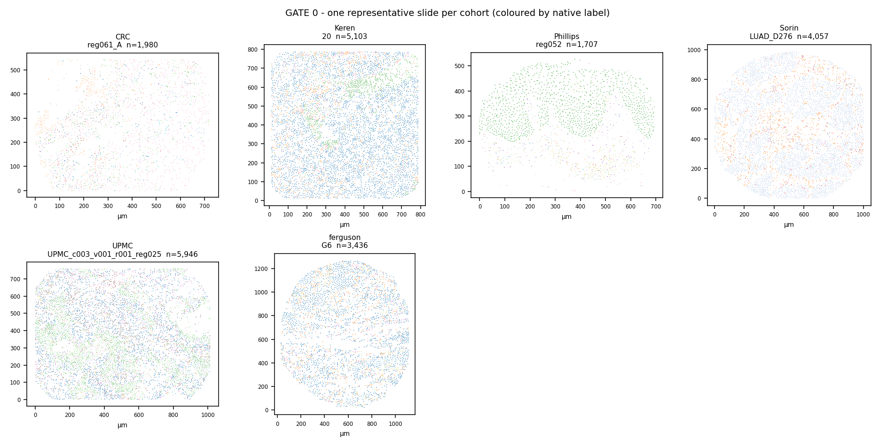

# Stage 0 - Acquire + Audit (GATE 0)

**6 cohorts built** - 5 for training, 1 frozen as held-out test.

Totals across training cohorts: **4,776,210 cells**, **1,093 slides**, **646 patients**.

## The gate table

| cohort   | tech     | tissue        | role    |     cells |   images |   patients |   markers |   labels |   px_um | arrival   |   median_cells_per_image |   slide_um_x |   slide_um_y |
|:---------|:---------|:--------------|:--------|----------:|---------:|-----------:|----------:|---------:|--------:|:----------|-------------------------:|-------------:|-------------:|
| CRC      | CODEX    | colorectal    | train   |   258,385 |      140 |         35 |        58 |       29 | 0.37744 | raw       |                     1979 |          690 |          536 |
| Keren    | MIBI-TOF | breast        | train   |   197,678 |       40 |         40 |        49 |       17 | 0.39063 | zscore    |                     4961 |          775 |          775 |
| Phillips | CODEX    | skin          | train   |   117,170 |       69 |         14 |        59 |       21 | 0.3774  | raw       |                     1707 |          674 |          533 |
| Sorin    | IMC      | lung          | train   | 2,141,875 |      536 |        476 |        18 |       17 | 1       | raw-uint8 |                     4057 |         1004 |          970 |
| UPMC     | CODEX    | head and neck | train   | 2,061,102 |      308 |         81 |        39 |       16 | 0.3774  | arcsinh   |                     5912 |         1000 |          815 |
| ferguson | IMC      | skin          | holdout |   155,913 |       44 |         17 |        36 |        9 | 1       | raw       |                     3407 |         1156 |         1159 |

## Where each micron-per-pixel comes from

This is the number every distance in the pipeline depends on. An assumed value is a stated risk, not a fact.

| cohort   |   px_um | px_um_source                                                              |
|:---------|--------:|:--------------------------------------------------------------------------|
| CRC      | 0.37744 | published - TCIA collection page states 377.44 nm/pixel (Keyence BZ-X710) |
| Keren    | 0.39063 | published - paper states 800 um field of view / 2048 pixels               |
| Phillips | 0.3774  | ASSUMED - not published; same Nolan-lab CODEX + Keyence stack as CRC      |
| Sorin    | 1       | hardware fact - IMC laser ablation spot size is 1 um by construction      |
| UPMC     | 0.3774  | ASSUMED - not published anywhere; same CODEX vendor stack as CRC          |
| ferguson | 1       | hardware fact - IMC laser ablation spot size is 1 um by construction      |

## Missing data

| cohort   |   pct_xy_missing |   pct_area_missing |   pct_patient_unknown | has_confidence   |
|:---------|-----------------:|-------------------:|----------------------:|:-----------------|
| CRC      |            0     |                  0 |                     0 | False            |
| Keren    |            0     |                  0 |                     0 | False            |
| Phillips |            0     |                  0 |                     0 | False            |
| Sorin    |            0.001 |                  0 |                     0 | False            |
| UPMC     |            0     |                  0 |                     0 | True             |
| ferguson |            0     |                  0 |                     0 | False            |

## Tissue check

Each panel is the **median-sized slide** of that cohort, in microns, coloured by native label. Read them for shape: real tissue is irregular and clustered. A regular grid, a straight line, or a uniform blob means the coordinate columns were read wrongly.

| cohort | slide shown | cells |
|---|---|---|
| CRC | `reg061_A` | 1,980 |
| Keren | `20` | 5,103 |
| Phillips | `reg052` | 1,707 |
| Sorin | `LUAD_D276` | 4,057 |
| UPMC | `UPMC_c003_v001_r001_reg025` | 5,946 |
| ferguson | `G6` | 3,436 |

## Native labels per cohort

Every label is kept. Nothing is dropped here - whether `dirt` is a cell is decided at Stage 1b on marker evidence, not by a hand-written list at load time.

<b>CRC</b> - 29 native labels

| native_label               |   cells |   share_% |
|:---------------------------|--------:|----------:|
| tumor cells                |   47602 |     18.42 |
| CD68+CD163+ macrophages    |   39596 |     15.32 |
| smooth muscle              |   27817 |     10.77 |
| granulocytes               |   22144 |      8.57 |
| stroma                     |   20139 |      7.79 |
| CD8+ T cells               |   16675 |      6.45 |
| CD4+ T cells CD45RO+       |   16661 |      6.45 |
| B cells                    |   13043 |      5.05 |
| vasculature                |   11725 |      4.54 |
| plasma cells               |    8510 |      3.29 |
| dirt                       |    7357 |      2.85 |
| undefined                  |    6524 |      2.52 |
| immune cells               |    3127 |      1.21 |
| Tregs                      |    2791 |      1.08 |
| CD4+ T cells               |    2303 |      0.89 |
| immune cells / vasculature |    2153 |      0.83 |
| CD68+ macrophages          |    2108 |      0.82 |
| adipocytes                 |    1811 |      0.7  |
| tumor cells / immune cells |    1797 |      0.7  |
| CD11b+CD68+ macrophages    |    1500 |      0.58 |
| CD11b+ monocytes           |     815 |      0.32 |
| nerves                     |     659 |      0.26 |
| CD11c+ DCs                 |     400 |      0.15 |
| lymphatics                 |     328 |      0.13 |
| NK cells                   |     323 |      0.13 |
| CD3+ T cells               |     189 |      0.07 |
| CD68+ macrophages GzmB+    |     183 |      0.07 |
| CD4+ T cells GATA3+        |      67 |      0.03 |
| CD163+ macrophages         |      38 |      0.01 |

<b>Keren</b> - 17 native labels

| native_label           |   cells |   share_% |
|:-----------------------|--------:|----------:|
| Keratin_positive_tumor |   99487 |     50.33 |
| Macrophages            |   20616 |     10.43 |
| CD8_T                  |   15698 |      7.94 |
| CD4_T                  |   12438 |      6.29 |
| B                      |    9115 |      4.61 |
| Mesenchymal_like       |    8170 |      4.13 |
| Other_immune           |    6891 |      3.49 |
| DC_Mono                |    5049 |      2.55 |
| CD3_T                  |    3848 |      1.95 |
| Tumor                  |    3167 |      1.6  |
| Mono_Neu               |    3110 |      1.57 |
| Neutrophils            |    3018 |      1.53 |
| Endothelial            |    2086 |      1.06 |
| Unidentified           |    1725 |      0.87 |
| Tregs                  |    1341 |      0.68 |
| DC                     |    1245 |      0.63 |
| NK                     |     674 |      0.34 |

<b>Phillips</b> - 21 native labels

| native_label                 |   cells |   share_% |
|:-----------------------------|--------:|----------:|
| tumor cells                  |   38499 |     32.86 |
| epithelium                   |   18182 |     15.52 |
| macrophages (M1>M2)          |   13800 |     11.78 |
| stroma                       |   11210 |      9.57 |
| Tregs                        |    7733 |      6.6  |
| vasculature                  |    5404 |      4.61 |
| CD8+ T cells                 |    5350 |      4.57 |
| macrophages (M1=M2)          |    4426 |      3.78 |
| B cells                      |    2205 |      1.88 |
| macrophages (M2>M1)          |    1859 |      1.59 |
| Langerhans cells             |    1744 |      1.49 |
| CD4+ T cells                 |    1647 |      1.41 |
| tumor cells, intraepithelial |    1316 |      1.12 |
| lymphatics                   |     783 |      0.67 |
| plasma cells                 |     725 |      0.62 |
| mast cells                   |     619 |      0.53 |
| nerves                       |     572 |      0.49 |
| neutrophils                  |     430 |      0.37 |
| IDO+ stromal cells           |     237 |      0.2  |
| CLA+ leukocytes              |     218 |      0.19 |
| DCs, CD11c+                  |     211 |      0.18 |

<b>Sorin</b> - 17 native labels

| native_label     |   cells |   share_% |
|:-----------------|--------:|----------:|
| Cancer           |  930658 |     43.45 |
| Cl MAC           |  198873 |      9.28 |
| Th               |  188104 |      8.78 |
| nan              |  182937 |      8.54 |
| Endothelial cell |  144889 |      6.76 |
| Tc               |  125507 |      5.86 |
| B cell           |   91152 |      4.26 |
| Cl Mo            |   64667 |      3.02 |
| Alt MAC          |   51533 |      2.41 |
| Neutrophils      |   50328 |      2.35 |
| T other          |   28388 |      1.33 |
| Treg             |   25186 |      1.18 |
| Non-Cl Mo        |   23364 |      1.09 |
| Mast cell        |   17424 |      0.81 |
| Int Mo           |   12838 |      0.6  |
| NK cell          |    4388 |      0.2  |
| DCs cell         |    1639 |      0.08 |

<b>UPMC</b> - 16 native labels

| native_label         |   cells |   share_% |
|:---------------------|--------:|----------:|
| Tumor (Ki67+)        |  275647 |     13.37 |
| Tumor                |  225099 |     10.92 |
| Macrophage           |  211303 |     10.25 |
| CD4 T cell           |  195578 |      9.49 |
| CD8 T cell           |  161271 |      7.82 |
| Stromal / Fibroblast |  158552 |      7.69 |
| B cell               |  136756 |      6.64 |
| Tumor (Podo+)        |  129357 |      6.28 |
| Tumor (CD15+)        |  125871 |      6.11 |
| Tumor (CD21+)        |  111077 |      5.39 |
| APC                  |   78777 |      3.82 |
| Vessel               |   70763 |      3.43 |
| Naive immune cell    |   69124 |      3.35 |
| Granulocyte          |   55415 |      2.69 |
| Tumor (CD20+)        |   43261 |      2.1  |
| Lymph vessel         |   13251 |      0.64 |

<b>ferguson</b> - 9 native labels

| native_label   |   cells |   share_% |
|:---------------|--------:|----------:|
| SC             |   87288 |     55.99 |
| EP             |   14170 |      9.09 |
| EC             |   14159 |      9.08 |
| TC_CD4         |   11753 |      7.54 |
| TC_CD8         |    8534 |      5.47 |
| GC             |    7993 |      5.13 |
| MC             |    5283 |      3.39 |
| BC             |    4322 |      2.77 |
| DC             |    2411 |      1.55 |

## Rejected during Stage 0

### Risom - NOT USED

*Risom et al., Cell 2022, 10.1016/j.cell.2021.12.023 (Mendeley 10.17632/d87vg86zd8.2)*

**Why:** Single_Cell_Data.csv (69,672 cells x 136 cols) ships NO X/Y centroid - only derived Neighbor_dist_* features. Risom_Mendeley_Image_Data.zip (298 MB, 82 Points) carries marker TIFs and four REGION masks (duct/epi/myoep/stroma) but no per-cell label mask, so centroids cannot be recovered. Unusable for a spatial graph.

**Note:** Zenodo 5945388, which several sources cite as this dataset, is a different study - the MIBI-TOF reproducibility paper on TONSIL (345,490 cells, 165 FOVs, 16 markers). It has centroids but is healthy tissue, so it fails the cancer-only rule.

## Sources

| cohort   | citation                                                             |
|:---------|:---------------------------------------------------------------------|
| CRC      | Schurch et al., Cell 2020, 10.1016/j.cell.2020.07.005                |
| Keren    | Keren et al., Cell 2018, 10.1016/j.cell.2018.08.039                  |
| Phillips | Phillips et al., Nat Commun 2021, 10.1038/s41467-021-26974-6         |
| Sorin    | Sorin et al., Nature 2023, 10.1038/s41586-022-05672-3                |
| UPMC     | Wu et al., Nat Biomed Eng 2022, 10.1038/s41551-022-00951-w           |
| ferguson | Ferguson et al., Clin Cancer Res 2022, 10.1158/1078-0432.CCR-22-1332 |