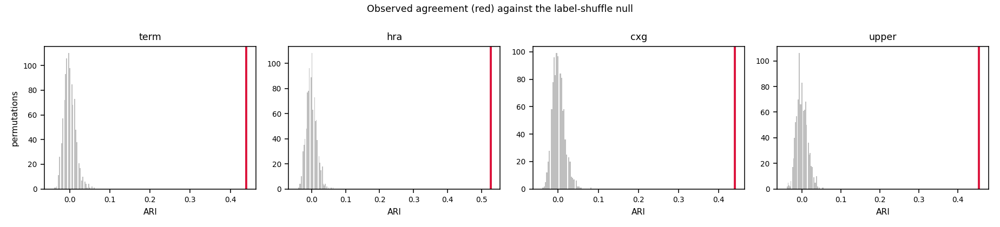
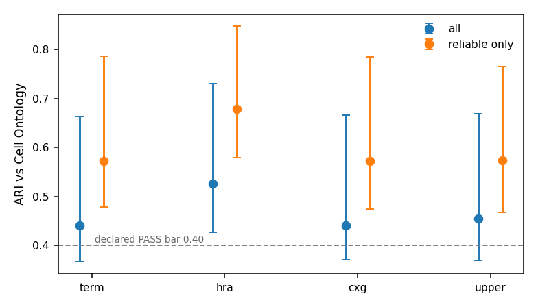

# Stage 12 - external validation of the 25-cluster label space (closes H15)

The 25 clusters Stage 1b derived are scored against the **Cell Ontology**, a published expert-curated cell-type ontology. Nothing was re-cut, re-clustered or re-tuned. Two of these checks were **declared expected to fail before the run** and both are reported.

## What is external here, and what is not

This matters more than any number below, so it comes first.

- **Not external** - which CL term each cohort label is given. That is a reading of the cohort's own paper. The `provenance` column in `_validation/cl_mapping.csv` shows exactly how much is automatic and how much is judgement.
- **External** - everything measured afterwards: which terms are the same, which contains which, how far apart two are, what level each sits at, which markers define it. All of that is the ontology's, and none of it can be moved by picking a term name.

So the claim is *the derived clusters agree with a published ontology's structure*. It is not *the labels were mapped without human input*. Those are different sentences and only the first is defended here.

## Sources

| source | version / date | sha256 (first 16) | used for |
|---|---|---|---|
| Cell Ontology `cl.obo` | releases/2026-06-08 | `7e19b4aef8e7fe77` | hierarchy, published levels, marker rules |
| CellMarker 2.0 (human) | downloaded 2026-08-14 | `bf52b8cd60df60f1` | defining markers, joined by CL id |
| `_validation/cl_mapping.csv` | frozen | `1727d241bfa10f4f` | label to CL term |

- Diehl AD et al., The Cell Ontology 2016. J Biomed Semantics 7:44
- Hu C et al., CellMarker 2.0. Nucleic Acids Research 2023;51:D870-D876

**HuBMAP ASCT+B, which `files/07` H15 names, is not used**: every documented API endpoint returned 404 or 500 on 2026-08-14. CellMarker 2.0 substitutes. Recorded, not swapped quietly.

## Check 0 - the ontology never touches the pipeline

30 modules under `pipeline2/` scanned with comments and string literals removed, so a docstring cannot pass or fail this by talking about the rule it describes.

**PASS** - no module except this one names a CL term in code or reads the scoring files. `files/02` 2.1 and D-4 hold: the Cell Ontology is a scoring set here, exactly as `_validation/hand_mapping_reference.csv` already was.

## Check 1 - coverage

| quantity | value | bar | verdict |
|---|---|---|---|
| labels resolved to a CL term | **101/106** = 0.953 | >= 0.95 | PASS |
| of those, resolved automatically | **23/101** = 0.228 | >= 0.50 | MISSED |

| provenance        |   labels |
|:------------------|---------:|
| manual_from_paper |       78 |
| auto_exact        |       18 |
| unmappable        |        5 |
| auto_stripped     |        4 |
| auto_synonym      |        1 |

33 distinct CL terms across 106 labels. The 5 unresolved labels are `CRC|dirt`, `CRC|undefined`, `Keren|Unidentified` (not cells) and `CRC|immune cells / vasculature`, `CRC|tumor cells / immune cells` (two lineages whose only common CL ancestor is `cell` itself). They are excluded from scoring and named here rather than dropped silently.

> **The automatic bar was MISSED, and that changes a sentence.** Most labels in this roster are marker-gated strings (`CD68+CD163+ macrophages`) or opaque codes (`SC`, `Cl MAC`, `Th`) that no exact string match can reach. The honest phrasing is **"assigned from each cohort's own paper, then checked against CL"**, not "resolved automatically against CL". Check 1b was declared non-blocking in advance for exactly this reason. What the assignment cannot bias is the STRUCTURE everything below is measured against.

78 labels carry a manual assignment. **0 of them contradict an automatic match** - a contradiction is a manual term that is neither an ancestor nor a descendant of the automatic one, which would mean judgement overriding evidence, and the builder reports every one. A further 7 manual entries REFINE a coarser automatic hit (`CD8+ T cells` strips to `T cell`; the manual entry says `CD8-positive, alpha-beta T cell`, which sits under it in CL). That is the automatic tier stopping at an ancestor, not a disagreement.

## Check 2 - do the clusters agree with the ontology?

**The four levels are the Cell Ontology's own published subsets, not this project's choice.** `term` is the exact CL term; `hra` is HuBMAP's Human Reference Atlas subset; `cxg` is the CZI CellxGene subset; `upper` is CL's coarse slims. "You picked the level that flattered you" is not available as an objection.

Intervals are a percentile bootstrap over labels. **This is the first gate in this project ever scored with a confidence interval** (H9). The interval prices the small label count and nothing else - it does not price the choice of CL term.

| level   | scope         | weight        |   n_labels |   n_classes | ARI (95% CI)         |   nmi |   hom |   comp |
|:--------|:--------------|:--------------|-----------:|------------:|:---------------------|------:|------:|-------:|
| term    | all           | per label     |        101 |          33 | 0.440 [0.366, 0.662] | 0.771 | 0.721 |  0.829 |
| term    | all           | cell weighted |        101 |          33 | 0.934 [0.773, 0.985] |       |       |        |
| term    | reliable only | per label     |         81 |          24 | 0.572 [0.478, 0.786] | 0.817 | 0.785 |  0.852 |
| term    | reliable only | cell weighted |         81 |          24 | 0.937 [0.754, 0.987] |       |       |        |
| hra     | all           | per label     |        101 |          28 | 0.526 [0.427, 0.730] | 0.779 | 0.749 |  0.812 |
| hra     | all           | cell weighted |        101 |          28 | 0.955 [0.853, 0.988] |       |       |        |
| hra     | reliable only | per label     |         81 |          20 | 0.678 [0.579, 0.847] | 0.832 | 0.825 |  0.839 |
| hra     | reliable only | cell weighted |         81 |          20 | 0.960 [0.856, 0.992] |       |       |        |
| cxg     | all           | per label     |        101 |          33 | 0.440 [0.370, 0.666] | 0.771 | 0.721 |  0.829 |
| cxg     | all           | cell weighted |        101 |          33 | 0.934 [0.753, 0.984] |       |       |        |
| cxg     | reliable only | per label     |         81 |          24 | 0.572 [0.475, 0.784] | 0.817 | 0.785 |  0.852 |
| cxg     | reliable only | cell weighted |         81 |          24 | 0.937 [0.752, 0.988] |       |       |        |
| upper   | all           | per label     |        100 |          17 | 0.455 [0.369, 0.668] | 0.725 | 0.751 |  0.7   |
| upper   | all           | cell weighted |        100 |          17 | 0.919 [0.718, 0.981] |       |       |        |
| upper   | reliable only | per label     |         81 |          14 | 0.573 [0.468, 0.765] | 0.77  | 0.818 |  0.728 |
| upper   | reliable only | cell weighted |         81 |          14 | 0.923 [0.710, 0.983] |       |       |        |

Only the ARI is cell-weighted; NMI, homogeneity and completeness are per label throughout and are left blank on the weighted rows rather than repeated as if they were weighted.

**Headline: ARI 0.4400 [0.3662, 0.6624] at the exact-term level, all clusters, per label -> PASS** against the declared bars (>= 0.40 PASS / 0.20-0.40 PARTIAL / < 0.20 FAIL).

Excluding the three clusters Gate 1b already flagged unreliable (2, 16, 18): **0.5725 [0.4784, 0.7857]**. Both are quoted everywhere, following D-53's rule - the first says how well the whole label space matches published biology, the second how well the part the method did not already disown matches it.

**Cell-weighted, the same comparison gives 0.9336 [0.7725, 0.9845].** The gap between that and the per-label number says where the disagreements are: the big clusters - tumour, macrophage, T cells - match published biology, and the errors sit in small ones.

### The number that matters most for the thesis

Gate 1b scored the same 25 clusters against **this project's own hand mapping** and got **0.596 per label / 0.962 cell-weighted**. The Cell Ontology, which no one on this project wrote, gives **0.440 per label / 0.934 cell-weighted** over a larger label set (101 against 64) and a larger class set (33 against 25).

An outside ontology reaches almost the same verdict as the hand mapping the method was built to replace. That is the point of the whole stage: the 0.928 agreement Gate 1b reported was not an artefact of scoring the method against a target written by the same people.

Homogeneity against completeness says, at no extra cost, which way the granularity runs: homogeneity above completeness means the 25 clusters are **finer** than that ontology level, below means coarser.

**The alternative tumour reading.** CL has only two malignant terms and no tissue-specific children. Forcing all 14 malignant labels to `neoplastic cell` instead of their lineage gives ARI **0.4094 [0.3512, 0.6457]** over 34 classes. It is reported so the lineage choice is priced rather than buried. That reading makes CRC's malignant colorectal epithelium and Phillips's malignant T cells the SAME term, which would score Stage 1b's correct split of them - the hardest case in `panel/gate1b_expect.csv` - as a failure.

Level-projection ties (a term equally near two published classes, broken by sorted id): {'upper': 0, 'cxg': 0, 'hra': 0}.

## Check 3 - is that agreement more than luck?

1000 shuffles of the cluster assignment among labels, cluster sizes preserved exactly. The null asks *could a partition of these shapes score this by luck*.

| level   |   observed |   null_mean |   null_p999 |   null_max |   p_value | passes   |
|:--------|-----------:|------------:|------------:|-----------:|----------:|:---------|
| term    |     0.44   |     -0.0002 |      0.0547 |     0.0619 |         0 | True     |
| hra     |     0.5258 |      0.0001 |      0.0582 |     0.0649 |         0 | True     |
| cxg     |     0.44   |      0.001  |      0.0583 |     0.0835 |         0 | True     |
| upper   |     0.4553 |     -0.0001 |      0.0528 |     0.0557 |         0 | True     |

**PASS at every level** - the observed agreement sits outside the null. Without this check the 0.40 bar would be decoration.

## Check 4 - pairwise relations, and the first external test of the nesting layer

All 5050 pairs of scored labels. The Cell Ontology classifies each pair; the learned space is read off `work/label_map.csv` and the 22 nesting edges in `work/label_graph.json`. This replaces 13 hand-written assertions with thousands of externally-sourced ones.

| cl_relation      |   same cluster |   nesting edge |   different |
|:-----------------|---------------:|---------------:|------------:|
| distant          |            135 |            212 |        3946 |
| parent-child     |             91 |             48 |         354 |
| same term        |            138 |             12 |          64 |
| same upper class |              9 |              2 |          39 |

| what CL asserts | what Stage 1b must do | all clusters | reliable only | bar | verdict |
|---|---|---|---|---|---|
| CL says SAME TERM | same cluster | **0.645** (214 pairs) | 0.736 (182 pairs) | &gt;= 0.90 | FAIL |
| CL says PARENT-CHILD | same cluster or a nesting edge | **0.282** (493 pairs) | 0.377 (300 pairs) | &gt;= 0.60 | FAIL |
| CL says DISTANT | NOT the same cluster | **0.031** (4293 pairs) | 0.018 (2715 pairs) | &lt;= 0.05 | PASS |

The verdict column is scored on **all clusters**, as declared. The reliable-only column is reported alongside under D-53's rule.

### The hardest case in the project, refereed from outside

`panel/gate1b_expect.csv` calls `Phillips|tumor cells` vs `CRC|tumor cells` *"the strongest single test of the whole Stage 1b claim"* - identical strings, different cell types, because Phillips is a cutaneous T-cell lymphoma and CRC is colorectal epithelium.

**The Cell Ontology places them `distant`. Stage 1b places them `different`.** An outside referee agrees with the method on the case the method was built to get right.

### Every mis-merge the project already knew about, found independently

`reports/PROJECT_AUDIT.md` B.4 named these by hand. The ontology was not shown that list and reaches the same pairs:

| pair                                 |   cluster | the audit said                         | Cell Ontology says   | Stage 1b does   |
|:-------------------------------------|----------:|:---------------------------------------|:---------------------|:----------------|
| Sorin\|NK cell + CRC\|granulocytes   |         3 | NK cells are not granulocytes          | distant              | same cluster    |
| Keren\|NK + ferguson\|DC             |        21 | NK cells are not dendritic cells       | distant              | same cluster    |
| Keren\|NK + Sorin\|DCs cell          |        21 | NK cells are not dendritic cells       | distant              | same cluster    |
| ferguson\|GC + Sorin\|Mast cell      |        22 | granulocyte with mast cell             | distant              | same cluster    |
| ferguson\|GC + Phillips\|DCs, CD11c+ |        22 | granulocyte with dendritic cell        | distant              | same cluster    |
| Keren\|Neutrophils + ferguson\|EP    |        20 | epithelial cluster holding neutrophils | distant              | same cluster    |

Where the distant-but-merged pairs sit, by cluster:

|   cluster |   distant pairs merged | flagged unreliable   |
|----------:|-----------------------:|:---------------------|
|         2 |                     82 | True                 |
|         1 |                     26 | False                |
|         0 |                     11 | False                |
|         4 |                      5 | False                |
|        18 |                      3 | True                 |
|        22 |                      3 | False                |
|         3 |                      2 | False                |
|        21 |                      2 | False                |
|        20 |                      1 | False                |

- **4b is the first evidence of any kind about the nesting layer** (H2, `files/07` gap 2). All three declared nesting cases FAILED at Gate 1b, and Stage 6's descendant-tolerant loss depends on this layer. A same-cluster merge counts as respected because `panel/gate1b_expect.csv` already rules that a merge is a granularity decision the stability filter is allowed to make.
- **4c was declared expected to fail.** `reports/PROJECT_AUDIT.md` B.4 had already named the mis-merges; this puts a number on them from an outside source.

The distant pairs merged anyway, largest first by cells:

|   cluster | cohort A   | label A          | cohort B   | label B          |   cells |
|----------:|:-----------|:-----------------|:-----------|:-----------------|--------:|
|         0 | Keren      | Other_immune     | Sorin      | Cancer           |  937549 |
|         4 | UPMC       | CD8 T cell       | Sorin      | Tc               |  286778 |
|         0 | UPMC       | Tumor (Ki67+)    | Keren      | Other_immune     |  282538 |
|         0 | UPMC       | Tumor            | Keren      | Other_immune     |  231990 |
|         1 | UPMC       | Macrophage       | Phillips   | Langerhans cells |  213047 |
|         1 | UPMC       | Macrophage       | Keren      | DC               |  212548 |
|         1 | Phillips   | Langerhans cells | Sorin      | Cl MAC           |  200617 |
|         1 | Keren      | DC               | Sorin      | Cl MAC           |  200118 |
|         4 | CRC        | CD8+ T cells     | Sorin      | Tc               |  142182 |
|         4 | Keren      | CD8_T            | Sorin      | Tc               |  141205 |
|         0 | UPMC       | Tumor (Podo+)    | Keren      | Other_immune     |  136248 |
|         4 | ferguson   | TC_CD8           | Sorin      | Tc               |  134041 |

## Check 5 - defining-marker coverage, and a prediction made before the lookup

For each cluster: its majority cell type by cells, that type's published markers from CellMarker 2.0 (joined by **CL id**, no string matching), and how specific the best of those markers is among the ones the contributing cohorts actually measure, per `work/marker_registry.csv`.

> The markers come from CellMarker rather than from CL's own rules for one reason: CL names Protein Ontology TERMS, not gene symbols, so using it would need a name-to-symbol resolution layer - and D-55 is a record of exactly that going wrong three times in this project. CL's own rules are shown in the last column wherever they exist.

`best_marker` is the most specific marker available: among symbols CellMarker lists for that cell type in at least 10 rows **and** the contributing cohorts actually measure, it is the one pointing at the fewest other cell types. `best_n_types` is that count - **lower is better**. `PTPRC` points at hundreds of types and identifies nothing; `TPSB2` points at four and identifies a mast cell.

> **This check took three attempts and the first two were broken. Recorded, not tidied away.** (1) Counting ANY listed marker made all 25 clusters covered - generic markers sit in every panel, and a dendritic-cell cluster passed on `HLA-DRA` and `ITGAX`, which macrophages carry too. (2) Ranking by specificity alone was worse in the opposite direction: it selects CellMarker's rarest entries, which are its least reliable, and it named `ZNF540` (listed once) the best CD8 T-cell marker and `COL4A4` the best B-cell marker. (3) Requiring support of >= 10 rows BEFORE reading specificity fixes it.

**The instrument was checked against known biology before the prediction was read off it**, which is the only way a third attempt is honest. Asked for the supported markers of cell types that are not in doubt, it now returns `MS4A1`, `CD19` and `CD79A` for B cells, `TPSAB1`, `TPSB2` and `CPA3` for mast cells, and `CD8A` and `CD8B` for CD8 T cells. That test is about the tool, not about the answer. The `best_marker` column below is then whichever supported marker the cohorts actually measure, so it is often a different member of the same list.

> **Why there is still no pass/fail column.** The check was declared as a binary, and no defensible cut exists between the two degenerate extremes above. Any threshold in between would be a number chosen after seeing which answer it gave - exactly what `panel/*_expect.csv` exists to prevent. So the score is reported as a number and the prediction is tested by comparing the four predicted clusters against the other 20, which needs no cut at all.

|   cluster | cl_type                              |   n_labels |   n_supported |   n_in_panel | best_marker   |   best_n_types | cl_rule                                                                  |
|----------:|:-------------------------------------|-----------:|--------------:|-------------:|:--------------|---------------:|:-------------------------------------------------------------------------|
|         0 | epithelial cell                      |         13 |             8 |            6 | KRT14         |             10 | -                                                                        |
|         1 | macrophage                           |         16 |            19 |            7 | ITGAM         |             11 | -                                                                        |
|         2 | classical monocyte                   |         17 |             1 |            1 | CD14          |             47 | -                                                                        |
|         3 | granulocyte                          |          3 |             0 |            0 | -             |            nan | cell adhesion molecule CEACAM8,integrin alpha-M                          |
|         4 | CD8-positive, alpha-beta T cell      |          7 |             8 |            7 | LAG3          |             10 | T cell receptor co-receptor CD8                                          |
|         5 | CD4-positive helper T cell           |          5 |             0 |            0 | -             |            nan | -                                                                        |
|         6 | B cell                               |          6 |            25 |            4 | CR2           |              8 | -                                                                        |
|         7 | endothelial cell                     |          5 |            16 |            3 | PECAM1        |             42 | -                                                                        |
|         8 | leukocyte                            |          3 |             2 |            2 | MS4A1         |             24 | -                                                                        |
|         9 | regulatory T cell                    |          4 |             8 |            4 | FOXP3         |             12 | -                                                                        |
|        10 | CD4-positive, alpha-beta T cell      |          2 |             5 |            3 | CD3E          |             25 | CD4 molecule                                                             |
|        11 | (no mapped label)                    |          1 |             0 |            0 | -             |            nan | -                                                                        |
|        12 | monocyte                             |          1 |            11 |            2 | CD163         |             20 | -                                                                        |
|        13 | dendritic cell                       |          1 |            11 |            2 | ITGAX         |             10 | -                                                                        |
|        14 | natural killer cell                  |          1 |            23 |            7 | GZMB          |             17 | -                                                                        |
|        15 | CD4-positive, alpha-beta T cell      |          2 |             5 |            3 | CD3E          |             25 | CD4 molecule                                                             |
|        16 | fibroblast                           |          2 |            12 |            3 | PDPN          |             15 | -                                                                        |
|        17 | endothelial cell of lymphatic vessel |          1 |             1 |            0 | -             |            nan | -                                                                        |
|        18 | endothelial cell                     |          4 |            16 |            2 | PECAM1        |             42 | -                                                                        |
|        19 | T cell                               |          2 |            25 |            9 | CD3G          |              8 | -                                                                        |
|        20 | epithelial cell                      |          2 |             8 |            6 | KRT14         |             10 | -                                                                        |
|        21 | dendritic cell                       |          3 |            11 |            3 | CD209         |             10 | -                                                                        |
|        22 | mast cell                            |          3 |             5 |            2 | TPSAB1        |              7 | C-C chemokine receptor type 3,cell surface glycoprotein CD200 receptor 3 |
|        23 | mast cell                            |          1 |             5 |            1 | TPSAB1        |              7 | C-C chemokine receptor type 3,cell surface glycoprotein CD200 receptor 3 |
|        24 | neutrophil                           |          1 |            10 |            3 | FCGR3B        |              8 | leukosialin,low affinity immunoglobulin gamma Fc region receptor II      |

**The prediction declared in `panel/gate12_expect.csv` before this lookup ran:** clusters 18, 20, 21, 22 would have no defining marker available. They are the four whose ferguson labels scored ~0.000 at Gate 7.

| group | clusters | median `best_n_types` |
|---|---|---|
| predicted to fail | 4 | **10** |
| all others | 17 | **12** |

**The clusters with NO supported marker measured at all: [3, 5, 17].** Zero is not a threshold anyone chose, so this is the one cut-free reading of the check, and it is the closest thing to what check 5a was reaching for. None of the four predicted clusters is in it. Cluster 3 is the granulocyte cluster that also holds `Sorin|NK cell`; the panels contributing to it measure no supported granulocyte marker, which is a stated scope condition rather than a modelling failure.

**The prediction is NOT SUPPORTED.** The four clusters do not have less specific markers available than the rest, so marker availability is not what separates them, and the reason their ferguson labels scored ~0.000 lies elsewhere - most likely in the mis-merge itself (check 4c) rather than in the panel. The prediction was declared before the lookup, it is wrong, and it stays here: deleting a failed prediction is how results get flattered.

## Check 6 - M6, the L1 agreement anomaly

Gate 1b reported L1 agreement 0.629 against 0.855 at L2 and 0.928 at target. Agreement normally RISES as classes get coarser, so the fall is a red flag. The suspected cause is the Hungarian one-to-one matching: 25 clusters cannot be matched onto 3 classes without leaving 22 unmatched. Re-scored many-to-one:

| level | classes | labels | cell-weighted | per label |
|---|---|---|---|---|
| hand L1 (M6) | 3 | 64 | **0.9927** | 0.9219 |
| CL upper slim | 17 | 100 | **0.9136** | 0.7100 |

**Settled: it was a matching artefact.** 0.629 -> 0.9927 many-to-one. The clusters do not cut across immune / stromal / tumour.

## Verdict against `panel/gate12_expect.csv`

| check                           | measured                                                                            | bar                                    | verdict                  |
|:--------------------------------|:------------------------------------------------------------------------------------|:---------------------------------------|:-------------------------|
| 0 independence                  | 0 violations in 30 modules                                                          | 0                                      | PASS                     |
| 1a coverage                     | 101/106 = 0.953                                                                     | >= 0.95                                | PASS                     |
| 1b automatic share              | 23/101 = 0.228                                                                      | >= 0.50                                | MISSED (non-blocking)    |
| 2a ARI at CL term level         | 0.4400 [0.3662, 0.6624]                                                             | >= 0.40                                | PASS                     |
| 2a same, reliable clusters only | 0.5725 [0.4784, 0.7857]                                                             | (reported alongside)                   | PASS                     |
| 3 permutation null              | beats p99.9 at 4/4 levels                                                           | all levels                             | PASS                     |
| 4a CL same term -> same cluster | 0.645                                                                               | >= 0.90                                | FAIL                     |
| 4b CL parent-child respected    | 0.282                                                                               | >= 0.60                                | FAIL                     |
| 4c CL distant -> merged anyway  | 0.031                                                                               | <= 0.05                                | PASS                     |
| 5a marker-coverage prediction   | best-marker specificity, predicted 10 vs rest 12 cell types (lower = more specific) | predicted clusters worse than the rest | NOT SUPPORTED (recorded) |

## Limitations, stated rather than discovered later

1. **The term assignment is judgement.** See the first section. The structure it is scored against is not.
2. **Cluster 2 is a junk drawer**, 17 labels named `no discriminative shared marker`. Every number is reported with and without it.
3. **CL cannot express tumour identity** - two malignant terms, no tissue-specific children. Both readings are reported.
4. **106 labels is a small sample.** The bootstrap prices that; nothing prices the roster being 6 cohorts.
5. **This says nothing about granularity.** Whether 25 is the right number of clusters is H11 / D-47 and is deliberately out of scope. The existing wording stands: 25 is one defensible choice inside a feasible window, not the granularity the data selected.
6. **CellMarker rows are pooled across tissues** rather than restricted to each cohort's tumour type, so check 5 asks whether a marker of that cell type exists in the panel at all, not whether it works in that tumour.
7. **Check 5 has no pass/fail and check 5a is answered by a two-group comparison**, because no defensible binary cut exists. The three attempts and why the first two failed are written into the check-5 section rather than left out.

1000 permutations, 2000 bootstrap resamples, 0.1 min, CPU. Seed 20260810.
