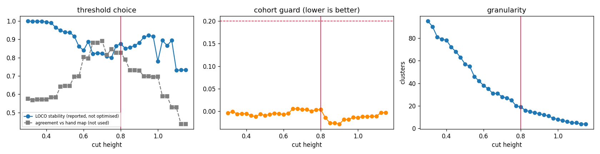

# Stage 1b - automatic label alignment (GATE 1b)

_106 native labels from 6 cohorts, aligned with no ontology, no hand-written dictionary and no text._

## What was measured

- Value transform: **`u_coh`**, the per-cohort ECDF - the arm that won Gate 1.
- Signature: **9 quantiles** per (label, marker) + prevalence + the within-label co-expression matrix.
- Markers combined by a **floored geometric mean** (floor 0.05), not an average, so one decisive disagreement can veto a merge.
- Evidence floor **k = 8** informative shared markers; a marker is informative when its between-label range reaches **0.1** in *both* cohorts.
- Merge threshold **tau = 0.800**, chosen by LOCO stability, never by agreement with the hand mapping.

**3 native labels excluded before any alignment** (183,042 cells) - quantiles on a handful of cells are noise, and an unlabelled group is not a cell type:

| cohort | native_label | cells | reason |
|---|---|---|---|
| Sorin | nan | 182937 | unlabelled |
| CRC | CD4+ T cells GATA3+ | 67 | below MIN_CELLS=100 |
| CRC | CD163+ macrophages | 38 | below MIN_CELLS=100 |

## Choosing the threshold without looking at the answer

Tuning `tau` against the hand mapping would make check 1 circular, so it is chosen by **leave-one-cohort-out stability**: mean ARI between the full clustering and each held-out re-derivation. ARI is chance-corrected, so both degenerate answers punish themselves - one giant cluster and all-singletons each score about 0.

Stability alone is **not enough**, and the first build of this stage proved it: a clustering that is really the cohort partition is perfectly reproducible when a *different* cohort is dropped, and it scored 0.972 while grouping tumour, macrophages, T cells and B cells together. So `cohort_ari` - how much the clustering is just "which dataset is this" - is a **hard feasibility constraint** (must be <= 0.2), not a term in the objective. Cohort id is metadata, not a cell type, so using it leaks nothing.

| cut | clusters | singletons | biggest | biggest_share | stability | cohort_ari | cross_cohort_share | usable | agreement_vs_hand |
|---|---|---|---|---|---|---|---|---|---|
| 0.300 | 95 | 84 | 2 | 0.019 | 0.999 | -0.004 | 0.185 | False | 0.575 |
| 0.325 | 90 | 77 | 3 | 0.028 | 0.998 | -0.001 | 0.205 | False | 0.568 |
| 0.350 | 81 | 64 | 4 | 0.038 | 0.999 | -0.006 | 0.491 | False | 0.571 |
| 0.375 | 79 | 61 | 4 | 0.038 | 0.998 | -0.005 | 0.494 | False | 0.571 |
| 0.400 | 78 | 59 | 4 | 0.038 | 0.995 | -0.006 | 0.494 | False | 0.571 |
| 0.425 | 72 | 52 | 6 | 0.057 | 0.990 | -0.010 | 0.542 | False | 0.583 |
| 0.450 | 68 | 47 | 6 | 0.057 | 0.964 | -0.012 | 0.595 | False | 0.583 |
| 0.475 | 63 | 41 | 6 | 0.057 | 0.948 | -0.006 | 0.601 | False | 0.641 |
| 0.500 | 57 | 35 | 7 | 0.066 | 0.939 | -0.010 | 0.648 | False | 0.646 |
| 0.525 | 55 | 32 | 7 | 0.066 | 0.938 | -0.007 | 0.696 | False | 0.646 |
| 0.550 | 46 | 24 | 7 | 0.066 | 0.916 | -0.005 | 0.884 | False | 0.696 |
| 0.575 | 42 | 21 | 7 | 0.066 | 0.861 | -0.006 | 0.885 | False | 0.697 |
| 0.600 | 38 | 19 | 10 | 0.094 | 0.839 | -0.007 | 0.888 | False | 0.802 |
| 0.625 | 35 | 16 | 10 | 0.094 | 0.887 | -0.005 | 0.945 | False | 0.796 |
| 0.650 | 31 | 13 | 12 | 0.113 | 0.821 | 0.005 | 0.946 | False | 0.881 |
| 0.675 | 31 | 13 | 12 | 0.113 | 0.825 | 0.005 | 0.946 | False | 0.881 |
| 0.700 | 28 | 12 | 16 | 0.151 | 0.823 | 0.004 | 0.946 | False | 0.890 |
| 0.725 | 27 | 12 | 16 | 0.151 | 0.807 | 0.004 | 0.946 | False | 0.814 |
| 0.750 | 25 | 11 | 16 | 0.151 | 0.799 | 0.000 | 0.967 | True | 0.846 |
| 0.775 | 20 | 8 | 17 | 0.160 | 0.864 | 0.003 | 0.996 | True | 0.827 |
| 0.800 | 19 | 7 | 17 | 0.160 | 0.875 | 0.004 | 0.996 | True | 0.827 |
| 0.825 | 16 | 7 | 30 | 0.283 | 0.850 | -0.015 | 0.996 | False | 0.789 |
| 0.850 | 15 | 7 | 36 | 0.340 | 0.856 | -0.026 | 0.996 | False | 0.730 |
| 0.875 | 14 | 6 | 36 | 0.340 | 0.865 | -0.027 | 0.996 | False | 0.730 |
| 0.900 | 13 | 6 | 36 | 0.340 | 0.881 | -0.028 | 0.996 | False | 0.729 |
| 0.925 | 12 | 6 | 44 | 0.415 | 0.911 | -0.019 | 0.996 | False | 0.697 |
| 0.950 | 11 | 5 | 44 | 0.415 | 0.921 | -0.018 | 0.996 | False | 0.697 |
| 0.975 | 9 | 4 | 45 | 0.425 | 0.916 | -0.014 | 0.996 | False | 0.694 |
| 1.000 | 8 | 4 | 45 | 0.425 | 0.780 | -0.015 | 0.997 | False | 0.695 |
| 1.025 | 7 | 4 | 74 | 0.698 | 0.894 | -0.012 | 0.997 | False | 0.589 |
| 1.050 | 6 | 3 | 74 | 0.698 | 0.866 | -0.012 | 0.997 | False | 0.589 |
| 1.075 | 5 | 3 | 74 | 0.698 | 0.894 | -0.012 | 0.997 | False | 0.528 |
| 1.100 | 5 | 3 | 74 | 0.698 | 0.731 | -0.012 | 0.997 | False | 0.528 |
| 1.125 | 4 | 3 | 103 | 0.972 | 0.733 | -0.003 | 0.997 | False | 0.438 |
| 1.150 | 4 | 3 | 103 | 0.972 | 0.733 | -0.003 | 0.997 | False | 0.438 |

Chosen **tau = 0.800** - the most stable threshold among those passing the cohort guard (stability 0.875, cohort_ari 0.004, 100% of labels in a cluster that spans >= 2 cohorts). 32 of 35 thresholds were rejected by the guard.

The agreement column is shown *only* so a reader can see whether that choice was lucky - it did not enter the decision. Agreement peaks at cut = 0.700 (0.890) against 0.827 at the chosen threshold.

## Check 1 - agreement with the hand-written mapping

The old dictionary covers **4 cohorts / 64 labels**. It is read only here.

It is scored at **all three of its own levels**, because the level matters and quoting one number would hide that. The finest level is what the hand mapping calls `target`; `L2` and `L1` are its own coarser groupings. The number of clusters the shared evidence can support is a finding, not something to be assumed in advance.

| level | classes | agreement | ari_cellwt | ari_perlabel |
|---|---|---|---|---|
| L1 - broad lineage | 3 | 0.629 | 0.610 | 0.107 |
| L2 - the level the old pipeline scored | 10 | 0.855 | 0.918 | 0.445 |
| target - the finest hand level | 25 | 0.928 | 0.962 | 0.596 |

Automatic clusters: **25**. Gate target: agreement **0.90**.

**21 of 64 covered labels disagree** (7.2% of covered cells):

| cohort | label | n_cells | hand | landed_with | cluster | cluster_name |
|---|---|---|---|---|---|---|
| CRC | stroma | 20139 | StromaFib | SMC | 2 | no discriminative shared marker |
| CRC | CD4+ T cells CD45RO+ | 16661 | CD4T | StromaFib | 5 | CD4+ CD3D|CD3E|CD3G+ PTPRC+ |
| CRC | plasma cells | 8510 | Plasma | ImmOther | 8 | PECAM1+ CD38+ SDC1+ |
| CRC | immune cells | 3127 | ImmOther | SMC | 2 | no discriminative shared marker |
| CRC | CD4+ T cells | 2303 | CD4T | Plasma | 10 | PTPRC+ CD3D|CD3E|CD3G+ EGFR- |
| CRC | adipocytes | 1811 | Adip | SMC | 2 | no discriminative shared marker |
| CRC | nerves | 659 | Nerve | SMC | 2 | no discriminative shared marker |
| CRC | CD11c+ DCs | 400 | DC | Adip | 13 | ITGAX+ CTNNB1- |
| CRC | lymphatics | 328 | Lymph | SMC | 2 | no discriminative shared marker |
| CRC | CD3+ T cells | 189 | Tcell | Plasma | 10 | PTPRC+ CD3D|CD3E|CD3G+ EGFR- |
| UPMC | APC | 78777 | APC | Mac | 1 | CD163+ CD68+ HLA-DRA|HLA-DRB1|HLA-DRB5+ |
| Keren | Other_immune | 6891 | ImmOther | Tumor | 0 | KRT1|KRT4|KRT5|KRT6A|KRT7|KRT8|KRT10|KRT |
| Keren | DC_Mono | 5049 | MyeloidMix | Mac | 1 | CD163+ CD68+ HLA-DRA|HLA-DRB1|HLA-DRB5+ |
| Keren | Tumor | 3167 | Tumor | Mesen | 18 | PTPRC- |
| Keren | Mono_Neu | 3110 | MyeloidMix | SMC | 2 | no discriminative shared marker |
| Keren | Neutrophils | 3018 | Neut | Epith | 20 | PDPN+ KRT1|KRT4|KRT5|KRT6A|KRT7|KRT8|KRT |
| Keren | DC | 1245 | DC | Mac | 1 | CD163+ CD68+ HLA-DRA|HLA-DRB1|HLA-DRB5+ |
| Keren | NK | 674 | NK | DC | 21 | ITGAX+ HLA-DRA|HLA-DRB1|HLA-DRB5+ IDO1+ |
| ferguson | EC | 14159 | Endo | Mesen | 18 | PTPRC- |
| ferguson | TC_CD4 | 11753 | CD4T | StromaFib | 5 | CD4+ CD3D|CD3E|CD3G+ PTPRC+ |
| ferguson | GC | 7993 | Gran | Nerve | 22 | CD68+ ITGAX+ ICOS- |

## Check 2 - the hard cases, declared in advance

From `pipeline2/panel/gate1b_expect.csv`, written **before** this run.

| case | relation | required | waived | result | detail |
|---|---|---|---|---|---|
| tumour_epithelial | same | 1 | 0 | PASS | clusters [0] |
| endothelium | same | 1 | 0 | PASS | clusters [7] |
| endothelium_ferguson | same | 0 | 0 | FAIL | clusters [7, 18] |
| stroma | same | 1 | 1 | FAIL | clusters [2, 16, 18] |
| cd4_vs_cd8 | different | 1 | 0 | PASS | clusters [15, 4] |
| same_name_different_type | different | 1 | 0 | PASS | clusters [5, 0] |
| b_cells | same | 0 | 0 | PASS | clusters [6] |
| macrophages | same | 0 | 0 | PASS | clusters [1] |
| cd8_t | same | 0 | 0 | PASS | clusters [4] |
| tumour_vs_tcell | different | 0 | 0 | PASS | clusters [0, 4] |
| nest_tcell | nested | 0 | 0 | FAIL | no edge 4 -> 10; reverse=False |
| nest_tumour_ki67 | nested | 0 | 0 | merged | merged into one cluster (0) |
| nest_treg | nested | 0 | 0 | FAIL | no edge 9 -> 15; reverse=False |

**Required cases: 4/5 pass, 1 waived on measured evidence, 0 blocking.**

> **`stroma` is a WAIVED FAILURE, not a pass.** It was declared required before the run and it failed. WAIVED AFTER THE RUN, on measured evidence, by explicit user decision 2026-08-10. This case was declared REQUIRED before the run and it FAILED - that history is left visible on purpose. The cause is the panel, not the method: of the 17 informative markers CRC+UPMC+Keren share, the only fibroblast-associated one is VIM, which is not fibroblast-specific. NO PDGFRB, FAP, COL1A1, DCN, LUM, POSTN, S100A4 or TAGLN exists anywhere in the roster; ACTA2 is CRC+UPMC only and CD34 is CRC+Phillips+UPMC only. Stroma is a NEGATIVE-DEFINITION class in this panel - CRC stroma's nearest cross-cohort neighbours are Sorin MONOCYTES (0.813), which are also negative for every lineage marker. Measured similarities 0.42-0.58 against a 0.449 merge threshold. CONSEQUENCE: stromal/fibroblast clusters are NOT reliable and must be excluded from or flagged in Stage 7 scoring. Re-test if a cohort with a fibroblast-specific marker is ever added.

**3 clusters carry a waived failure and are flagged `unreliable` in `work/label_map.csv`** (clusters [2, 16, 18], 23 labels, 420,862 cells). Stage 7 must exclude them from the headline score or report them separately - they are not evidence of anything either way.

**Why `endothelium_ferguson` failed.** Pairwise similarity between its members, against the chosen cut of 0.449:

| a | b | similarity | informative_markers | would_merge |
|---|---|---|---|---|
| CRC|vasculature | UPMC|Vessel | 0.628 | 29 | True |
| CRC|vasculature | Keren|Endothelial | 0.475 | 22 | True |
| CRC|vasculature | ferguson|EC | 0.444 | 20 | False |
| UPMC|Vessel | Keren|Endothelial | 0.505 | 18 | True |
| UPMC|Vessel | ferguson|EC | 0.455 | 20 | True |
| Keren|Endothelial | ferguson|EC | 0.595 | 14 | True |

Informative markers shared by **all** of them (12): CD274, CD3D|CD3E|CD3G, CD4, CD68, CD8A, FOXP3, HLA-DRA|HLA-DRB1|HLA-DRB5, KRT1|KRT4|KRT5|KRT6A|KRT7|KRT8|KRT, MS4A1, PDCD1, PECAM1, PTPRC

**Why `stroma` failed.** Pairwise similarity between its members, against the chosen cut of 0.449:

| a | b | similarity | informative_markers | would_merge |
|---|---|---|---|---|
| CRC|stroma | UPMC|Stromal / Fibroblast | 0.579 | 29 | True |
| CRC|stroma | Keren|Mesenchymal_like | 0.421 | 22 | False |
| UPMC|Stromal / Fibroblast | Keren|Mesenchymal_like | 0.513 | 18 | True |

Informative markers shared by **all** of them (17): CD274, CD3D|CD3E|CD3G, CD4, CD68, CD8A, FOXP3, HLA-DRA|HLA-DRB1|HLA-DRB5, ITGAM, ITGAX, KRT1|KRT4|KRT5|KRT6A|KRT7|KRT8|KRT, MS4A1, NCAM1, PDCD1, PECAM1, PTPRC, PTPRC, VIM

## Check 3 - evidence coverage and the floor sweep

| | pairs | share |
|---|---|---|
| directly comparable (evidence >= 8) | 5,565 | 100.0% |
| below the floor | 0 | 0.0% |
| never comparable (0 informative shared markers) | 0 | 0.0% |

Bridged by transitive closure: **0** cluster pairs.

| k | pairs_direct | share_direct | clusters | agreement |
|---|---|---|---|---|
| 4 | 5565 | 1.000 | 19 | 0.827 |
| 6 | 5565 | 1.000 | 19 | 0.827 |
| 8 | 5565 | 1.000 | 19 | 0.827 |
| 12 | 4989 | 0.896 | 26 | 0.578 |
| 16 | 3972 | 0.714 | 35 | 0.705 |

Median informative shared markers per cohort pair:

| cohort | CRC | Keren | Phillips | Sorin | UPMC | ferguson |
|---|---|---|---|---|---|---|
| CRC | 56 | 22 | 47 | 11 | 29 | 20 |
| Keren | 22 | 34 | 23 | 12 | 18 | 14 |
| Phillips | 47 | 23 | 57 | 12 | 28 | 20 |
| Sorin | 11 | 12 | 12 | 17 | 13 | 11 |
| UPMC | 29 | 18 | 28 | 13 | 39 | 20 |
| ferguson | 20 | 14 | 20 | 11 | 20 | 34 |

## Check 4 - split stability (M3)

The global cut sets the top level. Inside each branch, granularity is set separately: every cluster is offered a binary split, and the split is kept only if both sides hold at least 2 labels, both sides span **two or more cohorts** (so a split can never be a cohort boundary in disguise) and it reproduces with a cohort held out (LOCO ARI >= 0.5). Every decision, accepted or rejected, is listed.

**6 of 15 candidate splits accepted:**

| labels | left | right | left_cohorts | right_cohorts | stability | kept | reason |
|---|---|---|---|---|---|---|---|
| 6 | 5 | 1 | 5 | 1 |  | False | a side would hold < 2 labels |
| 16 | 7 | 9 | 6 | 6 | 1.000 | True | reproduces across held-out cohorts |
| 9 | 7 | 2 | 5 | 2 | 0.809 | True | reproduces across held-out cohorts |
| 7 | 2 | 5 | 2 | 4 | 0.750 | True | reproduces across held-out cohorts |
| 5 | 4 | 1 | 3 | 1 |  | False | a side would hold < 2 labels |
| 7 | 6 | 1 | 6 | 1 |  | False | a side would hold < 2 labels |
| 4 | 3 | 1 | 3 | 1 |  | False | a side would hold < 2 labels |
| 17 | 16 | 1 | 4 | 1 |  | False | a side would hold < 2 labels |
| 13 | 12 | 1 | 6 | 1 |  | False | a side would hold < 2 labels |
| 6 | 4 | 2 | 2 | 2 | 0.722 | True | reproduces across held-out cohorts |
| 4 | 3 | 1 | 2 | 1 |  | False | a side would hold < 2 labels |
| 8 | 3 | 5 | 3 | 5 | 1.000 | True | reproduces across held-out cohorts |
| 5 | 4 | 1 | 4 | 1 |  | False | a side would hold < 2 labels |
| 16 | 15 | 1 | 6 | 1 |  | False | a side would hold < 2 labels |
| 5 | 2 | 3 | 2 | 3 | 0.600 | True | reproduces across held-out cohorts |

**Rare-but-global types (the M3 test cases named in the plan):**

| rare_type | cohorts | clusters | swallowed |
|---|---|---|---|
| Plasma | 1 | [8] | no |
| NK | 2 | [14, 21] | no |
| DC | 3 | [1, 13, 21] | yes - in a cluster of 16 labels |

## Check 5 - nesting (M2)

**22 parent-child edges** (child ⊂ parent), all between clusters:

| child | parent | contain | label_pairs | kind |
|---|---|---|---|---|
| KRT1|KRT4|KRT5|KRT6A|KRT7|KRT8|KRT10|K | PECAM1+ CD38+ SDC1+ | 0.799 | 39 | measured |
| KRT1|KRT4|KRT5|KRT6A|KRT7|KRT8|KRT10|K | IDO1+ VIM+ LAG3- | 0.780 | 26 | measured |
| CD163+ CD68+ HLA-DRA|HLA-DRB1|HLA-DRB5 | PECAM1+ CD38+ SDC1+ | 0.758 | 48 | measured |
| no discriminative shared marker | PECAM1+ CD38+ SDC1+ | 0.828 | 51 | measured |
| no discriminative shared marker | KRT1|KRT4|KRT5|KRT6A|KRT7|KRT8|KRT10|K | 0.753 | 17 | measured |
| no discriminative shared marker | IDO1+ VIM+ LAG3- | 0.777 | 34 | measured |
| PECAM1+ CD34+ VIM+ | PECAM1+ CD38+ SDC1+ | 0.784 | 15 | measured |
| PTPRC+ CD3D|CD3E|CD3G+ EGFR- | CD4+ CD3D|CD3E|CD3G+ PTPRC+ | 0.792 | 10 | measured |
| PTPRC+ CD3D|CD3E|CD3G+ EGFR- | PECAM1+ CD38+ SDC1+ | 0.776 | 6 | measured |
| ICOS+ CD274+ LAG3+ CD163- | CD4+ CD3D|CD3E|CD3G+ PTPRC+ | 0.762 | 5 | measured |
| ICOS+ CD274+ LAG3+ CD163- | PECAM1+ CD38+ SDC1+ | 0.853 | 3 | measured |
| ICOS+ CD274+ LAG3+ CD163- | ITGAX+ CTNNB1- | 0.788 | 1 | measured |
| ITGAX+ CTNNB1- | PECAM1+ CD38+ SDC1+ | 0.773 | 3 | measured |
| PTPRC- | PECAM1+ CD38+ SDC1+ | 0.781 | 12 | measured |
| PTPRC- | IDO1+ VIM+ LAG3- | 0.785 | 8 | measured |
| PTPRC- | PDPN+ KRT1|KRT4|KRT5|KRT6A|KRT7|KRT8|K | 0.824 | 8 | measured |
| CD3D|CD3E|CD3G+ CD14- | FUT4+ ITGAM+ PTPRC+ | 0.805 | 6 | measured |
| CD3D|CD3E|CD3G+ CD14- | CD4+ CD3D|CD3E|CD3G+ PTPRC+ | 0.836 | 10 | measured |
| CD3D|CD3E|CD3G+ CD14- | LAG3+ VSIR+ PDCD1+ EGFR- | 0.835 | 2 | measured |
| CD3D|CD3E|CD3G+ CD14- | PDPN+ KRT1|KRT4|KRT5|KRT6A|KRT7|KRT8|K | 0.757 | 4 | measured |
| SDC1+ GZMB+ CD68+ PTPRC- | PECAM1+ CD38+ SDC1+ | 0.780 | 3 | measured |
| SDC1+ GZMB+ CD68+ PTPRC- | IDO1+ VIM+ LAG3- | 0.776 | 2 | measured |

## Check 6 - marker coherence

Within-cluster spread of the label signatures versus the spread between cluster centres. A cluster whose members disagree more than the clusters differ is not a cell type.

| cluster | name | labels | within | between | coherent |
|---|---|---|---|---|---|
| 0 | KRT1|KRT4|KRT5|KRT6A|KRT7|KRT8|KRT10|KRT | 13 | 0.552 | 1.173 | True |
| 1 | CD163+ CD68+ HLA-DRA|HLA-DRB1|HLA-DRB5+ | 16 | 0.533 | 1.173 | True |
| 2 | no discriminative shared marker | 17 | 0.451 | 1.173 | True |
| 3 | FUT4+ ITGAM+ PTPRC+ | 3 | 0.380 | 1.173 | True |
| 4 | CD8A+ LAG3+ CD3D|CD3E|CD3G+ | 7 | 0.202 | 1.173 | True |
| 5 | CD4+ CD3D|CD3E|CD3G+ PTPRC+ | 5 | 0.103 | 1.173 | True |
| 6 | MS4A1+ PTPRC+ PTPRC+ | 6 | 0.552 | 1.173 | True |
| 7 | PECAM1+ CD34+ VIM+ | 5 | 0.250 | 1.173 | True |
| 8 | PECAM1+ CD38+ SDC1+ | 3 | 0.233 | 1.173 | True |
| 9 | FOXP3+ MKI67+ CD4+ | 4 | 0.337 | 1.173 | True |
| 10 | PTPRC+ CD3D|CD3E|CD3G+ EGFR- | 2 | 0.234 | 1.173 | True |
| 11 | KRT1|KRT4|KRT5|KRT6A|KRT7|KRT8|KRT10|KRT | 1 | 0.000 | 1.173 | True |
| 12 | ICOS+ CD274+ LAG3+ CD163- | 1 | 0.000 | 1.173 | True |
| 13 | ITGAX+ CTNNB1- | 1 | 0.000 | 1.173 | True |
| 14 | LAG3+ VSIR+ PDCD1+ EGFR- | 1 | 0.000 | 1.173 | True |
| 15 | CD4+ PDCD1+ PTPRC+ SDC1- | 2 | 0.152 | 1.173 | True |
| 16 | IDO1+ VIM+ LAG3- | 2 | 0.119 | 1.173 | True |
| 17 | FOXP3+ CD38+ B3GAT1+ | 1 | 0.000 | 1.173 | True |
| 18 | PTPRC- | 4 | 0.075 | 1.173 | True |
| 19 | CD3D|CD3E|CD3G+ CD14- | 2 | 0.044 | 1.173 | True |
| 20 | PDPN+ KRT1|KRT4|KRT5|KRT6A|KRT7|KRT8|KRT | 2 | 0.708 | 1.173 | True |
| 21 | ITGAX+ HLA-DRA|HLA-DRB1|HLA-DRB5+ IDO1+ | 3 | 0.414 | 1.173 | True |
| 22 | CD68+ ITGAX+ ICOS- | 3 | 0.351 | 1.173 | True |
| 23 | SDC1+ GZMB+ CD68+ PTPRC- | 1 | 0.000 | 1.173 | True |
| 24 | FUT4+ FCGR3A|FCGR3B+ ITGAM+ | 1 | 0.000 | 1.173 | True |

**25/25 clusters coherent.**

## Check 7 - acyclicity and transitivity (M2b)

| | |
|---|---|
| `nx.is_directed_acyclic_graph` after SCC contraction | **True** |
| cycles (SCCs > 1 node) found before contraction | 0 |
| transitivity violations (measured, contradicting closure) | 0 |
| pairs bridged by closure (evidence was missing) | 0 |

**No transitivity violation.** No measured pair contradicts the closure.

## The cluster list

| cluster | name | labels | cohorts | cells | members |
|---|---|---|---|---|---|
| 0 | KRT1|KRT4|KRT5|KRT6A|KRT7|KRT8|KRT10|KRT13|K | 13 | 6 | 2102217 | CRC|tumor cells; CRC|tumor cells / immune cells; UPMC|Tumor (Ki67+); UPMC|Tumor; UPMC|Tumor (Podo+); UPMC|Tumor (CD15+); UPMC|Tumor (CD21+); UPMC|Tumo |
| 1 | CD163+ CD68+ HLA-DRA|HLA-DRB1|HLA-DRB5+ | 16 | 6 | 637895 | CRC|CD68+CD163+ macrophages; CRC|CD68+ macrophages; CRC|CD11b+CD68+ macrophages; CRC|CD68+ macrophages GzmB+; UPMC|Macrophage; UPMC|APC; Keren|Macroph |
| 4 | CD8A+ LAG3+ CD3D|CD3E|CD3G+ | 7 | 6 | 334351 | CRC|CD8+ T cells; UPMC|CD8 T cell; Keren|CD8_T; ferguson|TC_CD8; Phillips|CD8+ T cells; Phillips|tumor cells, intraepithelial; Sorin|Tc |
| 5 | CD4+ CD3D|CD3E|CD3G+ PTPRC+ | 5 | 4 | 256664 | CRC|CD4+ T cells CD45RO+; ferguson|TC_CD4; Phillips|tumor cells; Phillips|CD4+ T cells; Sorin|Th |
| 6 | MS4A1+ PTPRC+ PTPRC+ | 6 | 6 | 256593 | CRC|B cells; UPMC|B cell; Keren|B; ferguson|BC; Phillips|B cells; Sorin|B cell |
| 7 | PECAM1+ CD34+ VIM+ | 5 | 5 | 234867 | CRC|vasculature; UPMC|Vessel; Keren|Endothelial; Phillips|vasculature; Sorin|Endothelial cell |
| 2 | no discriminative shared marker | 17 | 4 | 234852 | CRC|smooth muscle; CRC|stroma; CRC|dirt; CRC|undefined; CRC|immune cells; CRC|adipocytes; CRC|nerves; CRC|lymphatics; Keren|Mono_Neu; Phillips|stroma; |
| 15 | CD4+ PDCD1+ PTPRC+ SDC1- | 2 | 2 | 208016 | UPMC|CD4 T cell; Keren|CD4_T |
| 16 | IDO1+ VIM+ LAG3- | 2 | 2 | 158789 | UPMC|Stromal / Fibroblast; Phillips|IDO+ stromal cells |
| 3 | FUT4+ ITGAM+ PTPRC+ | 3 | 3 | 81947 | CRC|granulocytes; UPMC|Granulocyte; Sorin|NK cell |
| 8 | PECAM1+ CD38+ SDC1+ | 3 | 3 | 78359 | CRC|plasma cells; UPMC|Naive immune cell; Phillips|plasma cells |
| 9 | FOXP3+ MKI67+ CD4+ | 4 | 4 | 37051 | CRC|Tregs; Keren|Tregs; Phillips|Tregs; Sorin|Treg |
| 19 | CD3D|CD3E|CD3G+ CD14- | 2 | 2 | 32236 | Keren|CD3_T; Sorin|T other |
| 18 | PTPRC- | 4 | 2 | 27221 | Keren|Mesenchymal_like; Keren|Tumor; Keren|Unidentified; ferguson|EC |
| 22 | CD68+ ITGAX+ ICOS- | 3 | 3 | 25628 | ferguson|GC; Phillips|DCs, CD11c+; Sorin|Mast cell |
| 20 | PDPN+ KRT1|KRT4|KRT5|KRT6A|KRT7|KRT8|KRT10|K | 2 | 2 | 17188 | Keren|Neutrophils; ferguson|EP |
| 17 | FOXP3+ CD38+ B3GAT1+ | 1 | 1 | 13251 | UPMC|Lymph vessel |
| 21 | ITGAX+ HLA-DRA|HLA-DRB1|HLA-DRB5+ IDO1+ | 3 | 3 | 4724 | Keren|NK; ferguson|DC; Sorin|DCs cell |
| 10 | PTPRC+ CD3D|CD3E|CD3G+ EGFR- | 2 | 1 | 2492 | CRC|CD4+ T cells; CRC|CD3+ T cells |
| 11 | KRT1|KRT4|KRT5|KRT6A|KRT7|KRT8|KRT10|KRT13|K | 1 | 1 | 2153 | CRC|immune cells / vasculature |
| 12 | ICOS+ CD274+ LAG3+ CD163- | 1 | 1 | 815 | CRC|CD11b+ monocytes |
| 23 | SDC1+ GZMB+ CD68+ PTPRC- | 1 | 1 | 619 | Phillips|mast cells |
| 24 | FUT4+ FCGR3A|FCGR3B+ ITGAM+ | 1 | 1 | 430 | Phillips|neutrophils |
| 13 | ITGAX+ CTNNB1- | 1 | 1 | 400 | CRC|CD11c+ DCs |
| 14 | LAG3+ VSIR+ PDCD1+ EGFR- | 1 | 1 | 323 | CRC|NK cells |

**Core clusters** (>= 2 cohorts): 17 · **cohort-exclusive**: 8 - the latter become the Stage 7 novel-class test material.

## GATE 1b verdict

| check | result | pass |
|---|---|---|
| 0 cohort guard: clusters are not the cohort partition | cohort_ari 0.011 (cap 0.2), 100% cross-cohort | yes |
| 1 agreement with hand mapping >= 0.90 | 0.928 | yes |
| 2 required hard cases | 4/5 + 1 waived | yes |
| 3 evidence coverage reported | 100.0% direct | yes |
| 4 per-branch splits tested | 6/15 accepted | yes |
| 5 nesting edges | 22 | yes |
| 6 every cluster coherent | 25/25 | yes |
| 7 graph is a DAG | True | yes |

# GATE 1b: PASS
