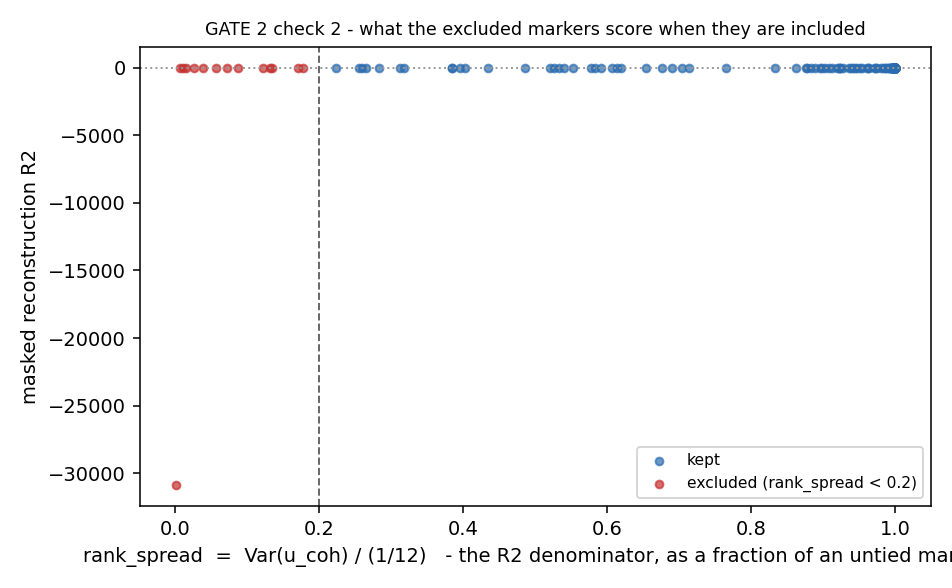

# Stage 2 - Tokenisation + masking (GATE 2)

One token per marker, over a vocabulary of **99 marker triples**. Panels run **17-57 markers**, so a fixed feature table cannot hold them; a set of tokens can.

**Verdict: GATE 2 FAILS. The failing check is reported in full below, not softened.**

| check                                      | result   | detail                                                                      |
|:-------------------------------------------|:---------|:----------------------------------------------------------------------------|
| 1  per-marker reconstruction R2            | FAIL     | median kept R2 0.5122, 1 below zero                                         |
| 2  flat-marker exclusion is auditable      | PASS     | 14 pairs excluded; median R2 differs by -0.4391, R2 spread 0.2881 vs 0.2379 |
| 3  dynamic tokens beat the fixed core (H3) | PASS     | full 0.1963 · control 0.1707 · Gate 1 0.169                                 |
| 4  [ABSENT] ablation (H1)                  | decided  | ship arm B; both columns agree                                              |

## What is being measured

Hide a marker, predict its cohort-level ECDF value back from the others. No labels are used anywhere in this stage, so it works across cohorts before a shared label space exists - and it is the same objective Gate 1 used to choose the normalisation, so the numbers are directly comparable.

Scored **on held-out slides**, not held-out cells. Held-out cells share their slide with training cells, so slide-level quirks can be memorised; a slide holdout removes that.

`R2 = 1 - MSE_model / MSE_baseline`, and the baseline is the **training mean** (decision D-26). The written design said *median*. Under squared error the mean is the best constant predictor, so a median baseline is weaker and inflates every R2 - and Gate 1's target number 0.169 was computed against the mean, so a median baseline would have made check 3 compare two different quantities. The median-baseline column is still printed below, as a diagnostic.

## The panel

| cohort   |   markers |   excluded |   kept |
|:---------|----------:|-----------:|-------:|
| Phillips |        57 |          0 |     57 |
| CRC      |        56 |          0 |     56 |
| UPMC     |        39 |          0 |     39 |
| Keren    |        39 |          9 |     30 |
| ferguson |        34 |          0 |     34 |
| Sorin    |        17 |          5 |     12 |

**14 of 242 (cohort, marker) pairs excluded** from the mask loss and from the headline R2 table, at `rank_spread < 0.2` (D-28, explained under check 2).

## Check 1 - per-marker masked reconstruction R2 on held-out slides

**PASS requires** every kept marker above 0, **and** a median kept-marker R2 of at least 0.1. Both declared in `pipeline2/panel/gate2_expect.csv` before the run.

| cohort   |   markers |   median_r2 |   min_r2 |   max_r2 |   median_r2_vs_median_baseline |
|:---------|----------:|------------:|---------:|---------:|-------------------------------:|
| CRC      |        56 |      0.629  |   0.285  |   0.8678 |                         0.6296 |
| Keren    |        28 |      0.4586 |  -0.0117 |   0.8587 |                         0.6044 |
| Phillips |        57 |      0.5095 |   0.1634 |   0.8062 |                         0.5191 |
| Sorin    |        12 |      0.3182 |   0.0586 |   0.5829 |                         0.5255 |
| UPMC     |        39 |      0.4369 |   0.1669 |   0.7126 |                         0.4372 |
| **all**  |       192 |      0.5122 |  -0.0117 |   0.8678 |                         0.5428 |

**FAIL - 1 kept pair(s) at or below zero; median R2 0.5122 against a floor of 0.1.**

### D-29 - the floor is applied to the split R2 is measured on

The first Gate 2 run exposed a defect in this check, not in the model. The exclusion floor is computed over **every cell** of the cohort, but R2 is computed on the **held-out slides**. A marker expressed on some slides and not others clears the cohort-wide floor and still has a collapsed denominator exactly where it is scored.

Measured case: Keren TP53, cohort-wide `rank_spread` 0.3843 - comfortably kept - but only **0.050** on its held-out slides, and it was the single kept pair with a negative R2 (-1.574). Keren has 40 slides, the fewest on the roster, so it is the most exposed.

The same floor is therefore applied to the scored split as well. It needs no retraining - the denominator was already stored when the run was scored. **2 pair(s) moved out of the headline table** on this rule:

| cohort   | gene   |   split_spread |      r2 |   baseline_mse |
|:---------|:-------|---------------:|--------:|---------------:|
| Keren    | TP53   |         0.05   | -1.1357 |       0.004167 |
| Keren    | KRT17  |         0.1604 |  0.1072 |       0.013366 |

<b>1 kept marker(s) below zero</b>

| cohort   | triple                  | kept   |   cells |   split_spread |      mse |      r2 |   r2_vs_median |   baseline_mse | kept_cohort_wide   |
|:---------|:------------------------|:-------|--------:|---------------:|---------:|--------:|---------------:|---------------:|:-------------------|
| Keren    | UniProt:P46013|pan|none | True   |    3000 |         0.2621 | 0.022101 | -0.0117 |         0.0626 |       0.021845 | True               |

## Check 2 - the flat-marker exclusion is auditable

`u_coh` is a rank, so its IQR is 0.5 by construction and cannot measure dynamic range, and raw IQR is not comparable across cohorts on different scales. Three scale-free measures are computed instead, all over **every cell** of the cohort:

- **`tie_mass`** - share of cells on the single most common **raw** value. Exposes Sorin's uint8 quantisation directly. **Reported, but it does not decide** - see below.
- **robust dispersion** - raw `IQR / (p99 - p01)`.
- **`rank_spread` = `Var(u_coh) / (1/12)`** - the R2 denominator itself, as a fraction of what an untied marker has. **This is the rule: excluded below 0.2.**

### The declared rule was replaced before any training run (D-28)

The design declared `tie_mass >= 0.5`. Building the dynamic-range table - before fitting anything - showed two defects, so the rule was restated on the quantity that actually matters. The old rule is kept in `panel/gate2_expect.csv` marked **REPLACED**, not deleted.

**Defect 1 - it catches none of the cases it was written for.** The design names UPMC's CD152, PDL1, PD1, CD134 and CD47 as its motivating example. Measured, all five sit at `tie_mass = 0.0001` with over a million distinct values each, so the rule excludes **0 of 39** UPMC markers. That is good news rather than bad: UPMC arrives arcsinh and is continuous, so **Stage 1's ECDF had already fixed them**. The plan's *"interquartile range of about 0.05"* was measured on the raw arcsinh scale - the exact "raw IQR is not comparable across cohorts" error the design itself warns against.

**Defect 2 - it over-fires on the cohorts it does hit**, removing 29 of 39 Keren markers and 16 of 17 Sorin markers, including CD3, CD4, CD8A, CD20, CD68 and HLA-DR. Those are the lineage markers Stage 1b's result rests on, and Sorin is the panel-mismatch stress test - running the rule as declared would have left Sorin training on one marker.

**And the mechanism was the wrong way round.** The design says flat markers *inflate* R2. Measured, the R2 **denominator collapses**: median `Var(u_coh)` is 0.0847 below `tie_mass` 0.1 and 0.0154 above 0.9, with a minimum of 0.00004, against 1/12 = 0.0833 for an untied rank. R2 then becomes a ratio of two tiny numbers - noise, not inflation. So this check now tests the mechanism that is there.

`rank_spread` separates a dead channel from a sparse-but-real one, which `tie_mass` does not. Sorin CD8A is `tie_mass` 0.83 - excluded by the old rule - but `rank_spread` 0.55, so it stays.

### Threshold sweep - so 0.2 is checkable rather than trusted

Pairs removed at each candidate `rank_spread` floor:

|   threshold | CRC    | Keren   | Phillips   | Sorin   | UPMC   | ferguson   |   total excluded |
|------------:|:-------|:--------|:-----------|:--------|:-------|:-----------|-----------------:|
|         0.1 | 0 / 56 | 6 / 39  | 0 / 57     | 3 / 17  | 0 / 39 | 0 / 34     |                9 |
|         0.2 | 0 / 56 | 9 / 39  | 0 / 57     | 5 / 17  | 0 / 39 | 0 / 34     |               14 |
|         0.3 | 0 / 56 | 13 / 39 | 0 / 57     | 6 / 17  | 0 / 39 | 0 / 34     |               19 |
|         0.5 | 0 / 56 | 16 / 39 | 0 / 57     | 11 / 17 | 0 / 39 | 0 / 34     |               27 |

The replaced rule, on the same table, for comparison:

|   threshold | CRC     | Keren   | Phillips   | Sorin   | UPMC   | ferguson   |   total excluded |
|------------:|:--------|:--------|:-----------|:--------|:-------|:-----------|-----------------:|
|         0.3 | 15 / 56 | 35 / 39 | 5 / 57     | 17 / 17 | 0 / 39 | 0 / 34     |               72 |
|         0.4 | 8 / 56  | 32 / 39 | 3 / 57     | 17 / 17 | 0 / 39 | 0 / 34     |               60 |
|         0.5 | 0 / 56  | 29 / 39 | 1 / 57     | 16 / 17 | 0 / 39 | 0 / 34     |               46 |
|         0.6 | 0 / 56  | 28 / 39 | 0 / 57     | 16 / 17 | 0 / 39 | 0 / 34     |               44 |
|         0.7 | 0 / 56  | 25 / 39 | 0 / 57     | 14 / 17 | 0 / 39 | 0 / 34     |               39 |

### What do the excluded markers score when they are included?

Measured in a separate run trained with **no exclusions at all**, so the number answers *what would they have scored if they had been included*. **PASS requires the excluded pairs not to look like ordinary markers** - either a median R2 differing by at least 0.10, or an R2 spread at least twice the kept pairs'. If they look ordinary, the rule removes nothing and is dropped.

| group                                 |   pairs |    mean_r2 |   median_r2 |   iqr_r2 |     min_r2 |
|:--------------------------------------|--------:|-----------:|------------:|---------:|-----------:|
| would be excluded (rank_spread < 0.2) |      14 | -2206.58   |      0.0686 |   0.2881 | -30892.1   |
| kept                                  |     194 |     0.4856 |      0.5077 |   0.2379 |     -1.529 |

**PASS - the excluded pairs are not ordinary markers: median R2 differs by -0.4391 and their R2 spread is 0.2881 against 0.2379 for kept pairs (1.2x), which is the collapsed R2 denominator showing up exactly where it was predicted to.**

<b>Every excluded (cohort, marker) pair, 14 rows</b>

| cohort   | gene    |   rank_spread |   var_ucoh |   tie_mass |   robust_dispersion |   distinct_values |   baseline_mse |          r2 |
|:---------|:--------|--------------:|-----------:|-----------:|--------------------:|------------------:|---------------:|------------:|
| Keren    | CD276   |        0.0006 |   4.9e-05  |     0.9998 |                   0 |                40 |       0        | -30892.1    |
| Keren    | CD163   |        0.0063 |   0.000522 |     0.9979 |                   0 |               410 |       0.000332 |     -1.0739 |
| Keren    | TNFRSF4 |        0.0103 |   0.000861 |     0.9965 |                   0 |               670 |       0.001659 |     -0.1284 |
| Keren    | FOXP3   |        0.026  |   0.002169 |     0.9912 |                   0 |              1663 |       0.013665 |      0.1406 |
| Keren    | NCAM1   |        0.0382 |   0.00318  |     0.9871 |                   0 |              2292 |       0.003522 |     -0.131  |
| Keren    | LAG3    |        0.0571 |   0.004757 |     0.9806 |                   0 |              3412 |       0.01318  |      0.0774 |
| Keren    | MPO     |        0.1225 |   0.010205 |     0.9574 |                   0 |              7690 |       0.022312 |      0.1966 |
| Keren    | CD209   |        0.1347 |   0.011225 |     0.9529 |                   0 |              7542 |       0.017169 |     -0.0325 |
| Keren    | PDCD1   |        0.1707 |   0.014226 |     0.9395 |                   0 |              8167 |       0.027845 |      0.1867 |
| Sorin    | KLRD1   |        0.0155 |   0.001288 |     0.9948 |                   0 |              9838 |       0.010344 |      0.0495 |
| Sorin    | KIT     |        0.0715 |   0.005958 |     0.9756 |                   0 |             41903 |       0.015415 |      0.1744 |
| Sorin    | ITGAX   |        0.0879 |   0.007325 |     0.9698 |                   0 |             49414 |       0.01422  |      0.2288 |
| Sorin    | FOXP3   |        0.1311 |   0.010928 |     0.9542 |                   0 |             73741 |       0.02332  |      0.3199 |
| Sorin    | MPO     |        0.1781 |   0.014841 |     0.9367 |                   0 |             99010 |       0.024806 |      0.0598 |

## Check 3 - do dynamic tokens beat the fixed 9-marker core?

This is open question **H3**, and it is what says whether Stage 2's complexity was earned. All three rows are LOCO masked-marker R2 **on the same 9 core markers**, averaged over the 5 training-cohort folds. ferguson is not in any fold - it is the frozen holdout.

| arm                                          |   markers |   loco_r2_on_core | note                                          |
|:---------------------------------------------|----------:|------------------:|:----------------------------------------------|
| Gate 1 V3 - concat MLP, 9 markers            |         9 |            0.169  | already measured, reports/s1_normalisation.md |
| core-9 control - set transformer, 9 markers  |         9 |            0.1707 | D-27; isolates architecture                   |
| full panel - set transformer, arm B (absent) |        99 |            0.1963 | isolates panel width against the control      |

The middle row is the control added as **D-27**. Without it, a win could just as easily be the set transformer beating a concat MLP as it could be the wider panel doing work - two changes at once, which is exactly the confound Gate 1's ladder was built to avoid.

**PASS - full panel 0.1963 clears Gate 1's 0.169 and beats the core-9 control 0.1707 by +0.0256, so the gain is panel width, not architecture.**

### Per-fold detail, both arms

| held_out   |   full_armA |   epochs_A |   full_armB |   epochs_B |   core9_control |   epochs_c9 |   shipped_minus_control |
|:-----------|------------:|-----------:|------------:|-----------:|----------------:|------------:|------------------------:|
| CRC        |      0.3042 |         30 |      0.3212 |         25 |          0.143  |          30 |                  0.1782 |
| UPMC       |      0.1515 |         30 |      0.1877 |         25 |          0.1644 |          23 |                  0.0233 |
| Keren      |      0.2018 |         26 |      0.1587 |         30 |          0.1817 |          18 |                 -0.023  |
| Phillips   |      0.281  |         30 |      0.275  |         28 |          0.2    |          17 |                  0.0751 |
| Sorin      |     -0.1033 |         30 |      0.0388 |         26 |          0.1644 |          17 |                 -0.1256 |
| **mean**   |      0.167  |            |      0.1963 |            |          0.1707 |             |                  0.0256 |

**Read the Sorin row first.** Sorin has 17 markers against 39-57 for the other cohorts, and it arrives uint8, so it is the panel-mismatch stress test the whole masked-token design exists for. It is also where the two arms separate most.

A fold where `epochs` equals the ceiling was still improving when it ran out. Those numbers are lower bounds, and the ceiling is not symmetric across the table - the core-9 control is a much smaller problem and converges sooner - so a full-panel loss by a small margin should not be read as a settled result.

## Check 4 - the [ABSENT] token, and whether it is a panel fingerprint

The plan mandates a learned `[ABSENT]` token for markers a cohort does not measure. The argument against it is that the set of measured markers is a near-perfect **cohort fingerprint** - 43 of 99 triples are measured by exactly one cohort - so absent slots hand the model panel identity while adding no biology. Absence is a property of the panel, not of the cell.

Settled by measurement. The rule declared before the run was *ship the better R2; if tied, ship Arm A* - but it did not say **which R2**, and that turned out to decide the answer.

| arm                             | slots              |   within_cohort_r2 |   cross_cohort_loco_r2 |   cohort_probe_acc |   seconds |
|:--------------------------------|:-------------------|-------------------:|-----------------------:|-------------------:|----------:|
| A - measured markers only       | panel size (12-57) |             0.4982 |                 0.167  |                  1 |      4512 |
| B - all slots, learned [ABSENT] | 99                 |             0.5107 |                 0.1963 |                  1 |     14817 |

Shipping **Arm B (absent tokens)**, decided on the **cross-cohort** column: +0.1670 (A) vs +0.1963 (B).

Both columns agree, so the decision does not depend on which one is used.

Cohort probe: 1.000 (A) vs 1.000 (B), chance 0.200. **The probe separates neither arm - both read 1.000.** So it cannot decide anything here, and the panel-fingerprint concern is neither confirmed nor cleared by it. What it does show is that Arm A leaks cohort identity just as completely, because the identity embeddings of the PRESENT markers already fingerprint the panel. That was the counter-argument stated in the design, and it is now measured.

### D-30 - why the cross-cohort column decides

The first Gate 2 run scored this check on the **within-cohort** slide holdout, where every cohort presents the same token-set size it trained on. An `[ABSENT]` token exists to absorb a panel the model has not seen, so that is the one setting where it cannot possibly help - the check was measuring the arms where their difference is invisible.

The held-out-Sorin fold made it visible. Sorin presents 12-17 tokens against the 39-57 the model trained on, and Arm A's masked-marker R2 there went **negative** while Arm B's stayed positive. Absent slots keep the set size fixed at 99 for every cohort, so the encoder never sees a set unlike anything in training.

So the arm is decided on the cross-cohort column. That is not a softened threshold - it is the same rule applied to the quantity this project actually claims, which is performance on a cohort the model has never seen.

### The cohort probe

A 5-way logistic regression on the pooled cell embedding, trained and scored on **different slides**. It is 5-way rather than the 6-way the design file wrote, because a probe is *trained* on these embeddings and ferguson is never trained on - so chance is 20%. It is diagnostic and never decides the gate.

## Runs, and what they cost

| run                                            |   epochs |   seconds |
|:-----------------------------------------------|---------:|----------:|
| arm A - measured markers only (holdout slides) |       22 |     804.1 |
| arm B - all slots, [ABSENT] (holdout slides)   |       47 |    5131.8 |
| no-exclusion diagnostic (check 2, Arm A)       |       30 |    1005.7 |
| LOCO arm A - held out CRC                      |       30 |     684.7 |
| LOCO arm A - held out UPMC                     |       30 |     760.7 |
| LOCO arm A - held out Keren                    |       26 |     679.3 |
| LOCO arm A - held out Phillips                 |       30 |     680.5 |
| LOCO arm A - held out Sorin                    |       30 |     903.2 |
| LOCO arm B - held out CRC                      |       25 |    2181.5 |
| LOCO arm B - held out UPMC                     |       25 |    1787.9 |
| LOCO arm B - held out Keren                    |       30 |    2003.1 |
| LOCO arm B - held out Phillips                 |       28 |    1888.8 |
| LOCO arm B - held out Sorin                    |       26 |    1824.3 |
| LOCO core-9 control - held out CRC             |       30 |     130.1 |
| LOCO core-9 control - held out UPMC            |       23 |     106.7 |
| LOCO core-9 control - held out Keren           |       18 |      85   |
| LOCO core-9 control - held out Phillips        |       17 |      82.4 |
| LOCO core-9 control - held out Sorin           |       17 |      75.3 |
| **total**                                      |      484 |   20815   |

Model: `d_model=64`, 2 blocks, 4 heads, 15% of eligible markers hidden per cell, minimum 1. Early stopping on held-out slides of the training cohorts, patience 4. Local CPU box, no CUDA.
