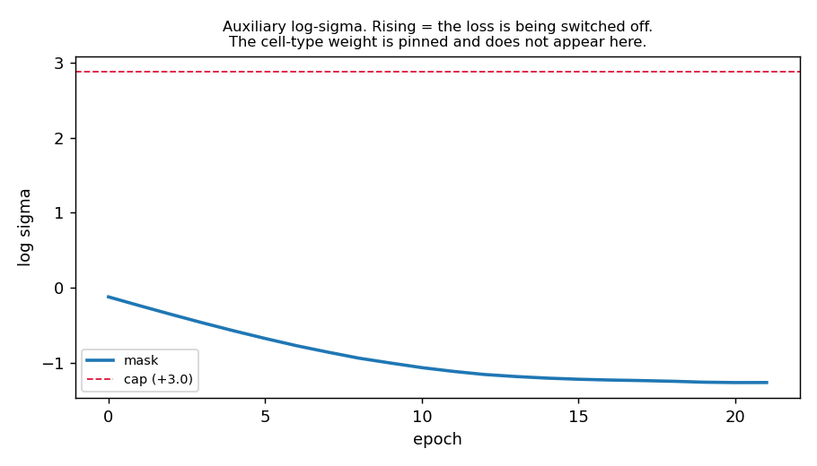
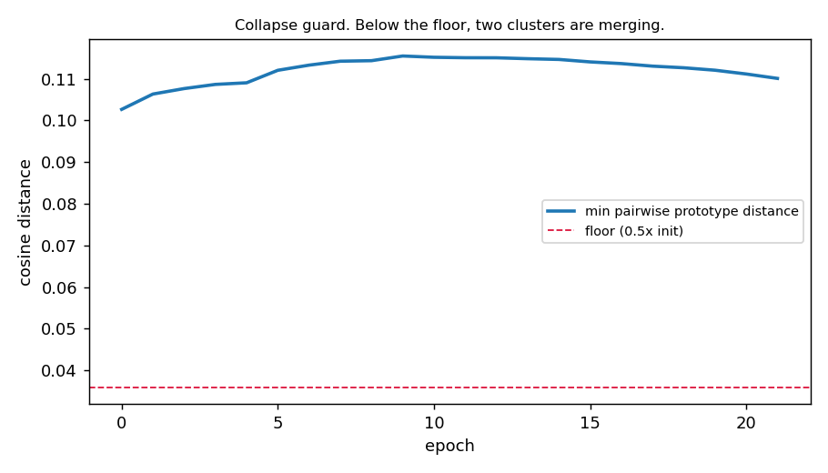
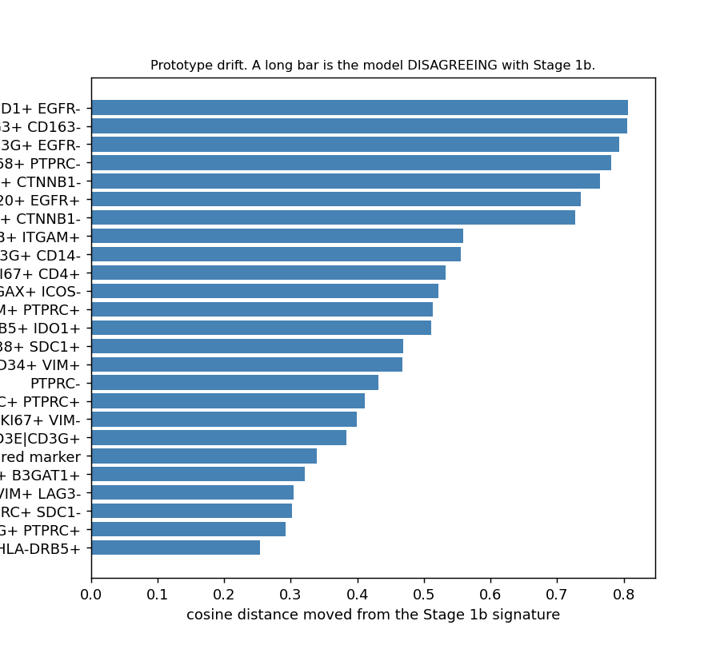

# Stage 6 - losses and training (GATE 6)

**PASS** - ships **2 losses** at LOCO macro-F1 **0.3901** - 73.5 min on cuda.

Label space: 25 Stage 1b clusters, 3 flagged unreliable and held out of
every headline number (stroma waiver, D-23/D-32).

## The gate

| check                                     | result   | detail                                                 |
|:------------------------------------------|:---------|:-------------------------------------------------------|
| 1  auxiliary sigma does not run away      | PASS     | largest log-sigma move 1.142 against a cap of 3.0      |
| 2  prototypes do not collapse             | PASS     | floor 0.0359 (init 0.0717); no pair frozen             |
| 3  do the extra losses earn their place   | ship 2   | 3 losses 0.3788 vs 2 losses 0.3901 - delta -0.0113     |
| 4  beats the plain linear head by >= 0.02 | PASS     | 2 losses 0.3901 vs linear head 0.3692 - margin +0.0209 |

Thresholds were declared in `pipeline2/panel/gate6_expect.csv` before any of this code was
written. Three rows there record things the design asked for that are NOT built, each with its
reason - read them before concluding anything is missing.

## What is deliberately not in this stage

**Descendant-tolerant cross-entropy.** It needs Stage 1b's nesting graph, which missed all three
cases declared for it (section 7 gap 2). A loss over an untrusted parent/child graph rewards wrong
predictions silently, and the failure would read as a modelling result rather than a graph defect.
Deferred, not rejected.

**The neighbourhood-context loss.** It needs `z_neigh` from Stage 4, which is deferred (D-18), so
it has no input at all. **The declared "2 vs 4 losses" ablation is therefore a 2 vs 3** - cell
type, masked marker, VICReg. Check 3 below is that comparison, not the one originally written.

**The adversary.** Gate 3 swept 5 lambdas x 5 folds and none beat lambda=0 (D-36).

## Check 3 - the loss ablation

| losses | LOCO macro-F1 |
|---|---|
| 2 - cell type + masked marker | 0.3901 |
| 3 - plus VICReg | 0.3788 |

VICReg does NOT improve macro-F1, so it is dropped. The design said to keep the extra losses only if they earn it.

## Check 4 - did this stage earn its existence

| head | LOCO macro-F1 |
|---|---|
| Stage 3's plain linear head, same encoder, same run | 0.3692 |
| Stage 6 prototype loss (2 losses) | 0.3901 |
| **margin** | **+0.0209** against a required +0.02 |

The linear control is re-measured INSIDE this run rather than read from Gate 3's report. Gate 3
ran on an 88-triple vocabulary before D-39 fixed that, so its 0.3642 is not comparable with
anything produced afterwards. Same discipline as Gate 2's core-9 control (D-27): measure the
baseline in the same run, or the comparison changes two things at once.

## Every run

| tag             | held     | head   | vicreg   | conf   |   f1_core |   f1_all |   f1_majority |   seconds |
|:----------------|:---------|:-------|:---------|:-------|----------:|---------:|--------------:|----------:|
| proto3_CRC      | CRC      | proto  | True     | True   |    0.2726 |   0.2847 |        0.0101 |     274.8 |
| proto3_UPMC     | UPMC     | proto  | True     | True   |    0.3741 |   0.3367 |        0.0248 |     240.8 |
| proto3_Keren    | Keren    | proto  | True     | True   |    0.4148 |   0.3662 |        0      |     286.6 |
| proto3_Phillips | Phillips | proto  | True     | True   |    0.3976 |   0.3616 |        0.0158 |     307.7 |
| proto3_Sorin    | Sorin    | proto  | True     | True   |    0.4348 |   0.4343 |        0.0131 |     331.2 |
| proto2_CRC      | CRC      | proto  | False    | True   |    0.2983 |   0.3023 |        0.0101 |     239.8 |
| proto2_UPMC     | UPMC     | proto  | False    | True   |    0.3763 |   0.3386 |        0.0248 |     196.6 |
| proto2_Keren    | Keren    | proto  | False    | True   |    0.4058 |   0.3532 |        0      |     326.5 |
| proto2_Phillips | Phillips | proto  | False    | True   |    0.427  |   0.3933 |        0.0158 |     228.3 |
| proto2_Sorin    | Sorin    | proto  | False    | True   |    0.4432 |   0.4457 |        0.0131 |     325.5 |
| linear_CRC      | CRC      | linear | True     | True   |    0.2858 |   0.2729 |        0.0101 |     272.3 |
| linear_UPMC     | UPMC     | linear | True     | True   |    0.3783 |   0.3404 |        0.0248 |     261.4 |
| linear_Keren    | Keren    | linear | True     | True   |    0.4147 |   0.3557 |        0      |     273.2 |
| linear_Phillips | Phillips | linear | True     | True   |    0.4452 |   0.3972 |        0.0158 |     295.5 |
| linear_Sorin    | Sorin    | linear | True     | True   |    0.322  |   0.3223 |        0.0131 |     306   |
| noconf_UPMC     | UPMC     | proto  | True     | False  |    0.3741 |   0.3367 |        0.0248 |     240.9 |

## Check 1 - the sigma trajectory

Kendall uncertainty weighting can switch a loss off by driving its sigma up - the weight is
1/(2 sigma^2), so a runaway sigma silently deletes the term while training still looks healthy.
**The cell-type sigma is pinned at 1.0 and is not learned**, because cross-cohort labels come from
six annotation schemes and look extremely noisy, which is exactly the condition under which
Kendall weighting would switch off the one task that matters.

## Check 2 - the collapse guard

Learnable prototypes can silently merge two classes, and macro-F1 over classes present in the
truth does not necessarily expose it. A breach freezes the pair and logs it rather than aborting -
a merge may be a true statement about the label space.

_No pair ever breached the floor._

## Prototype drift - a diagnostic, not a failure

Prototypes start at their Stage 1b marker signature and are learnable on purpose, so the protein
data may correct the clustering. A large move is the model DISAGREEING with Stage 1b about where
that cluster lives. That disagreement is a finding worth reading, not a bug.

| cluster                                                                                                                         |   moved |
|:--------------------------------------------------------------------------------------------------------------------------------|--------:|
| LAG3+ VSIR+ PDCD1+ EGFR-                                                                                                        |  0.8069 |
| ICOS+ CD274+ LAG3+ CD163-                                                                                                       |  0.8056 |
| PTPRC+ CD3D|CD3E|CD3G+ EGFR-                                                                                                    |  0.7929 |
| SDC1+ GZMB+ CD68+ PTPRC-                                                                                                        |  0.7813 |
| ITGAX+ CTNNB1-                                                                                                                  |  0.7644 |
| PDPN+ KRT1|KRT4|KRT5|KRT6A|KRT7|KRT8|KRT10|KRT13|KRT14|KRT15|KRT16|KRT17|KRT18|KRT19|KRT20+ EGFR+                               |  0.7359 |
| KRT1|KRT4|KRT5|KRT6A|KRT7|KRT8|KRT10|KRT13|KRT14|KRT15|KRT16|KRT17|KRT18|KRT19|KRT20+ CD163+ HLA-DRA|HLA-DRB1|HLA-DRB5+ CTNNB1- |  0.7266 |
| FUT4+ FCGR3A|FCGR3B+ ITGAM+                                                                                                     |  0.5589 |
| CD3D|CD3E|CD3G+ CD14-                                                                                                           |  0.5554 |
| FOXP3+ MKI67+ CD4+                                                                                                              |  0.5325 |
